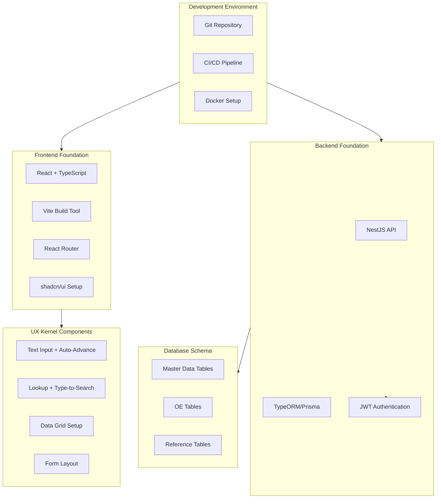

# Phase 0: Foundation Implementation Plan

## Overview

Phase 0 establishes the complete foundation for the PoC implementation, including development infrastructure, core reusable components, database schema for PoC tables, authentication framework, and UX kernel components. This phase must be completed before starting Phase 1 (Master Data Module).

**Duration**: 4 weeks (Weeks 1-4)

**Reference**: [Phased Delivery Plan](docs/modernization-strategy/11-phased-delivery-plan/phased-delivery-plan.md) lines 27-88

## Architecture Overview

## Week-by-Week Breakdown

### Week 1-2: Infrastructure Setup

**Objective**: Establish complete development environment and tooling

#### Tasks

1. **Development Environment Setup** ([Task 01-01](docs/planning/poc_planning/00-phase-0-foundation/01-infrastructure-setup/task-01-01-development-environment.md))

   - Install Node.js 18+ LTS, PostgreSQL 14+, Docker
   - Set up VS Code with required extensions (ESLint, Prettier, TypeScript, GitLens)
   - Create project structure (frontend/, backend/, docs/)
   - Configure .gitignore and environment variables
   - Install and verify all dependencies

2. **Database Setup** ([Task 01-02](docs/planning/poc_planning/00-phase-0-foundation/01-infrastructure-setup/task-01-02-database-setup.md))

   - Create development database `baitin_poc_dev`
   - Configure database user and permissions
   - Set up database connection pooling
   - Create database migration structure
   - Test database connectivity

3. **Git and CI/CD Setup** ([Task 01-03](docs/planning/poc_planning/00-phase-0-foundation/01-infrastructure-setup/task-01-03-git-and-cicd.md))

   - Initialize Git repository
   - Set up branch strategy (main, develop, feature branches)
   - Configure basic CI/CD pipeline (lint, test, build)
   - Set up pre-commit hooks
   - Document Git workflow

**Deliverables**:

- ✅ Development environment fully operational
- ✅ Database accessible and configured
- ✅ Git repository with CI/CD pipeline
- ✅ All team members can run the project locally

### Week 3: Core Components Development

**Objective**: Build frontend and backend foundations with authentication

#### Tasks

1. **Frontend Foundation** ([Task 02-03](docs/planning/poc_planning/00-phase-0-foundation/02-core-components/task-02-03-frontend-foundation.md))

   - Initialize React 18 + TypeScript project with Vite
   - Set up React Router for navigation
   - Configure React Query for data fetching
   - Install and configure shadcn/ui
   - Set up React Hook Form
   - Create base layout components (Header, Sidebar, Main)
   - Configure Tailwind CSS and design tokens
   - Set up path aliases (@/components, @/lib, etc.)

2. **Backend Foundation** ([Task 02-02](docs/planning/poc_planning/00-phase-0-foundation/02-core-components/task-02-02-api-foundation.md))

   - Initialize NestJS project with TypeScript
   - Set up project structure (modules, controllers, services, DTOs)
   - Configure TypeORM or Prisma for database access
   - Set up PostgreSQL connection
   - Create base API structure (health check endpoint)
   - Configure CORS for frontend communication
   - Set up global exception filters
   - Configure validation pipes (class-validator)

3. **Authentication Framework** ([Task 02-01](docs/planning/poc_planning/00-phase-0-foundation/02-core-components/task-02-01-authentication-setup.md))

   - Implement JWT authentication (basic, OIDC deferred to MVP)
   - Create Auth module (login, register, token refresh)
   - Set up JWT guards and decorators
   - Create user entity and basic user management
   - Implement password hashing (bcrypt)
   - Create authentication middleware
   - Set up frontend auth context and protected routes

4. **Database Schema - PoC Tables** ([Task 03-01](docs/planning/poc_planning/00-phase-0-foundation/03-database-schema/task-03-01-master-data-tables.md), [Task 03-02](docs/planning/poc_planning/00-phase-0-foundation/03-database-schema/task-03-02-oe-tables-schema.md), [Task 03-03](docs/planning/poc_planning/00-phase-0-foundation/03-database-schema/task-03-03-reference-tables-schema.md))

   - Create master data tables (item, customer, vendor)
   - Create Order Enquiry tables (order_enquiry_header, order_enquiry_detail, order_enquiry_control)
   - Create reference/lookup tables (as needed)
   - Set up foreign key relationships
   - Create indexes for performance
   - Write migration scripts
   - Seed sample data for development

**Deliverables**:

- ✅ Frontend application running with routing
- ✅ Backend API running with database connection
- ✅ Authentication working (login, JWT tokens)
- ✅ Database schema created with all PoC tables
- ✅ Sample data seeded

### Week 4: UX Kernel Development

**Objective**: Build reusable keyboard-first UX components

#### Tasks

1. **Text Input Component** ([Task 04-01](docs/planning/poc_planning/00-phase-0-foundation/04-ux-kernel/task-04-01-text-input-component.md))

   - Create TextInput component with auto-advance on Enter
   - Implement keyboard navigation (Tab, Enter, Shift+Tab)
   - Add inline validation display
   - Integrate with React Hook Form
   - Support different input types (text, number, email)
   - Add accessibility features (ARIA labels, screen reader support)
   - Create NumberInput variant with formatting

2. **Lookup Component** ([Task 04-02](docs/planning/poc_planning/00-phase-0-foundation/04-ux-kernel/task-04-02-lookup-component.md))

   - Create Lookup component with type-to-search
   - Implement debounced search (instant feedback)
   - Add keyboard navigation (Arrow keys, Enter to select)
   - Display code and description
   - Show recently used items first
   - Support async data fetching
   - Create reusable lookup hook

3. **Data Grid Setup** ([Task 04-03](docs/planning/poc_planning/00-phase-0-foundation/04-ux-kernel/task-04-03-data-grid-setup.md))

   - Install and configure React Data Grid (Adazzle) or AG Grid Community
   - Set up Excel-like keyboard navigation (Arrow keys, Tab, Enter)
   - Implement copy/paste support
   - Configure inline editing
   - Set up virtual scrolling for performance
   - Create base grid component with common features
   - Add row selection (single and multi)

4. **Form Layout Components** ([Task 04-04](docs/planning/poc_planning/00-phase-0-foundation/04-ux-kernel/task-04-04-form-layout-components.md))

   - Create standard form layout (header, fields, actions)
   - Implement form section components
   - Create field group components
   - Set up form validation display
   - Create form action buttons (Save, Cancel, Delete)
   - Implement form state management
   - Add auto-save indicator component

**Deliverables**:

- ✅ All UX kernel components implemented and tested
- ✅ Keyboard-first navigation working smoothly
- ✅ Components reusable across application
- ✅ Design system foundation established
- ✅ Components documented with examples

## Technology Stack

### Frontend

- **Framework**: React 18+ with TypeScript
- **Build Tool**: Vite
- **UI Library**: shadcn/ui
- **Data Grid**: React Data Grid (Adazzle) or AG Grid Community
- **State Management**: React Query + Context API
- **Form Management**: React Hook Form
- **Routing**: React Router v6
- **Styling**: Tailwind CSS

### Backend

- **Framework**: NestJS (TypeScript)
- **Database**: PostgreSQL 14+
- **ORM**: TypeORM or Prisma
- **Authentication**: JWT (basic, OIDC in MVP)
- **Validation**: class-validator, class-transformer

### Infrastructure

- **Version Control**: Git
- **CI/CD**: GitHub Actions or similar
- **Containerization**: Docker (optional for local dev)
- **Database**: PostgreSQL (local or Docker)

## Database Schema - PoC Tables

### Master Data Tables

- `item` - Item master data
- `customer` - Customer master data
- `vendor` - Vendor master data

### Order Enquiry Tables

- `order_enquiry_header` - OE header information
- `order_enquiry_detail` - OE line items
- `order_enquiry_control` - OE control records

### Reference Tables

- User management tables
- Lookup/reference tables as needed

**Reference**: [PoC Strategy](docs/modernization-strategy/15-poc-strategy/poc-strategy.md) lines 113-128

## Key Implementation Requirements

### UX Requirements

All components must follow the UX/UI Strategy:

- **Keyboard-First**: Primary input via keyboard, not mouse
- **Auto-Advance**: Text inputs advance to next field on Enter
- **Type-to-Search**: Lookups support instant search
- **Excel-Like Grids**: Grid navigation matches Excel behavior
- **Performance**: < 500ms API response, < 2s page load

**Reference**: [UX/UI Strategy](docs/modernization-strategy/06-ux-ui-strategy/ux-ui-strategy.md)

### Code Quality Standards

- All code must include documentation references
- Follow TypeScript best practices
- Implement proper error handling
- Write unit tests for core logic
- Follow ESLint and Prettier configuration

### Documentation Requirements

- Code comments must reference original documentation
- Document all business logic preservation
- Include validation rule references
- Document special cases (e.g., INSP company prefix)

## Dependencies and Sequencing

### Critical Path

1. Week 1-2: Infrastructure → Must complete before Week 3
2. Week 3: Frontend/Backend Foundation → Must complete before Week 4
3. Week 3: Database Schema → Required for Week 4 testing
4. Week 4: UX Kernel → Depends on Frontend Foundation

### Parallel Work

- Frontend and Backend foundation can be developed in parallel
- Database schema can be designed in parallel with frontend/backend
- UX components can be developed in parallel after frontend foundation

## Success Criteria

### Phase 0 Completion Checklist

- [ ] Development environment fully operational for all team members
- [ ] Frontend application runs and displays base layout
- [ ] Backend API runs and connects to database
- [ ] Authentication working (login, JWT tokens, protected routes)
- [ ] Database schema created with all PoC tables
- [ ] All UX kernel components implemented and tested
- [ ] Keyboard-first navigation working in all components
- [ ] Sample data seeded for development
- [ ] CI/CD pipeline running successfully
- [ ] Code quality standards met (linting, formatting)
- [ ] Documentation complete for all components

### Ready for Phase 1

- ✅ Team can start developing Master Data Module
- ✅ All foundation components are reusable
- ✅ Database schema supports PoC requirements
- ✅ Authentication framework ready
- ✅ UX patterns established and documented

## Risk Mitigation

### High Risks

1. **Technology Stack Issues**

   - Mitigation: Validate stack early, have alternatives ready
   - Validate: Test React Data Grid performance early

2. **Infrastructure Delays**

   - Mitigation: Use Docker for consistency, automate setup
   - Validate: All team members can set up environment in < 1 day

3. **UX Component Complexity**

   - Mitigation: Start with simple implementations, iterate
   - Validate: Test keyboard navigation early with users

### Medium Risks

1. **Database Schema Changes**

   - Mitigation: Design schema carefully, use migrations
   - Validate: Review schema with business stakeholders

2. **Performance Issues**

   - Mitigation: Performance test early, optimize as needed
   - Validate: API response times < 500ms, page load < 2s

## Testing Strategy

### Unit Tests

- Core business logic functions
- Validation functions
- Utility functions
- Component logic (React Testing Library)

### Integration Tests

- API endpoints (supertest)
- Database operations
- Authentication flow

### Manual Testing

- Keyboard navigation flows
- Auto-advance behavior
- Lookup type-to-search
- Grid navigation
- Form validation

## Documentation Deliverables

1. **Setup Guide**: How to set up development environment
2. **Component Documentation**: Storybook or similar for UX components
3. **API Documentation**: OpenAPI/Swagger for backend API
4. **Database Schema Documentation**: ER diagrams and table descriptions
5. **Architecture Decision Records (ADRs)**: Key technical decisions

## Next Steps After Phase 0

Upon completion of Phase 0, proceed to:

- **Phase 1: Master Data Module** (Weeks 5-6)
  - Item Master (Entry form, Lookup, List)
  - Customer Master (Entry form, Lookup, List)
  - Vendor Master (Entry form, Lookup, List)

**Reference**: [PoC Strategy](docs/modernization-strategy/15-poc-strategy/poc-strategy.md) lines 139-161

## References

### Primary Documentation

- [Phased Delivery Plan - Phase 0](docs/modernization-strategy/11-phased-delivery-plan/phased-delivery-plan.md) (lines 27-88)
- [PoC Strategy](docs/modernization-strategy/15-poc-strategy/poc-strategy.md)
- [Target Architecture](docs/modernization-strategy/03-target-state-architecture/target-state-architecture.md)
- [UX/UI Strategy](docs/modernization-strategy/06-ux-ui-strategy/ux-ui-strategy.md)

### Task Documents

- [Phase 0 Task List](docs/planning/poc_planning/00-phase-0-foundation/README.md)
- All individual task documents in `docs/planning/poc_planning/00-phase-0-foundation/`

### Business Documentation

- [System Summary](docs/source/00-overview/system-summary.md)
- [Data Architecture](docs/source/01-data-architecture/database-overview.md)
- [Master Data Management](docs/source/02-business-processes/master-data-management.md)