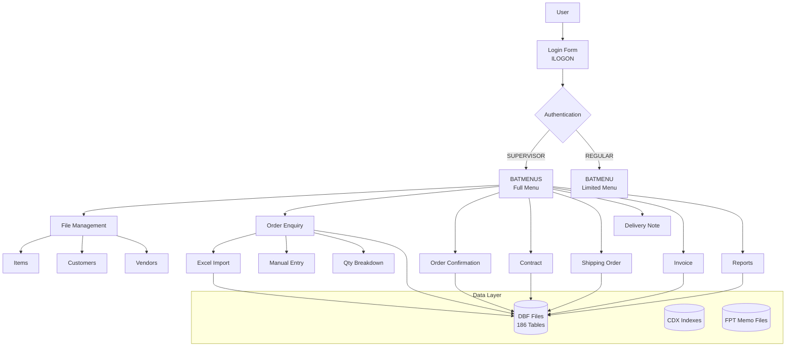

# System Summary

## Application Information

**Application Name:** Trading Management System  
**Version:** V3.0  
**Release Date:** July 9, 2025  
**Technology:** Visual FoxPro 9.0  
**Database:** DBF/CDX/FPT (File-based)

## Purpose

The Trading Management System is a comprehensive desktop application designed for managing international trading operations. It handles the complete lifecycle of trading documents from initial customer inquiries through to final invoicing and shipping.

## High-Level Capabilities

The system manages:

1. **Order Processing**
   - Order Enquiry (OE) creation and management
   - Order Confirmation (OC) processing
   - Contract generation and management
   - Shipping Order (SO) creation
   - Delivery Note (DN) processing
   - Invoice generation and packing lists

2. **Master Data Management**
   - Item/product catalog
   - Customer database
   - Vendor/supplier management
   - Manufacturer information
   - Product BOM (Bill of Materials)

3. **Document Management**
   - Excel import/export for orders
   - PDF report generation
   - Multiple document formats per customer
   - Customizable shipping order formats

4. **Reporting & Analysis**
   - Sales analysis by customer, item, date
   - Order summaries and enquiries
   - Contract summaries
   - Invoice summaries
   - Cost breakdown analysis

5. **Multi-Company Support**
   - Supports multiple trading companies (HT, BAT, INSP, HFW)
   - Company-specific configurations
   - Separate data contexts

## Deployment Model

- **Type:** Desktop application (Windows)
- **Architecture:** File-based, multi-user capable
- **Database:** Local/network file shares (DBF files)
- **Working Directories:**
  - `C:\batwork` - Shared working directory
  - `C:\<userid>work` - Per-user working directory

## User Count

- Multi-user capable (file-based locking)
- User-specific working directories
- Role-based access control (SUPERVISOR vs REGULAR_USER)

## Business Domain

**International Trading Operations**

The system is designed for companies engaged in:
- Import/export trading
- Order fulfillment
- Vendor management
- Customer relationship management
- Shipping and logistics coordination
- Invoice and payment tracking

## Key Features Summary

### 1. Order Enquiry (OE) Management
- Excel import from multiple formats
- Manual order entry
- Quantity breakdown by size/color/style
- BOM (Bill of Materials) processing
- OE Control record validation
- Customer/item validation

### 2. Order Confirmation (OC)
- Post OE to OC workflow
- Confirmation document generation
- Quantity and pricing confirmation

### 3. Contract Management
- Automatic contract generation from OC
- Vendor grouping
- Contract amendments
- Payment terms management
- Delivery date tracking

### 4. Shipping Operations
- Shipping Order (SO) creation
- Customizable SO formats per customer
- Ship mark management
- FOB port/terms handling

### 5. Invoice & Packing
- Invoice generation from SO/DN
- Multi-page invoice support
- Packing list generation
- Carton breakdown
- Excel/PDF export

### 6. Master Data
- Item master with pricing, dimensions, packaging
- Customer master with shipping parameters
- Vendor master with payment terms
- Product BOM management

### 7. Reporting
- 116+ reports available
- Sales analysis reports
- Transaction summaries
- Item enquiries
- Cost breakdowns

## System Architecture

## System Scale

- **Forms:** 195+ screens (.scx files)
- **Programs:** 176+ business logic files (.prg)
- **Database Tables:** 186 DBF files
- **Reports:** 116+ FRX report files
- **Menu Items:** 100+ menu options

## Technology Foundation

- **Development Platform:** Visual FoxPro 9.0
- **Database:** FoxPro DBF format (no SQL backend)
- **Indexing:** CDX compound index files
- **Memo Fields:** FPT files for large text
- **Reports:** FRX report engine
- **External Integration:** Excel (ODBC/Automation), PDF generation

## Key Business Workflows

1. **Order-to-Invoice Flow:**
   OE → OC → Contract → SO → DN → Invoice

2. **Data Import Flow:**
   Excel File → Validation → OE Creation → Processing

3. **Master Data Flow:**
   Item/Customer/Vendor Setup → Transaction Creation → Reporting

## System Characteristics

- **File-based:** No centralized database server
- **Multi-user:** File locking for concurrent access
- **Desktop Application:** Windows-only deployment
- **Legacy Technology:** Visual FoxPro (discontinued by Microsoft)
- **Custom Business Logic:** Extensive custom code for trading operations

