# Entity Relationships

## Overview

The FoxPro system uses **manual relationships** between tables. There are no enforced foreign key constraints at the database level. Relationships are maintained through application logic and field matching.

## Relationship Patterns

### Header/Detail Pattern

The system extensively uses a header/detail pattern for transaction tables:

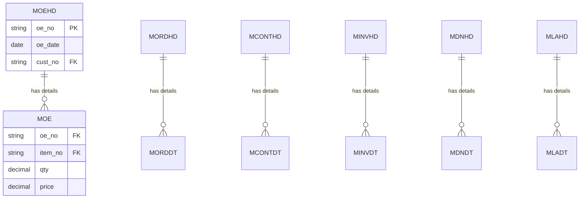

## Core Transaction Flow Relationships

### Order Enquiry to Order Confirmation

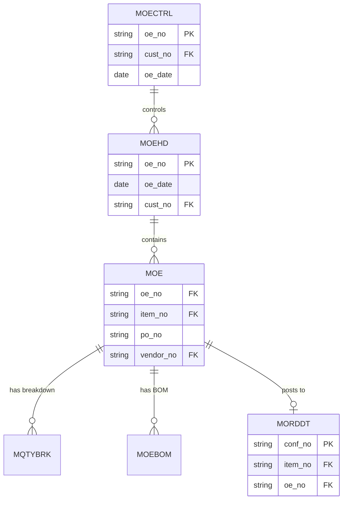

**Relationship Logic:**
- `MOE.oe_no` → `MORDDT.oe_no` (when posting OE to OC)
- `MOE.item_no` → `MORDDT.item_no`
- `MOE` records are copied to `MORDDT` during posting

### Order Confirmation to Contract

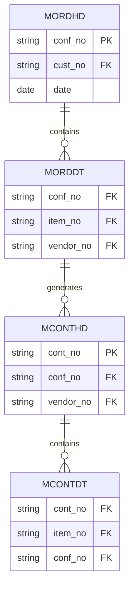

**Relationship Logic:**
- `MORDDT.conf_no` → `MCONTHD.conf_no`
- Contracts are grouped by `vendor_no` from `MORDDT`
- `MORDDT.item_no` → `MCONTDT.item_no`

### Contract to Shipping Order

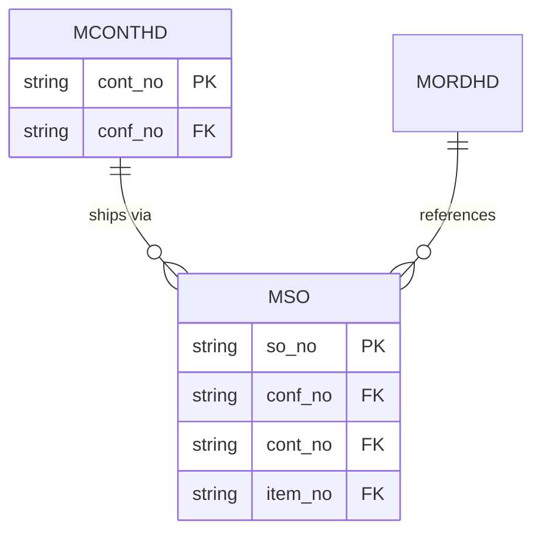

**Relationship Logic:**
- `MSO.conf_no` links to `MORDHD.conf_no`
- `MSO.cont_no` links to `MCONTHD.cont_no`

### Shipping Order to Invoice

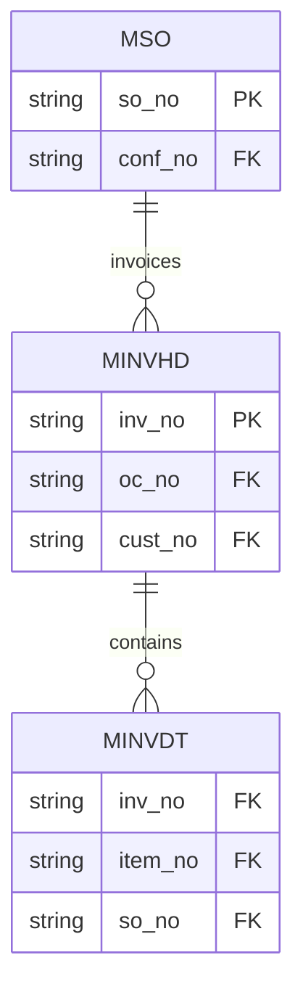

**Relationship Logic:**
- `MINVHD.oc_no` links to `MORDHD.conf_no`
- `MINVDT.so_no` links to `MSO.so_no`

## Master Data Relationships

### Item Relationships

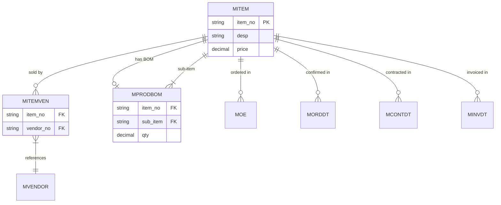

**Relationship Logic:**
- `MITEM.item_no` is the primary key
- `MITEMVEN` creates many-to-many relationship between items and vendors
- `MPRODBOM` creates parent-child relationships for BOM items

### Customer Relationships

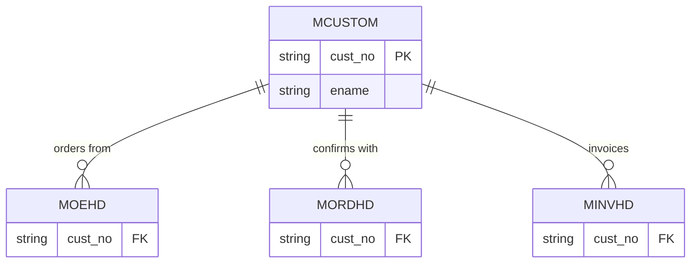

**Relationship Logic:**
- `MCUSTOM.cust_no` is referenced by all transaction headers
- Customer validation occurs during OE import and transaction creation

### Vendor Relationships

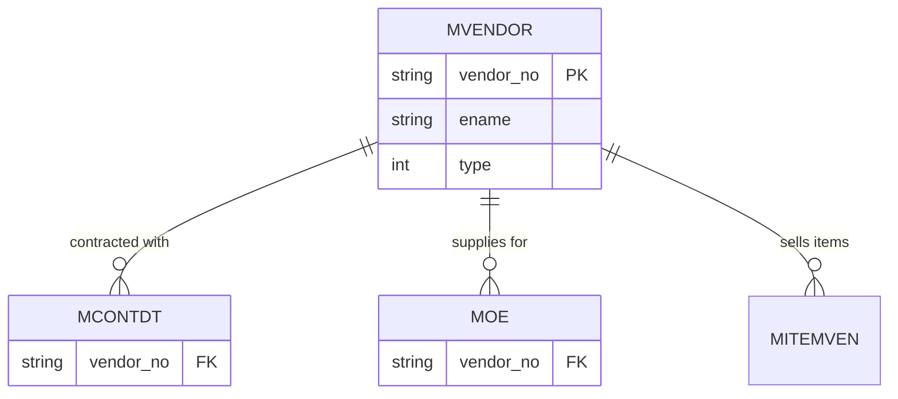

**Relationship Logic:**
- `MVENDOR.vendor_no` links to contracts and OEs
- `MVENDOR.type` distinguishes between VENDOR (1) and MAKER (2)

## Supporting Table Relationships

### Quantity Breakdown

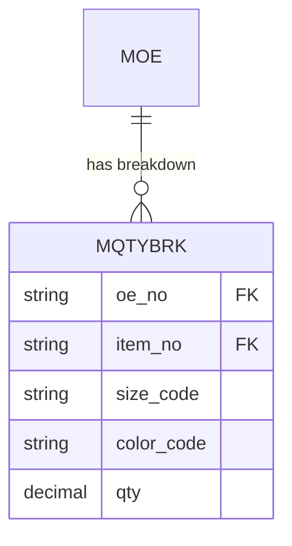

**Relationship Logic:**
- `MQTYBRK.oe_no` + `MQTYBRK.item_no` links to `MOE`

### BOM Relationships

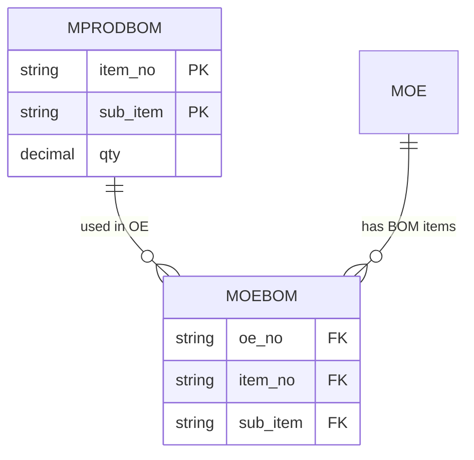

**Relationship Logic:**
- `MPRODBOM` defines product BOM structure
- `MOEBOM` applies BOM to specific OE
- BOM quantities are calculated from `MPRODBOM.qty`

## Lookup Table Relationships

### Reference Data

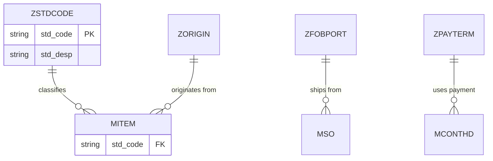

**Relationship Logic:**
- Lookup tables provide reference data
- Relationships are via code matching (not enforced)

## Manual Relationship Enforcement

### Application-Level Validation

Relationships are enforced in application code:

**Example from `uoexls_2013.prg`:**
```foxpro
select moectrl
set order to OE_NO
seek w_oe_no
if eof()
    messagebox(w_oe_no+" --- No OE Control Record"+ chr(10)+"Import Skipped", 0+16, "Syster Message")
    loop
ENDIF
```

**Example from `uordcont.prg`:**
```foxpro
locate for alltrim(morddt.conf_no)==alltrim(voe1.oc_no) and alltrim(morddt.item_no)==alltrim(voe1.item_no)
```

### Key Field Patterns

**Primary Keys (inferred from usage):**
- `oe_no` - Order Enquiry number
- `conf_no` - Order Confirmation number
- `cont_no` - Contract number
- `so_no` - Shipping Order number
- `inv_no` - Invoice number
- `item_no` - Item number
- `cust_no` - Customer number
- `vendor_no` - Vendor number

**Foreign Key Patterns:**
- Transaction headers reference `cust_no`
- Transaction details reference `item_no`
- Contracts reference `vendor_no`
- All transactions link via document numbers

## Relationship Integrity Risks

### No Foreign Key Constraints

**Risks:**
1. **Orphaned Records:** Detail records without headers
2. **Invalid References:** Non-existent customer/vendor/item codes
3. **Data Inconsistency:** Mismatched document numbers
4. **Cascade Issues:** No automatic deletion of related records

### Manual Validation Required

**Validation Points:**
1. **OE Import:** Validates OE Control, Customer, Item
2. **Post OE to OC:** Validates OE exists
3. **Contract Generation:** Validates OC exists
4. **Invoice Creation:** Validates SO/DN exists

## Summary

The system relies on **application-level relationship management** rather than database constraints. This provides flexibility but requires careful validation in code to maintain data integrity.


