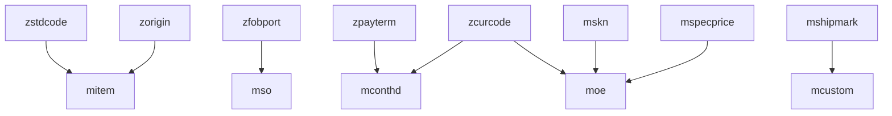

# Supporting Tables - Detailed Schemas

## Quantity Breakdown Tables

### mqtybrk (Quantity Breakdown)

**Purpose:** Stores quantity breakdowns by size, color, style for OE items

**Key Fields (inferred from usage):**
- `oe_no` (C) - Order Enquiry number (links to moe)
- `item_no` (C) - Item number (links to mitem)
- `size_code` (C) - Size code
- `color_code` (C) - Color code
- `style_code` (C) - Style code
- `qty` (N) - Quantity for this breakdown
- `user_id` (C) - User who created

**Business Rules:**
- One record per size/color/style combination per item
- Created during OE import or manual entry
- Used for detailed quantity tracking

**File Size:** 15MB (large table)

**Indexes:**
- Primary: `oe_no` + `item_no` + `size_code` + `color_code`

**Code Reference:** `uoexls_2013.prg` (lines 67-71, 217)

## Code and Reference Tables

### zstdcode (Standard Code)

**Purpose:** Standard classification codes for items

**Key Fields:**
- `std_code` (C) - Standard code (Primary Key)
- `std_desp` (C) - Standard code description

**Business Rules:**
- Used to classify items
- Referenced in `mitem.std_code`
- Used in reports and analysis

**Code Reference:** `xitem.prg` (lines 59-64)

### zorigin (Country of Origin)

**Purpose:** Country of origin codes

**Key Fields:**
- `origin_code` (C) - Origin code (Primary Key)
- `origin_name` (C) - Origin name

**Business Rules:**
- Used for item origin tracking
- Referenced in `mitem.origin`

### zfobport (FOB Port)

**Purpose:** FOB (Free On Board) port codes

**Key Fields:**
- `port_code` (C) - Port code (Primary Key)
- `port_name` (C) - Port name
- `port_location` (C) - Port location

**Business Rules:**
- Used in shipping orders
- Referenced in contract and SO records

### zfobterm (FOB Terms)

**Purpose:** FOB terms definitions

**Key Fields:**
- `term_code` (C) - Term code (Primary Key)
- `term_desp` (C) - Term description

**Business Rules:**
- Used for shipping terms
- Referenced in contracts

### zpayterm (Payment Terms)

**Purpose:** Payment terms codes

**Key Fields:**
- `pay_code` (C) - Payment code (Primary Key)
- `pay_desp` (C) - Payment description

**Business Rules:**
- Used in contracts
- Referenced in `mconthd.payment`

### zcurcode (Currency Code)

**Purpose:** Currency codes

**Key Fields:**
- `cur_code` (C) - Currency code (Primary Key)
- `cur_name` (C) - Currency name
- `cur_rate` (N) - Exchange rate (if applicable)

**Business Rules:**
- Used throughout transaction tables
- Referenced in `moe.cur_code`, `mconthd.cur_code`

### zpurunit (Purchase Unit)

**Purpose:** Purchase unit codes

**Key Fields:**
- `unit_code` (C) - Unit code (Primary Key)
- `unit_desp` (C) - Unit description

**Business Rules:**
- Used for item units
- Referenced in `moe.unit`

### zcountry (Country)

**Purpose:** Country codes

**Key Fields:**
- `country_code` (C) - Country code (Primary Key)
- `country_name` (C) - Country name

**Business Rules:**
- Used for addresses and origin
- Alternative to `zorigin`

## Shipping and Logistics Tables

### mshipmark (Shipping Mark)

**Purpose:** Shipping mark templates

**Key Fields:**
- `mark_code` (C) - Mark code (Primary Key)
- `mark_desp` (M) - Mark description (memo)
- `cust_no` (C) - Customer number (links to mcustom)

**Business Rules:**
- Customer-specific shipping marks
- Stored in `mcustom.shipmark` (constructed from multiple fields)
- Used in shipping documents

**Code Reference:** `xcustom.prg` (lines 45-50)

### mshipqty (Shipping Quantity)

**Purpose:** Shipping quantity tracking

**Key Fields:**
- `so_no` (C) - Shipping Order number
- `item_no` (C) - Item number
- `qty` (N) - Shipping quantity

**Business Rules:**
- Tracks quantities shipped
- Links to shipping orders

## Pricing Tables

### mspecprice (Special Pricing)

**Purpose:** Special pricing rules

**Key Fields:**
- `item_no` (C) - Item number (links to mitem)
- `cust_no` (C) - Customer number (links to mcustom)
- `price` (N) - Special price
- `date_from` (D) - Effective date from
- `date_to` (D) - Effective date to

**Business Rules:**
- Customer/item specific pricing
- Date range validation
- Overrides standard item price

**Code Reference:** `zspecprice.prg`

## SKN and Numbering Tables

### mskn (SKN Number)

**Purpose:** SKN (Stock Keeping Number) mapping

**Key Fields:**
- `skn_no` (C) - SKN number (Primary Key)
- `item_no` (C) - Item number (links to mitem)
- `cust_no` (C) - Customer number (links to mcustom)

**Business Rules:**
- Maps customer SKN to item numbers
- Customer-specific item numbering
- Used during OE import

**Code Reference:** `uoexls_2013.prg` (lines 55-59), `get_skn.prg`

## System and Configuration Tables

### zpara (System Parameters)

**Purpose:** System-wide configuration parameters

**Key Fields:**
- `para_code` (C) - Parameter code (Primary Key)
- `para_value` (C) - Parameter value
- `para_desp` (C) - Parameter description

**Business Rules:**
- System configuration storage
- Referenced throughout application
- May include company settings, defaults

### zsoformat (Shipping Order Format)

**Purpose:** Customizable SO format definitions

**Key Fields:**
- `so_key` (C) - Format key (Primary Key)
- `uniqueid` (C) - Unique identifier
- `vpos` (N) - Vertical position
- `hpos` (N) - Horizontal position
- `height` (N) - Height
- `width` (N) - Width

**Business Rules:**
- Customer-specific SO formats
- Used for custom SO printing
- Referenced in `pso.prg`

**Code Reference:** `pso.prg` (lines 4-7)

### zvencon (Vendor Conversion)

**Purpose:** Vendor code conversion mapping

**Key Fields:**
- `old_vendor_no` (C) - Old vendor number
- `new_vendor_no` (C) - New vendor number

**Business Rules:**
- Used for vendor code migration
- Data conversion utility

## Activity and Audit Tables

### mactivity (Activity Log)

**Purpose:** System activity tracking

**Key Fields:**
- `activity_id` (C) - Activity ID (Primary Key)
- `user_id` (C) - User ID
- `activity_type` (C) - Activity type
- `activity_date` (D) - Activity date
- `activity_time` (C) - Activity time
- `description` (M) - Activity description

**Business Rules:**
- Tracks user activities
- Audit trail functionality
- May track OE creation, posting, etc.

## User and Security Tables

### user (User Accounts)

**Purpose:** User account information

**Key Fields:**
- `user_id` (C) - User ID (Primary Key)
- `password` (C) - Password (likely plain text)
- `user_name` (C) - User name
- `user_right` (C) - User rights (SUPERVISOR/REGULAR_USER)
- `active` (L) - Active flag

**Business Rules:**
- Used for authentication
- `user_right` determines menu access
- Referenced in login process

**Code Reference:** `main.prg` (line 27), `iuser` form

### rights (User Rights)

**Purpose:** Additional rights/permissions (if used)

**Key Fields:**
- `user_id` (C) - User ID (links to user)
- `right_code` (C) - Right code
- `right_value` (L) - Right value (granted/denied)

**Business Rules:**
- Granular permission control (if implemented)
- May extend beyond SUPERVISOR/REGULAR_USER roles

## Other Supporting Tables

### zttrgp (TTR Group)

**Purpose:** TTR (Testing/Inspection/Sample Approval) groups

**Key Fields:**
- `ttr_code` (C) - TTR code (Primary Key)
- `ttr_desp` (C) - TTR description

**Business Rules:**
- Customer testing/inspection groups
- Referenced in customer setup

### zchgso (Change Shipping Order)

**Purpose:** SO change tracking

**Key Fields:**
- `so_no` (C) - Shipping Order number
- `change_date` (D) - Change date
- `change_reason` (M) - Change reason

**Business Rules:**
- Tracks SO modifications
- Audit trail for SO changes

### zchitem (Change Item)

**Purpose:** Item change tracking

**Key Fields:**
- `item_no` (C) - Item number
- `change_date` (D) - Change date
- `old_value` (C) - Old value
- `new_value` (C) - New value

**Business Rules:**
- Tracks item modifications
- Used for data conversion

## Table Usage Summary

### Frequently Used Supporting Tables

| Table | Usage | Size |
|-------|-------|------|
| mqtybrk | Quantity breakdowns | 15MB |
| zstdcode | Item classification | Small |
| zfobport | Shipping ports | Small |
| zpayterm | Payment terms | Small |
| mshipmark | Shipping marks | Small |
| mspecprice | Special pricing | Small |
| mskn | SKN mapping | Small |
| zpara | System parameters | Small |
| user | User accounts | Small |
| rights | User rights | Small |

### Lookup Table Pattern

Most supporting tables follow this pattern:
- **Code field** (Primary Key) - Short code
- **Description field** - Human-readable description
- **Optional fields** - Additional attributes

### Reference Data Flow

## Data Maintenance

### Code Tables
- Typically maintained through admin forms
- Changes require validation
- May affect existing transactions

### Configuration Tables
- `zpara` - System-wide settings
- `zsoformat` - Customer-specific formats
- Changes may require application restart

### Audit Tables
- `mactivity` - Append-only
- Historical record
- May require periodic archiving

