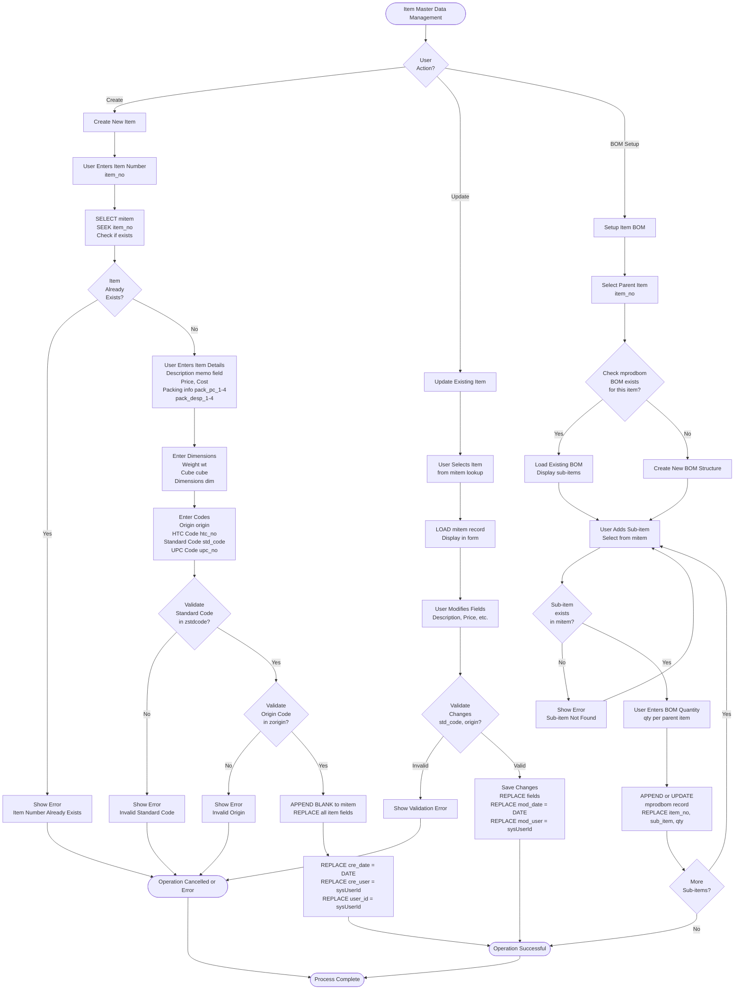
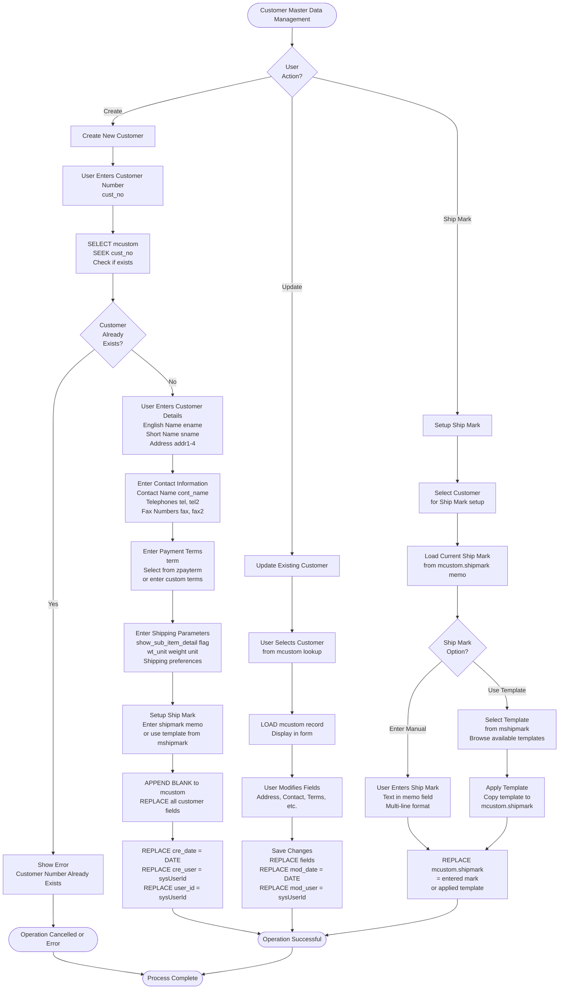
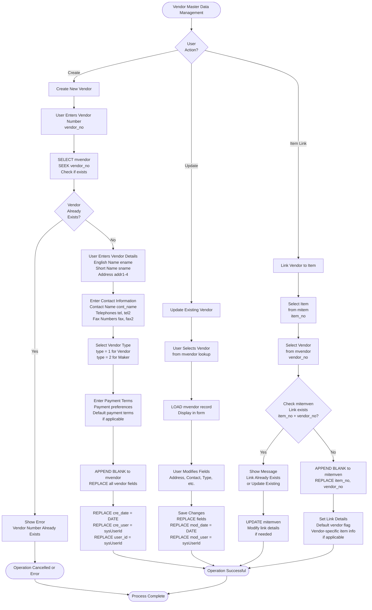

# Master Data Management

## Overview

Master data management covers the creation and maintenance of items, customers, vendors, and supporting reference data. This data forms the foundation for all transactions.

## Item Creation and Maintenance

### Item Entry Form

**Form:** `iitem` (Input Item)

### Item Master Data Management Detailed Flow

**Code Reference:** Form `iitem` - Item entry form, Form `iprodbom` - BOM setup

### Item Import

**Form:** `uimport_item` (Import Item)

**Source:** Excel file or legacy `item.dbf`

**Process:**
1. Load source file
2. Map fields to `mitem` structure
3. Validate data
4. Import items

**Code Reference:** `xitem.prg` (legacy import from `item.dbf`)

### Item Fields

**Key Fields:**
- `item_no` - Item number (Primary Key)
- `desp` - Description (memo)
- `price` - Standard price
- `cost` - Cost
- `pack_pc_1-4` - Pack pieces (4 levels)
- `pack_desp_1-4` - Pack descriptions
- `wt` - Weight
- `cube` - Cube measurement
- `origin` - Country of origin
- `htc_no` - HTC/Harmonized Tariff Code
- `std_code` - Standard code
- `upc_no` - UPC barcode

### Item Validation

**Rules:**
- `item_no` must be unique
- `std_code` validated against `zstdcode`
- HTC code extracted from origin fields
- UPC constructed from multiple fields

### Item BOM Setup

**Form:** `iprodbom` (Product BOM)

**Process:**
1. Select parent item
2. Add sub-items
3. Set quantities per parent
4. Save to `mprodbom`

**Usage:**
- Define product structures
- Used in OE/OC/Contract processing
- Automatic quantity calculation

### Item Manufacturer

**Form:** `iitemmftr@` (Input Item Manufacturer)

**Process:**
1. Select item
2. Add manufacturer
3. Link in `mitemmftr` table

### Item Vendor Relationships

**Table:** `mitemven`

**Purpose:** Define which vendors can supply which items

**Process:**
1. Select item
2. Add vendor
3. Set vendor-specific details
4. Save to `mitemven`

**Usage:**
- Contract generation (vendor grouping)
- OE validation
- Vendor capability tracking

## Customer Setup

### Customer Entry Form

**Form:** `icustom` (Input Customer)

### Customer Master Data Management Detailed Flow

**Code Reference:** Form `icustom` - Customer entry form

### Customer Import

**Source:** Legacy `cus.dbf` table

**Filter:** `C_cname = "CUSTOMER" or "TRADING"`

**Process:**
1. Load from legacy system
2. Map fields to `mcustom`
3. Construct ship mark from memo fields
4. Import customers

**Code Reference:** `xcustom.prg` (lines 1-54)

### Customer Fields

**Key Fields:**
- `cust_no` - Customer number (Primary Key)
- `ename` - English name
- `sname` - Short name
- `addr1-4` - Address lines
- `cont_name` - Contact name
- `tel`, `tel2` - Telephones
- `fax`, `fax2` - Fax numbers
- `term` - Payment terms
- `shipmark` - Shipping mark (memo)
- `show_sub_item_detail` - Display flag

### Customer Invoice Parameters

**Form:** `icustinv` (Customer Invoice Parameter)

**Purpose:** Customer-specific invoice settings

### Customer Shipment Parameters

**Form:** `ishippara` (Customer Shipment Parameter)

**Purpose:** Customer-specific shipping settings

### Customer SKN

**Form:** `iskn` (SKN No.)

**Purpose:** Map customer SKN numbers to item numbers

**Table:** `mskn`

**Usage:**
- Customer-specific item numbering
- OE import mapping

## Vendor Setup

### Vendor Entry Form

**Form:** `ivendor` (Input Vendor)

### Vendor Master Data Management Detailed Flow

**Code Reference:** Form `ivendor` - Vendor entry form, Item-Vendor linking logic

### Vendor Import

**Source:** Legacy `cus.dbf` table

**Filter:** `C_CNAME="VENDOR" or "MAKER"`

**Process:**
1. Load from legacy system
2. Map fields to `mvendor`
3. Set type (1=Vendor, 2=Maker)
4. Import vendors

**Code Reference:** `xvendor.prg` (lines 1-49)

### Vendor Fields

**Key Fields:**
- `vendor_no` - Vendor number (Primary Key)
- `ename` - English name
- `sname` - Short name
- `addr1-4` - Address lines
- `cont_name` - Contact name
- `tel`, `tel2` - Telephones
- `fax`, `fax2` - Fax numbers
- `type` - Type (1=Vendor, 2=Maker)

### Manufacturer Entry

**Form:** `imftr` (Input Manufacturer)

**Table:** `zmftr`

**Purpose:** Separate manufacturer information from vendors

## Supporting Data Management

### Standard Code

**Form:** `izstdcode` (Standard Code)

**Table:** `zstdcode`

**Purpose:** Item classification codes

### Country of Origin

**Form:** `izorigin` (Country of Origin)

**Table:** `zorigin`

**Purpose:** Origin codes for items

### FOB Port

**Form:** `ifobport` (FOB Port)

**Table:** `zfobport`

**Purpose:** FOB port definitions

### Payment Terms

**Form:** `ipayterm` (Payment Terms)

**Table:** `zpayterm`

**Purpose:** Payment term codes

### FOB Terms

**Form:** `ifobterm` (FOB Terms)

**Table:** `zfobterm`

**Purpose:** FOB term definitions

### Purchase Unit

**Form:** `ipurunit` (Purchase Unit)

**Table:** `zpurunit`

**Purpose:** Purchase unit codes

### Ship Mark

**Form:** `ishipmark` (Ship Mark)

**Table:** `mshipmark`

**Purpose:** Shipping mark templates

## Data Conversion Processes

### Vendor Code Conversion

**Form:** `zvencon` (Vendor Code Conversion)

**Table:** `zvencon`

**Process:**
1. Map old vendor codes to new codes
2. Update all references
3. Maintain conversion history

### Item Number Change

**Form:** `zchange_item` (Change Item No.)

**Process:**
1. Select old item number
2. Enter new item number
3. Update all transaction references
4. Maintain change history

### Customer Number Change

**Form:** `ichangecustno` (Change Customer No.)

**Process:**
1. Select customer
2. Change customer number
3. Update all transaction references
4. Validate no duplicates

## Data Validation

### Item Validation

**Rules:**
- Item number must be unique
- Standard code must exist
- HTC code format validation
- UPC code format validation

### Customer Validation

**Rules:**
- Customer number must be unique
- Address fields required
- Contact information validation

### Vendor Validation

**Rules:**
- Vendor number must be unique
- Type must be 1 (Vendor) or 2 (Maker)
- Address fields required

## Data Maintenance

### Reindexing

**Utility:** `zdoc.prg`

**Process:**
1. Reindex all master data tables
2. Rebuild indexes for fast lookups
3. Verify data integrity

### Data Recovery

**Form:** `systemtools.prg`

**Purpose:** Recover corrupted data
- Rebuild indexes
- Fix data inconsistencies
- Restore from backups

### Delete Data

**Form:** `zdel_data` (Delete Data)

**Purpose:** Delete obsolete data
- Archive old records
- Clean up temporary data
- Maintain data hygiene

## Summary

Master data management is the foundation of the trading system. It handles items, customers, vendors, and all supporting reference data. The system supports both manual entry and import from legacy systems, with validation and conversion tools to maintain data integrity.

