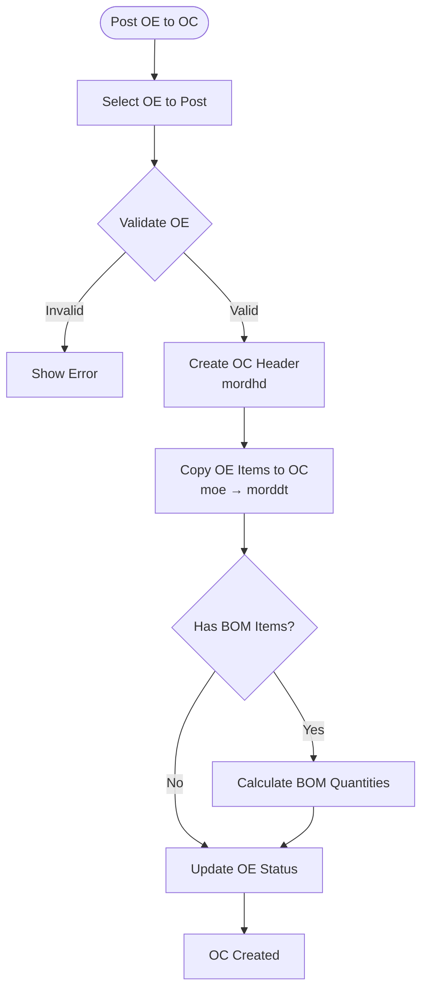

# Order Confirmation Process

## Overview

Order Confirmation (OC) represents confirmed customer orders. OCs are created by posting Order Enquiries (OE) and serve as the basis for contract generation.

## Post OE to OC Workflow

### Process Flow



### Step 1: Select OE

**Form:** `upostoe` (Post OE/Post OC)

**Process:**
1. User selects OE number(s) to post
2. System validates OE exists and is postable
3. System checks for duplicate postings

### Step 2: Create OC Header

**Table:** `mordhd` (Order Confirmation Header)

**Fields Created:**
- `conf_no` - Order Confirmation number (generated)
- `date` - Confirmation date
- `cust_no` - Customer number (from OE)

**Business Rules:**
- One OC header per posting
- OC number generated from OE or sequential
- Date set to posting date or OE date

### Step 3: Copy OE Items to OC

**Tables:** `moe` → `morddt`

**Fields Copied:**
- `item_no` - Item number
- `qty` - Quantity
- `ctn` - Carton quantity
- `price` - Price
- `po_no` - Purchase Order number
- `oe_no` - Original OE number (for reference)

**Code Reference:** `uordcont.prg` (lines 14-19)

### Step 4: BOM Processing

**Process:**
1. Check if item has BOM in `mprodbom`
2. If yes:
   - Set `head = .T.` for parent item
   - Create sub-item records with `head = .F.`
   - Calculate sub-item quantities

**Quantity Calculation:**
```foxpro
SELECT sum(qty) as total_qty
FROM baitin!mprodbom 
WHERE alltrim(Mprodbom.item_no) == alltrim(morddt.item_no)

if sum_qty.total_qty > 0
    w_head_item = morddt.item_no
    w_head_qty = morddt.qty
    select morddt
    skip
    do while morddt.head = .f.
        select mprodbom
        locate for alltrim(mprodbom.item_no)==alltrim(w_head_item) and;
                    alltrim(mprodbom.sub_item)==alltrim(morddt.item_no)
        select morddt        
        replace morddt.qty with w_head_qty * mprodbom.qty / sum_qty.total_qty
        skip
    enddo     
endif
```

**Code Reference:** `uordcont.prg` (lines 40-56)

### Step 5: Update OE Status

**Process:**
1. Mark OE as posted
2. Update OE status field
3. Link OE to OC (via `morddt.oe_no`)

## Data Transformation Rules

### Field Mappings

| OE Field (moe) | OC Field (morddt) | Transformation |
|----------------|-------------------|----------------|
| `oe_no` | `oe_no` | Direct copy (reference) |
| `item_no` | `item_no` | Direct copy |
| `qty` | `qty` | Direct copy (may be adjusted for BOM) |
| `ctn` | `ctn` | Direct copy |
| `price` | `price` | Direct copy |
| `po_no` | `po_no` | Direct copy |
| `cust_no` | `cust_no` | Copied to header (`mordhd`) |

### Quantity Adjustments

**BOM Items:**
- Parent item: Original quantity
- Sub-items: Calculated from BOM ratios

**Formula:**
```
sub_item_qty = (head_qty * bom_qty) / total_bom_qty
```

## Confirmation Numbering

### Number Generation

**Methods:**
1. **Sequential:** Generate next number in sequence
2. **OE-based:** Use OE number as base
3. **Custom:** User-defined format

### Number Format

- Format varies by company
- May include prefixes/suffixes
- Must be unique

## Status Updates

### OE Status

**After Posting:**
- OE marked as posted
- Status field updated
- Cannot be posted again (validation)

### OC Status

**Initial Status:**
- Created
- Ready for contract generation

**Status Transitions:**
```
Created → Confirmed → Contracted → Shipped → Invoiced
```

## Validation Rules

### Pre-Posting Validation

1. **OE Exists:**
   - OE must exist in `moe` table
   - OE must not be already posted

2. **Items Valid:**
   - All items must exist in `mitem`
   - Quantities must be positive
   - Prices must be valid

3. **Customer Valid:**
   - Customer must exist in `mcustom`
   - Customer must match OE customer

### Post-Posting Validation

1. **OC Created:**
   - OC header exists
   - OC details match OE

2. **BOM Calculated:**
   - BOM quantities correct
   - Sub-items created

## Manual OC Entry

### Form: `iordhd` (Input Order Confirmation)

**Process:**
1. User enters OC number manually
2. User enters customer
3. User enters date
4. User enters items manually
5. System validates and saves

**Use Case:**
- Direct OC entry (without OE)
- OC amendments
- Manual corrections

## OC Updates

### Update Process

**Form/Program:** `uordcont.prg`

**Process:**
1. Select OC to update
2. Update quantities, prices, PO numbers
3. Recalculate BOM quantities if needed
4. Save changes

**Code Reference:** `uordcont.prg` (lines 11-31)

### Update Rules

**Allowed Updates:**
- Quantities
- Prices
- PO numbers
- Carton quantities

**BOM Recalculation:**
- If quantities change, BOM quantities recalculated
- Sub-item quantities adjusted proportionally

## OC to Contract Link

### Relationship

**OC → Contract:**
- `mcontdt.conf_no` links to `mordhd.conf_no`
- Contracts generated from OC items
- One OC can generate multiple contracts (by vendor)

**Code Reference:** `uwcontract.prg` (lines 18-23)

## Reporting

### OC Reports

1. **Order Confirmation Report:**
   - Form: `pconfirm`
   - Shows OC header and details
   - Printable format

2. **OC Qty Breakdown:**
   - Form: `pocbrk`
   - Shows quantity breakdowns by PO

3. **OC Summary:**
   - Form: `eocsumry`
   - Summary of OCs by date/customer

## Error Handling

### Posting Errors

**OE Not Found:**
- Error: OE does not exist
- Action: Cannot post

**Items Invalid:**
- Error: Item not found
- Action: Item line skipped or error shown

**BOM Calculation Errors:**
- Error: BOM data inconsistent
- Action: Use default quantities or error

## Summary

The Order Confirmation process transforms customer enquiries into confirmed orders. It handles BOM calculations, maintains data integrity, and prepares orders for contract generation. The process supports both automated posting from OE and manual entry.


