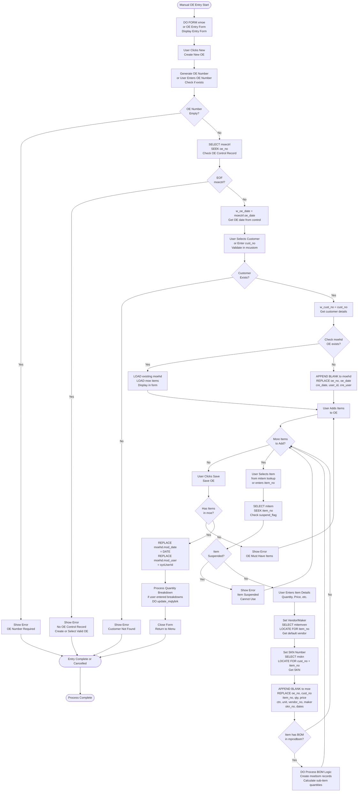
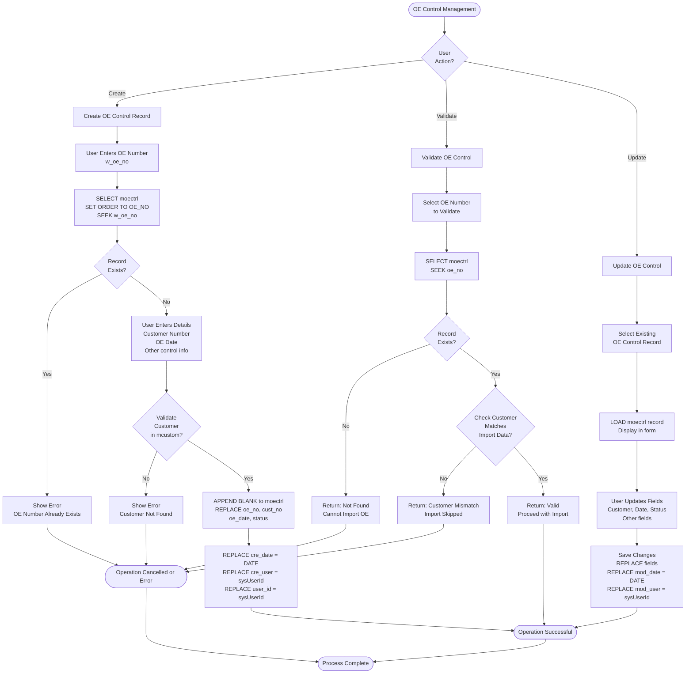

# Order Enquiry Process

## Overview

Order Enquiry (OE) is the entry point for customer orders. OEs can be created through Excel import or manual entry, and go through validation, processing, and posting workflows.

## OE Creation Methods

### 1. Excel Import

**Primary Method:** Most OEs are imported from Excel files

**Supported Formats:**
- Standard Excel format
- Walmart XLS format
- CSV format (2013)
- XLS format (2013)
- Multi-item block format
- New format Excel file

**Forms/Programs:**
- `uoexls` - Standard Excel import
- `uoexls_2013` - 2013 CSV format (1,747 lines - most complex)
- `uoexls_2013_xls` - 2013 XLS format
- `uoexls2` - Multi-item block format
- `unewoexls` - New format Excel
- `uwalxls` - Walmart format

**Code Reference:** `uoexls_2013.prg` (primary import logic)

### 2. Manual Entry

**Form:** `ioe1@` (Input OE New)

**Process:**
1. User enters OE number
2. System validates OE Control record
3. User enters items manually
4. System validates items and quantities
5. OE saved to database

## OE Validation Rules

### OE Control Record Validation

**Requirement:** OE must have control record in `moectrl` table

**Exception:** INSP company (adds "IN-" prefix automatically)

**Validation Logic (from `uoexls_2013.prg` lines 148-156):**
```foxpro
IF ALLTRIM(w_password)="INSP"
    w_oe_no="IN-"+ALLTRIM(w_oe_no)   
ELSE 
    select moectrl
    set order to OE_NO
    seek w_oe_no
    if eof()
        messagebox(w_oe_no+" --- No OE Control Record"+ chr(10)+"Import Skipped", 0+16, "Syster Message")
        loop
    ENDIF
ENDIF
```

**Business Rules:**
- OE Control record must exist before import (except INSP)
- OE number must match control record
- Customer code must match (validated separately)

### Customer Validation

**Requirement:** Customer code must exist in `mcustom` and match OE Control

**Validation Logic (lines 177-184):**
```foxpro
IF ALLTRIM(w_password)<>"INSP"
    if alltrim(w_cust_no)<>alltrim(moectrl.cust_no) and !empty(w_oe_no)
        messagebox("OE No.:"+alltrim(w_oe_no) +" --- OE Control Record Cust Code Not Match"+ chr(10)+"Import Skipped", 0+16, "Syster Message")
        loop
    ENDIF
ENDIF
```

**Additional Check (lines 185-190):**
```foxpro
select mcustom
locate for alltrim(mcustom.cust_no)== alltrim(w_cust_no)
w_show_sub_item=''
if !eof()
   w_show_sub_item = mcustom.show_sub_item_detail
endif
```

**Business Rules:**
- Customer must exist in `mcustom`
- Customer code from Excel must match OE Control customer
- Customer's `show_sub_item_detail` setting affects display

### Item Validation

**Requirement:** All items must exist in `mitem` table

**Validation Logic:**
- Items checked against `mitem` table
- Item number must match exactly
- Item must be active (not suspended)

**Code Reference:** `uoexls_2013.prg` (lines 22-28)

## Excel Import Process (uoexls_2013.prg)

This is the most complex import process with 1,747 lines of code handling multiple Excel formats, dynamic field detection, validation, and data processing.

### Excel Import Detailed Flow

```mermaid
flowchart TD
    Start([Excel Import Start]) --> InitPublicVars[Initialize Public Variables<br/>w_field_no, n_item, n_qty, w_cust_no<br/>w_head, field_array, etc.]
    InitPublicVars --> InitDefaults[w_oe_date = CTOD 01/01/01<br/>wh_item_no = empty<br/>w_head = .F.<br/>w_oe_prefix = empty]
    InitDefaults --> OpenMasterTables[Open Master Tables<br/>USE mitem SET ORDER TO item_no<br/>USE mcustom<br/>USE moectrl<br/>USE moehd<br/>USE moe<br/>USE mskn, mitemven, mqtybrk<br/>USE moebom, mprodbom SET ORDER TO iprodbom<br/>USE mvendor, zmftr]
    OpenMasterTables --> OpenTempTables[Open Temporary Tables<br/>USE woexlst<br/>USE woexls EXCLUSIVE<br/>USE wsknlog, wsuspend]
    OpenTempTables --> SetDetailPos[w_detail_pos = 1<br/>DO locate_detail_record]
    
    SetDetailPos --> LocateDetailLoop[DO WHILE !EOF woexls<br/>Search for OENO in f01<br/>Store position to w_detail_pos<br/>Exit when found]
    LocateDetailLoop --> ExtractOENumbers[SELECT DISTINCT woexlst.f01<br/>FROM woexlst<br/>WHERE RECNO >= w_detail_pos + 1<br/>INTO CURSOR voeno]
    
    ExtractOENumbers --> OELoopStart{More OE Numbers<br/>in voeno?}
    OELoopStart -->|No| EndImport[Import Complete]
    OELoopStart -->|Yes| GetOENumber[w_oe_no = ALLTRIM voeno.f01<br/>w_oe_no_save = w_oe_no]
    
    GetOENumber --> CheckOEEmpty{OE Number<br/>Empty?}
    CheckOEEmpty -->|Yes| SkipOE[SKIP voeno<br/>Continue Loop]
    CheckOEEmpty -->|No| CheckCompany{w_password<br/>== INSP?}
    
    CheckCompany -->|Yes| AddINPrefix[w_oe_no = IN- + ALLTRIM w_oe_no<br/>Skip OE Control Check]
    CheckCompany -->|No| ValidateOEControl[SELECT moectrl<br/>SET ORDER TO OE_NO<br/>SEEK w_oe_no]
    
    ValidateOEControl --> EOFCheck{EOF moectrl?}
    EOFCheck -->|Yes| ShowError1[MESSAGEBOX<br/>w_oe_no + No OE Control Record<br/>Import Skipped]
    EOFCheck -->|No| ClearWOEXLS[ZAP woexls<br/>Clear temporary table]
    ShowError1 --> SkipOE
    
    AddINPrefix --> ClearWOEXLS
    ClearWOEXLS --> AppendFirstRow[APPEND FROM woexlst<br/>FOR RECNO = 1<br/>Append header row]
    AppendFirstRow --> CallAppendWOEXLS[DO append_woexls<br/>Dynamic Field Detection]
    
    CallAppendWOEXLS --> DetectItemField[Detect ITEM Field<br/>DO WHILE w_field_no < 50<br/>Search for ITEM in field names<br/>Store field position to n_item]
    DetectItemField --> DetectSubSKN[Detect SUB SKN Field<br/>Search for SUB SKN or SUB SKU #]
    DetectSubSKN --> DetectSKU[Detect SKU Field<br/>Search for SKU #]
    DetectSKU --> GroupItems[SELECT FROM woexlst<br/>GROUP BY f01, n_item<br/>WHERE f01 = w_oe_no_save<br/>AND SUB SKN = SEE BELOW or empty<br/>INTO CURSOR vtempoe]
    
    GroupItems --> ItemGroupLoop{Process Each<br/>Item Group}
    ItemGroupLoop -->|More| ScatterToArray[SCATTER TO field_array<br/>APPEND BLANK to woexls<br/>GATHER FROM field_array]
    ScatterToArray --> CheckSEEBELOW{SUB SKN ==<br/>SEE BELOW?}
    CheckSEEBELOW -->|Yes| ProcessSubItems[LOCATE next records<br/>DO WHILE SKU == SEE ABOVE<br/>Append sub-item rows to woexls]
    CheckSEEBELOW -->|No| ItemGroupLoop
    ProcessSubItems --> ItemGroupLoop
    ItemGroupLoop -->|No More| CallSetQTY[DO set_qty<br/>Detect Quantity Field]
    
    CallSetQTY --> DetectQTYField[Search for TOTAL PIECE<br/>TOTAL QTY, TOT PIECE, TOT QTY<br/>Store to n_qty]
    DetectQTYField --> DetectItemField2[Re-detect ITEM field position<br/>Store to n_item_no]
    DetectItemField2 --> ProcessQtyAggregate[For each item in woexls<br/>SUM quantities from woexlst<br/>MIN/MAX dates for shipping<br/>REPLACE aggregated values]
    ProcessQtyAggregate --> CallFindCustNo[DO find_cust_no<br/>Extract Customer Number]
    
    CallFindCustNo --> FindCustLoop[Search woexls from w_detail_pos<br/>DO WHILE w_field_no < 50<br/>Search for CUST in field names<br/>Store customer to w_cust_no]
    FindCustLoop --> CheckCompany2{w_password<br/>== INSP?}
    
    CheckCompany2 -->|Yes| FindOEDate[DO find_oe_date<br/>Extract OE Date from Excel]
    CheckCompany2 -->|No| GetDateFromCtrl[w_oe_date = moectrl.oe_date]
    
    FindOEDate --> ValidateCustomer
    GetDateFromCtrl --> ValidateCustomer{Company != INSP<br/>AND Customer !=<br/>moectrl.cust_no?}
    
    ValidateCustomer -->|Yes| ShowCustError[MESSAGEBOX<br/>OE Control Cust Code Not Match<br/>Import Skipped]
    ValidateCustomer -->|No| ValidateCustMaster[SELECT mcustom<br/>LOCATE FOR cust_no == w_cust_no<br/>Get show_sub_item_detail]
    ShowCustError --> SkipOE
    
    ValidateCustMaster --> CheckDelRepeat{w_del_repeat<br/>== .T.?}
    CheckDelRepeat -->|Yes| DeleteOldOE[DELETE FROM moehd<br/>WHERE oe_no == w_oe_no<br/>DELETE FROM moe<br/>DELETE FROM moebom<br/>DELETE FROM mqtybrk]
    CheckDelRepeat -->|No| CheckOEHD
    DeleteOldOE --> CheckOEHD{Check moehd<br/>record exists}
    
    CheckOEHD -->|EOF| CreateOEHD[APPEND BLANK to moehd<br/>REPLACE oe_no, oe_date<br/>cre_date, user_id, cre_user]
    CheckOEHD -->|Found| UpdateOEHD[Update existing moehd record]
    CreateOEHD --> FindPONo
    UpdateOEHD --> FindPONo[DO find_po_no<br/>Extract PO Number]
    
    FindPONo --> FindFieldNames[DO find_field_name<br/>Detect all field positions<br/>SKN, SUB SKN, INNER, MASTER<br/>QTY, CTN, PRICE, RETAIL1, RETAIL2<br/>MAKER, VENDOR, etc.]
    FindFieldNames --> CallUpdateMOE[DO update_moe<br/>Process Each Item]
    
    CallUpdateMOE --> ItemLoop{More Items<br/>in woexls?}
    ItemLoop -->|No| CallUpdateMQTYBRK
    ItemLoop -->|Yes| GetItem[Get next item from woexls<br/>Position = w_detail_pos + 1]
    
    GetItem --> CheckItemEmpty{Item Number<br/>Empty?}
    CheckItemEmpty -->|Yes| SkipItem[SKIP woexls<br/>Continue Loop]
    CheckItemEmpty -->|No| ValidateItem[SELECT mitem<br/>SEEK item_no<br/>Check suspend_flag]
    
    ValidateItem --> ItemSuspended{Item<br/>Suspended?}
    ItemSuspended -->|Yes| AddToSuspended[APPEND BLANK to wsuspend<br/>Store item_no<br/>Skip item]
    ItemSuspended -->|No| CallSetRemark[DO set_remark<br/>Extract remarks and retail prices]
    
    AddToSuspended --> SkipItem
    CallSetRemark --> CheckSubSKN{SUB SKN empty<br/>OR == SEE BELOW?}
    
    CheckSubSKN -->|Yes| SetHeadItem[w_head = .T.<br/>wh_item_no = item_no]
    CheckSubSKN -->|No| SetSubItem[w_head = .F.]
    
    SetHeadItem --> CheckIsSubItem{Is Sub Item?<br/>SUB SKN != item_no<br/>AND w_head != .T.?}
    SetSubItem --> CheckIsSubItem
    
    CheckIsSubItem -->|Yes| CreateMOEBOM[APPEND BLANK to moebom<br/>REPLACE oe_no, item_no<br/>sub_item, qty, price<br/>SKN, retail, remark]
    CreateMOEBOM --> CheckMprodbom{moebom.item_no<br/>== sub_item?}
    CheckMprodbom -->|No| SeekMprodbom[SELECT mprodbom<br/>SEEK item_no + sub_item]
    SeekMprodbom --> FoundBOM{Found<br/>in mprodbom?}
    FoundBOM -->|No| CreateMprodbom[APPEND BLANK to mprodbom<br/>REPLACE item_no, sub_item, qty]
    FoundBOM -->|Yes| UpdateMprodbom[REPLACE qty with MASTER value]
    CreateMprodbom --> CheckHeadFlag
    UpdateMprodbom --> CheckHeadFlag{w_head<br/>== .T.?}
    
    CheckIsSubItem -->|No| CheckHeadFlag
    CheckHeadFlag -->|Yes| UpdateExistingMoe[LOCATE moe WHERE<br/>oe_no == w_oe_no<br/>AND item_no == wh_item_no<br/>REPLACE dates, costs, remarks]
    CheckHeadFlag -->|No| CallAppendMOE
    UpdateExistingMoe --> CallAppendMOE[DO append_moe<br/>Create moe record]
    
    CallAppendMOE --> AppendMoeRecord[APPEND BLANK to moe<br/>DO set_packing<br/>DO set_vendor_maker<br/>DO set_skn]
    AppendMoeRecord --> SetMoeFields[REPLACE moe fields<br/>oe_no, cust_no, item_no<br/>ctn, qty, unit, price<br/>chester, retail prices<br/>po_no, item_desc, pack fields]
    SetMoeFields --> SetCompanyCode{Set oc_no based on<br/>w_password:<br/>HT: HT-OC/+oe_no<br/>BAT: BTL-+oe_no<br/>HFW: HFW-OC/+oe_no<br/>INSP: IN-OC/+oe_no}
    SetCompanyCode --> SetAuditFields[REPLACE date, user_id<br/>l_mod_date, l_mod_time<br/>comp_code]
    SetAuditFields --> SkipItem
    SkipItem --> ItemLoop
    
    CallUpdateMQTYBRK[DO update_mqtybrk<br/>Process Quantity Breakdowns] --> DetectPortCode[Detect PORT CODE field<br/>If found, process breakdowns]
    DetectPortCode --> QtyBrkLoop{Process Quantity<br/>Breakdowns}
    QtyBrkLoop --> CreateMQTYBRK[For each port/item combination<br/>APPEND BLANK to mqtybrk<br/>REPLACE oe_no, item_no, port<br/>po_no, del_from, del_to, qty]
    CreateMQTYBRK --> QtyBrkLoop
    
    DetectPortCode --> CallProcessMOE[DO Process_Moe<br/>Handle BOM Items]
    QtyBrkLoop --> CallProcessMOE
    
    CallProcessMOE --> BOMProcessLoop[SELECT moe<br/>SET ORDER TO ioe<br/>SEEK w_oe_no]
    BOMProcessLoop --> BOMLoop{More moe records<br/>with this oe_no?}
    BOMLoop -->|No| CallProcessQtyBreakdown
    BOMLoop -->|Yes| GetMOERecord[Get next moe record]
    GetMOERecord --> CheckHasMOEBOM{Has moebom<br/>records for this item?}
    CheckHasMOEBOM -->|Yes| CalcBOMQty[SELECT SUM qty, SUM qty*price<br/>FROM moebom<br/>Calculate pack_qty, tot_price]
    CheckHasMOEBOM -->|No| SkipMOERecord[SKIP moe<br/>Continue Loop]
    
    CalcBOMQty --> UpdateMOEQty{pack_qty > 0?}
    UpdateMOEQty -->|Yes| ReplaceMOEQty[REPLACE moe.qty = pack_qty<br/>REPLACE moe.price = tot_price / pack_qty]
    UpdateMOEQty -->|No| CheckMprodbomQty
    ReplaceMOEQty --> CheckMprodbomQty[SELECT FROM mprodbom<br/>INNER JOIN moebom<br/>Calculate ctn from BOM]
    CheckMprodbomQty --> ReplaceMOECtn[REPLACE moe.ctn<br/>REPLACE pack_pc_2 if empty]
    ReplaceMOECtn --> SkipMOERecord
    SkipMOERecord --> BOMLoop
    
    CallProcessQtyBreakdown[DO process_qty_breakdown<br/>Process Port-based Breakdowns] --> DetectPortField[Detect PORT field position<br/>Store w_port_col, w_port_row]
    DetectPortField --> PortLoop{More PORT<br/>columns?}
    PortLoop -->|No| NextOE
    PortLoop -->|Yes| GetPortData[Get port, port_po<br/>break_from, break_to<br/>Check if Q column]
    GetPortData --> ProcessPortItems{Process Items<br/>for This Port}
    ProcessPortItems --> CheckPortQty{port_qty<br/>== .T.?}
    CheckPortQty -->|Yes| CreatePortMQTYBRK[APPEND BLANK to mqtybrk<br/>REPLACE qty = numval port]
    CheckPortQty -->|No| CreatePortMQTYBRK2[APPEND BLANK to mqtybrk<br/>REPLACE qty = port * master<br/>if inner > 0]
    CreatePortMQTYBRK --> ProcessPortItems
    CreatePortMQTYBRK2 --> ProcessPortItems
    ProcessPortItems -->|No More| CheckNextPort[Check next column<br/>for PORT keyword]
    CheckNextPort --> PortLoop
    
    NextOE[SKIP voeno<br/>Next OE Number] --> OELoopStart
    SkipOE --> NextOE
```



**Code Reference:** `source/uoexls_2013.prg` (lines 1-1747)

## Manual OE Entry Flow

### Manual OE Entry Detailed Flow



**Code Reference:** Form `xmoe` - Manual OE entry form logic

## OE Control Record Management

### OE Control Record Management Detailed Flow



**Special Case: INSP Company Exception:**
- If `w_password == "INSP"`, OE Control validation is skipped
- System automatically adds "IN-" prefix to OE number
- No OE Control record required for INSP imports

**Code Reference:** `source/uoexls_2013.prg` (lines 145-157, 178-184)

## Quantity Breakdown Processing

### Purpose

Track quantities by size, color, style variations within an item

### Storage

**Table:** `mqtybrk`

**Fields:**
- `oe_no` - Links to OE
- `item_no` - Links to item
- `port` - Port code
- `po_no` - Purchase Order number
- `del_from` - Delivery date from
- `del_to` - Delivery date to
- `qty` - Quantity for this combination

### Quantity Breakdown Processing Detailed Flow

```mermaid
flowchart TD
    Start([Process Quantity Breakdown]) --> DetectPortCode[Detect PORT CODE Field<br/>n_port_code = empty<br/>finished = .F.<br/>w_field_no = 2]
    DetectPortCode --> SearchPortCode[DO WHILE w_field_no < 50<br/>AND finished != .T.<br/>field_name = f + STRZERO w_field_no,2<br/>Search for PORT CODE in field name]
    
    SearchPortCode --> FoundPortCode{Found<br/>PORT CODE?}
    FoundPortCode -->|Yes| StorePortCode[n_port_code = temp. + field_id<br/>finished = .T.]
    FoundPortCode -->|No| IncrFieldNo[w_field_no = w_field_no + 1]
    IncrFieldNo --> SearchPortCode
    StorePortCode --> DetectShipFrom[Detect C SHIP FROM field<br/>Store to n_ship_from]
    DetectShipFrom --> DetectQtyField[Detect TOTAL QTY field<br/>Store to w_qty]
    DetectQtyField --> CheckPortCode{!EMPTY<br/>n_port_code?}
    
    CheckPortCode -->|No| EndQtyBrk[End Qty Breakdown]
    CheckPortCode -->|Yes| GroupItemsByOE[SELECT FROM woexls<br/>GROUP BY f01, n_item<br/>WHERE f01 = w_oe_no_save<br/>INTO CURSOR vtempoe]
    
    GroupItemsByOE --> ItemLoop{More Items<br/>in vtempoe?}
    ItemLoop -->|No| EndQtyBrk
    ItemLoop -->|Yes| GetItemCode[w_item_field = vtempoe. + n_item<br/>w_item_code = ALLTRIM item_code]
    
    GetItemCode --> CountItemRows[SELECT COUNT n_qty<br/>FROM woexlst<br/>WHERE f01 = w_oe_no_save<br/>AND item == item_code<br/>INTO CURSOR vcount]
    CountItemRows --> CheckQtyCount{vcount.qty_count<br/>> 1?}
    
    CheckQtyCount -->|No| SkipItem[SKIP vtempoe<br/>Continue Loop]
    CheckQtyCount -->|Yes| SelectItemRows[SELECT FROM woexlst<br/>WHERE f01 = w_oe_no_save<br/>AND item == item_code<br/>INTO CURSOR temp]
    
    SelectItemRows --> PortRowLoop{More Rows<br/>in temp<br/>AND qty_count > 1?}
    PortRowLoop -->|No| SkipItem
    PortRowLoop -->|Yes| CheckPortEmpty{EMPTY<br/>n_port_code?}
    
    CheckPortEmpty -->|Yes| SkipRow[SKIP temp<br/>Continue Loop]
    CheckPortEmpty -->|No| CreateMQTYBRK[APPEND BLANK to mqtybrk<br/>REPLACE user_id = USERID<br/>REPLACE mod_date = DATE<br/>REPLACE mod_time = SUBSTR TIME,1,8]
    
    CreateMQTYBRK --> SetMQTYBRKFields[REPLACE mqtybrk.oe_no<br/>= w_oe_prefix + w_oe_no<br/>REPLACE mqtybrk.item_no = w_item_code<br/>REPLACE mqtybrk.port = n_port_code]
    SetMQTYBRKFields --> SetPortPO[w_port_po = temp. + n_po_no<br/>REPLACE mqtybrk.po_no = port_po]
    SetPortPO --> SetDates[REPLACE mqtybrk.del_from<br/>= CTOD ALLTRIM n_ship_from<br/>REPLACE mqtybrk.del_to<br/>= CTOD ALLTRIM n_ship_to]
    SetDates --> SetQty[REPLACE mqtybrk.qty<br/>= NUMVAL w_qty]
    SetQty --> SkipRow
    SkipRow --> PortRowLoop
    
    SkipItem --> ItemLoop
    EndQtyBrk --> End([Qty Breakdown Complete])
```



**Code Reference:** `source/uoexls_2013.prg` (lines 508-605, `update_mqtybrk` procedure)

## BOM Handling

### Product BOM Structure

**Table:** `mprodbom`

**Structure:**
- `item_no` - Parent item
- `sub_item` - Sub-item
- `qty` - Quantity of sub-item per parent

### OE BOM Processing

**Table:** `moebom`

### BOM Processing Logic Detailed Flow

```mermaid
flowchart TD
    Start([Process BOM]) --> SelectMOE[SELECT moe<br/>SET ORDER TO ioe<br/>SEEK w_oe_prefix + w_oe_no]
    SelectMOE --> BOMLoop{More moe records<br/>with this oe_no?}
    
    BOMLoop -->|No| EndBOM[End BOM Processing]
    BOMLoop -->|Yes| GetMOERecord[Get next moe record<br/>Current item_no]
    
    GetMOERecord --> SelectMOEBOM[SELECT FROM moebom<br/>oe_no, item_no, sub_item, qty, price<br/>WHERE oe_no = w_oe_no<br/>INTO CURSOR vmoebom_item]
    SelectMOEBOM --> AggregateBOM[SELECT SUM qty as Pack_qty<br/>SUM qty*price as tot_price<br/>FROM vmoebom_item<br/>WHERE oe_no = w_oe_no<br/>AND item_no = moe.item_no<br/>INTO CURSOR vmoebom]
    
    AggregateBOM --> CheckHasBOM{!EOF<br/>vmoebom?}
    CheckHasBOM -->|No| SkipMOERecord[SKIP moe<br/>Continue Loop]
    CheckHasBOM -->|Yes| CheckPackQty{vmoebom.pack_qty<br/>> 0?}
    
    CheckPackQty -->|Yes| UpdateMOEQty[REPLACE moe.qty<br/>= vmoebom.pack_qty<br/>REPLACE moe.price<br/>= ROUND tot_price / pack_qty, 4]
    CheckPackQty -->|No| JoinMprodbom
    UpdateMOEQty --> JoinMprodbom[SELECT FROM mprodbom a<br/>INNER JOIN vmoebom_item b<br/>ON a.item_no = b.item_no<br/>AND a.sub_item = b.sub_item<br/>WHERE a.item_no = moe.item_no<br/>INTO CURSOR vprodbom_item]
    
    JoinMprodbom --> CalcCtnQty[SELECT SUM mprodbom_qty as tot_qty<br/>SUM qty as tot_ctn_qty<br/>FROM vprodbom_item<br/>INTO CURSOR vtot_ctn]
    CalcCtnQty --> UpdateMOECtn{vtot_ctn.tot_qty<br/>> 0 AND<br/>tot_ctn_qty > 0?}
    
    UpdateMOECtn -->|Yes| ReplaceCtn[REPLACE moe.ctn<br/>= tot_qty / tot_ctn_qty]
    UpdateMOECtn -->|No| CheckPackPC2
    ReplaceCtn --> CheckPackPC2{EMPTY<br/>moe.pack_pc_2?}
    
    CheckPackPC2 -->|Yes| ReplacePackPC2[REPLACE moe.pack_pc_2<br/>= vtot_ctn.tot_ctn_qty]
    CheckPackPC2 -->|No| SkipMOERecord
    ReplacePackPC2 --> SkipMOERecord
    SkipMOERecord --> BOMLoop
    
    EndBOM --> End([BOM Processing Complete])
```



**Code Reference:** `source/uoexls_2013.prg` (lines 1608-1637, `Process_Moe` procedure)

### BOM Quantity Calculation

**Formula (from `uordcont.prg` lines 53):**
```foxpro
replace morddt.qty with w_head_qty * mprodbom.qty / sum_qty.total_qty
```

**Process:**
1. Sum all BOM quantities for parent item
2. For each sub-item, calculate: `(head_qty * bom_qty) / total_bom_qty`
3. Distribute head quantity proportionally

## OE Control Record Requirements

### Purpose

OE Control records (`moectrl`) serve as:
- Validation checkpoint before OE creation
- Source of OE date
- Customer validation reference

### Required Fields

- `oe_no` - Order Enquiry number (Primary Key)
- `cust_no` - Customer number
- `oe_date` - Order Enquiry date

### Creation

**Form:** `ioectrl` (Input OE Control File)

**Process:**
1. User enters OE number
2. User selects customer
3. User enters OE date
4. System creates `moectrl` record

### Usage

**During OE Import:**
- Validates OE number exists
- Validates customer matches
- Provides OE date

**Code Reference:** `uoexls_2013.prg` (lines 148-175)

## Customer Matching Logic

### Process

1. Extract customer code from Excel (dynamic field detection)
2. Validate against `moectrl.cust_no`
3. Validate against `mcustom.cust_no`
4. Retrieve customer settings (e.g., `show_sub_item_detail`)

### Customer-Specific Behavior

**`show_sub_item_detail` Setting:**
- Affects how sub-items are displayed
- Retrieved from `mcustom` table
- Used in OE processing

**Code Reference:** `uoexls_2013.prg` (lines 185-190)

## Item Validation

### Process

1. Extract item numbers from Excel
2. Look up each item in `mitem` table
3. Validate item exists
4. Retrieve item details (price, cost, etc.)

### Item Lookup

**Code Reference:**
```foxpro
select mitem
set order to item_no
seek item_no
```

### Item Details Used

- Item description
- Standard price
- Cost
- Packing information
- Dimensions (cube, weight)
- HTC code
- Standard code

## Error Handling

### Validation Errors

**OE Control Not Found:**
- Error: "No OE Control Record"
- Action: Import skipped for that OE

**Customer Mismatch:**
- Error: "OE Control Record Cust Code Not Match"
- Action: Import skipped

**Invalid Item:**
- Error: Item not found in `mitem`
- Action: Item line skipped or error shown

### Processing Errors

**Quantity Errors:**
- Negative quantities
- Zero quantities
- Mismatched totals

**Date Errors:**
- Invalid date formats
- Missing required dates

## OE Status Management

### Status Values

- `status = 1` - Active/Posted (from `xmoe.prg` line 49)
- Other status codes may exist for different states

### Status Transitions

```
Created → Processing → Posted → Confirmed
```

### Status Updates

- Set during OE creation
- Updated when posted to OC
- May be updated during amendments

## Company-Specific Behavior

### HT (Holiday Times)
- OE numbers contain "/" character
- `comp_code = "HT"` set automatically

### BAT (Baitin Trading)
- OE numbers don't contain "/"
- `comp_code = "BAT"` set automatically

### INSP (InSpirt Designs)
- Adds "IN-" prefix to OE numbers
- Bypasses OE Control validation
- Uses different date logic

### HFW (Holiday Funworld)
- Uses "HFW" prefix for OE numbers
- `w_oe_prefix = "HFW"`

**Code Reference:** `xmoe.prg` (lines 50-54), `uoexls_2013.prg` (lines 145-147, 1337-1341)

## Summary

The Order Enquiry process is the foundation of the trading system. It handles complex Excel imports with dynamic field detection, validates data against master files, processes quantity breakdowns and BOMs, and prepares orders for confirmation. The process is highly configurable to support different customer formats and company-specific requirements.


