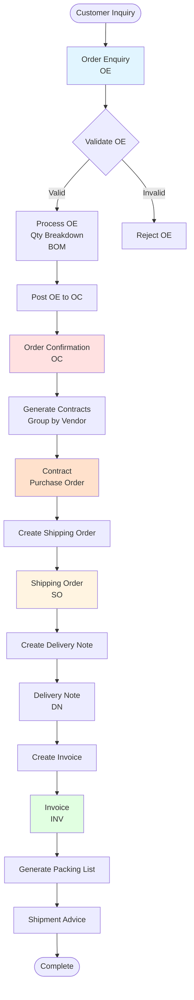
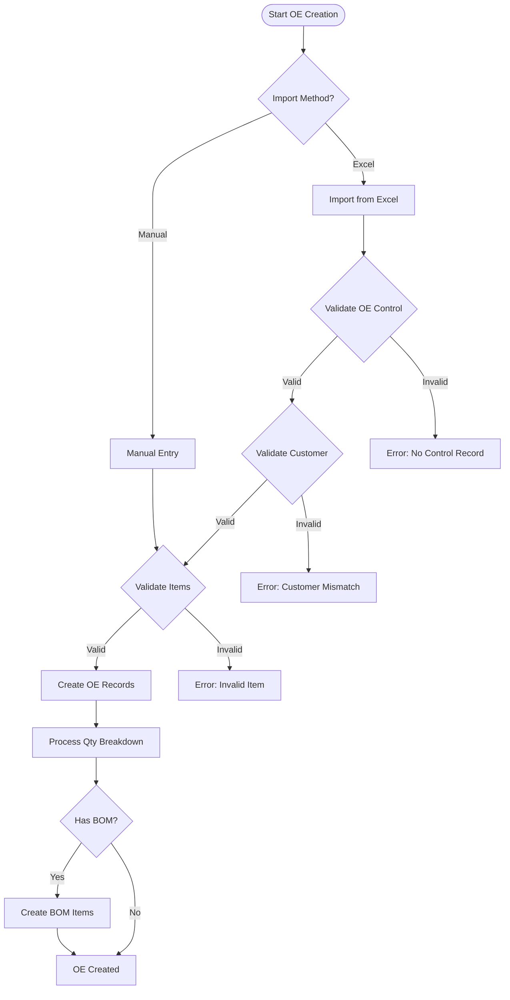
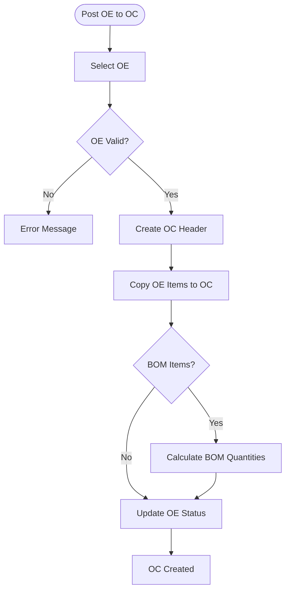
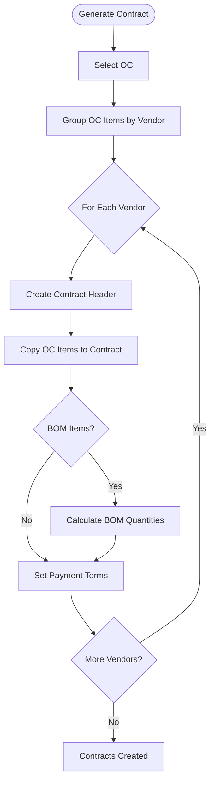

# Workflow Overview

## End-to-End Trading Workflow

The system manages the complete lifecycle of international trading operations from initial customer inquiry through final invoicing.

## Document Lifecycle



## Document Types

### 1. Order Enquiry (OE)
- **Purpose:** Initial customer inquiry/request
- **Source:** Excel import or manual entry
- **Tables:** `moehd`, `moe`, `moectrl`
- **Status:** Draft → Processed → Posted

### 2. Order Confirmation (OC)
- **Purpose:** Confirmed order from customer
- **Source:** Posted from OE
- **Tables:** `mordhd`, `morddt`
- **Status:** Created → Confirmed

### 3. Contract
- **Purpose:** Purchase order to vendor
- **Source:** Generated from OC (grouped by vendor)
- **Tables:** `mconthd`, `mcontdt`
- **Status:** Created → Sent → Confirmed

### 4. Shipping Order (SO)
- **Purpose:** Shipping instructions
- **Source:** Created from confirmed orders
- **Tables:** `mso`
- **Status:** Created → Shipped

### 5. Delivery Note (DN)
- **Purpose:** Delivery documentation
- **Source:** Created from shipping orders
- **Tables:** `mdnhd`, `mdndt`, `mdnbrk`
- **Status:** Created → Delivered

### 6. Invoice
- **Purpose:** Customer billing
- **Source:** Created from SO/DN
- **Tables:** `minvhd`, `minvdt`
- **Status:** Created → Sent → Paid

## Process Flow Diagrams

### Order Enquiry Creation Flow



### Post OE to OC Flow



### Contract Generation Flow



## Status Transitions

### Order Enquiry Status

```
Draft → Processing → Posted → Confirmed
```

**Status Values:**
- `status = 1` - Active/Posted (from `xmoe.prg` line 49)
- Other status codes may exist

### Order Confirmation Status

```
Created → Confirmed → Contracted
```

### Contract Status

```
Created → Sent → Confirmed → Shipped
```

### Invoice Status

```
Created → Sent → Paid
```

## Key Business Rules

### 1. OE Control Requirement
- OE must have control record in `moectrl` before import
- Exception: INSP company (adds "IN-" prefix automatically)
- Customer code must match between OE Control and import data

### 2. BOM Processing
- Items with BOM have `head = .T.` flag
- Sub-items have `head = .F.` flag
- Quantities calculated from `mprodbom.qty`
- Formula: `sub_item_qty = head_qty * bom_qty / total_bom_qty`

### 3. Vendor Grouping
- Contracts generated by grouping OC items by `vendor_no`
- One contract per vendor per OC
- All items from same vendor in one contract

### 4. Document Numbering
- OE numbers: Format varies by company (HT uses "/", BAT doesn't)
- OC numbers: Generated from OE
- Contract numbers: Generated from OC
- SO numbers: Generated from OC/Contract
- Invoice numbers: Generated from SO/DN

### 5. Quantity Tracking
- OE quantities can have breakdowns (size/color/style)
- Breakdowns stored in `mqtybrk`
- BOM quantities calculated automatically
- Quantities flow: OE → OC → Contract → SO → Invoice

## Data Flow Summary

### Forward Flow (Creation)

```
Customer Request
  ↓
OE (Order Enquiry)
  ↓
OC (Order Confirmation)
  ↓
Contract (Purchase Order to Vendor)
  ↓
SO (Shipping Order)
  ↓
DN (Delivery Note)
  ↓
Invoice (Customer Billing)
```

### Backward References

Each document maintains links to previous documents:
- `morddt.oe_no` → `moe.oe_no`
- `mcontdt.conf_no` → `mordhd.conf_no`
- `mso.conf_no` → `mordhd.conf_no`
- `minvhd.oc_no` → `mordhd.conf_no`
- `minvdt.so_no` → `mso.so_no`

## Workflow Variations

### Standard Flow
Most orders follow the complete flow: OE → OC → Contract → SO → DN → Invoice

### Direct Contract
Some orders may create contracts directly without OC

### Direct Invoice
Some orders may create invoices directly from SO

### Amendment Flow
- Contract amendments: `mcontamdrmk`
- Order adjustments: `mordadj`
- Invoice adjustments: `minvadj`

## Integration Points

### Excel Import
- OE can be imported from Excel
- Multiple Excel formats supported
- Validation during import

### Manual Entry
- All documents can be entered manually
- Forms provide data entry interfaces

### Reporting
- Each document type has associated reports
- Summary reports track workflow status
- Analysis reports provide business insights

## Error Handling

### Validation Errors
- OE Control not found
- Customer mismatch
- Invalid item numbers
- Missing required fields

### Business Rule Errors
- Cannot post OE without valid items
- Cannot create contract without OC
- Cannot create invoice without SO/DN

### Data Integrity Errors
- Orphaned detail records
- Invalid foreign key references
- Missing master data

## Workflow Completion Criteria

### OE Complete
- All items validated
- Qty breakdowns processed
- BOM items calculated
- Ready for posting

### OC Complete
- OE posted successfully
- All items confirmed
- Quantities confirmed
- Ready for contract generation

### Contract Complete
- OC items grouped by vendor
- Contracts created for each vendor
- Payment terms set
- Ready for vendor confirmation

### SO Complete
- Shipping instructions created
- Items assigned to shipments
- Ready for shipping

### Invoice Complete
- Items invoiced
- Packing list generated
- Ready for customer

## Summary

The workflow follows a linear progression from customer inquiry to final invoicing, with each step building on the previous. The system maintains referential integrity through manual linking and validation at each stage.


