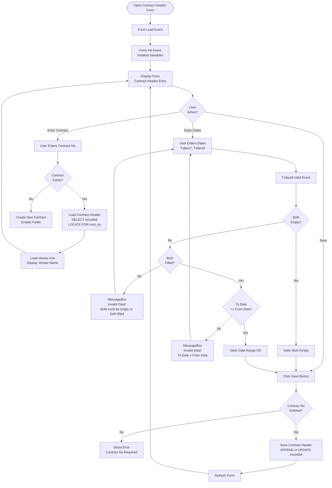

# Contract Forms

## Overview

Contract forms handle the creation and management of contracts from Order Confirmations. Contracts define vendor commitments and are used for shipping order and invoice generation.

## Form: isetcont@@_2018 (Input Contract 2018 Fast)

### Form Details

- **Form Name:** `isetcont@@_2018`
- **File:** `source/isetcont@@_2018.scx` / `source/isetcont@@_2018.SCT`
- **Type:** Single form with grid
- **Purpose:** Fast contract entry from OC

### Form Layout

**Key Controls:**
- `Txtbox1` - Contract Number
- `Txtbox2` - OC Number (conf_no)
- `Label3` - OC prefix label
- `Grid1` - Contract items grid (wsetcontgrid1)
- `Command1` - Save button
- `Command2` - Cancel button

### Process Flow



```mermaid
flowchart TD
    Start([Open Contract Form]) --> Load[Form Load Event<br/>Initialize Variables]
    Load --> Init["Form Init Event<br/>Initialize Variables<br/>w_fr_cont2 = False"]
    Init --> Display["Display Form<br/>Contract Entry"]
    
    Display --> UserEntersContract["User Enters Contract No<br/>Txtbox1"]
    UserEntersContract --> ValidateContract["Txtbox1.Valid Event"]
    
    ValidateContract --> BuildContractNo["Build Contract Number<br/>w_value = w_po_head1 plus Txtbox1.value<br/>or w_po_head1 plus dash plus Txtbox1.value"]
    BuildContractNo --> CheckExisting{Contract<br/>Exists?}
    
    CheckExisting -->|Yes| LoadExistingContract[Load Existing Contract<br/>SELECT mcontdt<br/>WHERE conf_no<br/>Load items to wsetcontgrid1]
    CheckExisting -->|No| LoadOCItems[Load OC Items<br/>SELECT moe<br/>WHERE oe_no<br/>Load items to wsetcontgrid1]
    
    LoadExistingContract --> DisplayGrid
    LoadOCItems --> DisplayGrid[Display Grid<br/>Contract Items]
    
    DisplayGrid --> UserAction{User<br/>Action?}
    
    UserAction -->|Edit Item| EditItem[Edit Item in Grid]
    UserAction -->|Save| SaveContract[Click Save Button<br/>Command1.Click]
    UserAction -->|Cancel| CancelForm[Click Cancel Button]
    
    EditItem --> ModifyItem[User Modifies Item<br/>Vendor, Price, Dates]
    ModifyItem --> ValidateItem{Item<br/>Valid?}
    ValidateItem -->|No| ShowError[Show Validation Error]
    ValidateItem -->|Yes| UpdateGrid[Update Grid<br/>Refresh Display]
    
    SaveContract --> ValidateHasItems{Has Items<br/>in Grid?}
    ValidateHasItems -->|No| ShowError1[Show Error<br/>Contract Must Have Items]
    ValidateHasItems -->|Yes| SaveContractHeader[Call save Method<br/>Save Contract Header]
    
    SaveContractHeader --> CheckContractExists{Contract<br/>Header Exists?}
    CheckContractExists -->|Yes| UpdateContractHeader[UPDATE mconthd<br/>REPLACE fields]
    CheckContractExists -->|No| CreateContractHeader[APPEND BLANK to mconthd<br/>REPLACE cont_no, conf_no<br/>vendor_no, dates]
    
    UpdateContractHeader --> SaveContractItems
    CreateContractHeader --> SaveContractItems[Save Contract Items<br/>Loop through wsetcontgrid1]
    
    SaveContractItems --> DeleteOldItems[DELETE FROM mcontdt<br/>WHERE cont_no]
    DeleteOldItems --> LoopItems[Loop Through wsetcontgrid1<br/>For Each Item]
    
    LoopItems --> CreateContItem[APPEND BLANK to mcontdt<br/>REPLACE cont_no, conf_no<br/>item_no, qty, ctn<br/>price, vendor, dates]
    
    CreateContItem --> CheckBOM{Item Has<br/>BOM?}
    CheckBOM -->|Yes| ProcessBOM[Process BOM Items<br/>Create sub-items]
    CheckBOM -->|No| NextItem
    
    ProcessBOM --> CreateSubItems["Create BOM Sub-items<br/>APPEND to mcontdt<br/>Set head = False"]
    CreateSubItems --> NextItem
    
    NextItem{More<br/>Items?}
    NextItem -->|Yes| LoopItems
    NextItem -->|No| UpdateAudit[UPDATE mconthd<br/>REPLACE l_mod_date<br/>REPLACE l_mod_time<br/>REPLACE user_id]
    
    UpdateAudit --> ShowSuccess[Show Success Message]
    ShowSuccess --> CloseForm[Close Form]
    
    CancelForm --> CloseForm
    CloseForm --> End([Form Closed])
```

### Validation Rules

#### Contract Number Validation

**Rules:**
1. **Format:**
   - HT/HFW/INSP: `w_po_head1 + Txtbox1.value`
   - BAT: `w_po_head1 + "-" + Txtbox1.value`

2. **Uniqueness:**
   - Contract number must be unique in `mconthd` table

#### Date Validation (iconthd_2018)

**Rules:**
1. **Both Empty or Both Filled:**
   - If `req_date_f` empty, `req_date_t` must be empty
   - If `req_date_f` filled, `req_date_t` must be filled
   - Error: "Invalid Date !" if mismatch

2. **Date Range:**
   - `req_date_t` must be >= `req_date_f`
   - Error: "Invalid Date !" if To Date < From Date

**Validation Code:**
```foxpro
PROCEDURE Txtbox8.Valid
IF empty(thisform.txtbox7.value) AND !empty(thisform.txtbox8.value)
    Messagebox("Invalid Date !", 16, "Error!")
    return .f.
ENDIF

IF !empty(thisform.txtbox7.value) AND empty(thisform.txtbox8.value)
    Messagebox("Invalid Date !", 16, "Error!")
    return .f.
ENDIF

IF !empty(thisform.txtbox7.value) OR !empty(thisform.txtbox8.value)
    IF this.value < thisform.txtbox7.value
        Messagebox("Invalid Date !", 16, "System Message!")
        this.value = {//}
    ENDIF
ENDIF
ENDPROC
```

### set_wsetcontgrid1 Method

**Purpose:** Populate contract items grid

**Process:**
1. Build contract number
2. If existing contract:
   - Load items from `mcontdt`
   - Load vendor from `mconthd`
3. Load OC items from `moe`
4. Merge existing and new items
5. Display in grid

## Form: iconthd_2018 (Contract Header)

### Form Details

- **Form Name:** `iconthd_2018`
- **File:** `source/iconthd_2018.scx` / `source/iconthd_2018.SCT`
- **Purpose:** Contract header entry and editing

### Form Layout

**Key Controls:**
- `Txtbox1` - Contract Number
- `Txtbox6` - OC Number (conf_no)
- `Txtbox7` - Request Date From (req_date_f)
- `Txtbox8` - Request Date To (req_date_t)
- `Txtbox2` - Vendor Number
- `Txtbox3` - Vendor Name (display)

### Process Flow



## Form: icontdt_2018 (Contract Detail)

### Form Details

- **Form Name:** `icontdt_2018`
- **Purpose:** Contract detail item entry
- **Called From:** Contract header form

### Process Flow

Similar to OC detail entry, but saves to `mcontdt` table instead of `morddt`.

## Form: pcontract@_2018 (Print Contract 2018)

### Form Details

- **Form Name:** `pcontract@_2018`
- **Purpose:** Print contract document
- **Process:** Generate report from `mconthd` and `mcontdt`

## Form: pcontbrk (Print Contract Qty Breakdown)

### Form Details

- **Form Name:** `pcontbrk`
- **Purpose:** Print contract quantity breakdown by vendor
- **Process:** Aggregate and format contract quantity breakdowns

## Form: pcontamdrmk (Print Contract Amendment)

### Form Details

- **Form Name:** `pcontamdrmk`
- **Purpose:** Print contract amendment document
- **Process:** Generate amendment report

## Form: pitname (Print Item Description for Carton)

### Form Details

- **Form Name:** `pitname`
- **Purpose:** Print item descriptions for carton making
- **Process:** Generate item description labels

## Summary

Contract forms provide:
- **isetcont@@_2018** - Fast contract entry from OC
- **iconthd_2018** - Contract header management with date validation
- **icontdt_2018** - Contract detail item entry
- **pcontract@_2018** - Contract document printing
- **pcontbrk** - Contract quantity breakdown printing
- **pcontamdrmk** - Contract amendment printing
- **pitname** - Item description printing

The forms include extensive date validation, BOM processing, and integration with the shipping order workflow.
