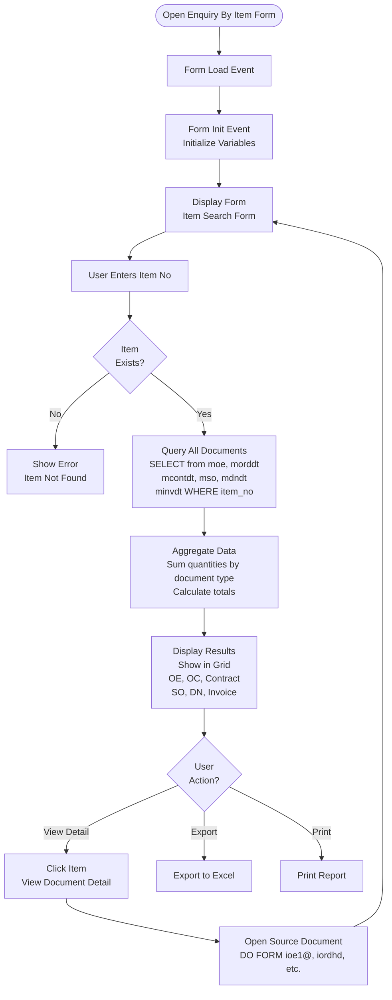

# Enquiry Forms

## Overview

Enquiry forms provide search, query, and reporting capabilities across the system. These forms allow users to view data, generate summaries, and analyze business information.

## Form: enqbyitem (Enquiry By Item)

### Form Details

- **Form Name:** `enqbyitem`
- **Purpose:** Search and view items across all documents
- **Process:** Query items from OE, OC, Contract, SO, DN, Invoice

### Process Flow

## Form: enqbyso (Enquiry By S/O)

### Form Details

- **Form Name:** `enqbyso`
- **Purpose:** Search and view shipping orders
- **Process:** Query SO data with filters

## Form: enqbyso2 (Enquiry By S/O Multiple Search)

### Form Details

- **Form Name:** `enqbyso2`
- **Purpose:** Multiple SO search with advanced filters
- **Process:** Query multiple SOs with various criteria

## Form: eoesumry (OE Summary Enquiry)

### Form Details

- **Form Name:** `eoesumry`
- **Purpose:** View OE summary and statistics
- **Process:** Aggregate OE data by customer, date, status

## Form: eocsumry (OC Summary Enquiry)

### Form Details

- **Form Name:** `eocsumry`
- **Purpose:** View OC summary and statistics
- **Process:** Aggregate OC data by customer, date, status

## Form: econtsumry (Contract Summary Enquiry)

### Form Details

- **Form Name:** `econtsumry`
- **Purpose:** View contract summary and statistics
- **Process:** Aggregate contract data by vendor, date, status

## Form: einvsumry (Invoice Summary Enquiry)

### Form Details

- **Form Name:** `einvsumry`
- **Purpose:** View invoice summary and statistics
- **Process:** Aggregate invoice data by customer, date, status

## Form: eoebypo (OE Enquiry By PO)

### Form Details

- **Form Name:** `eoebypo`
- **Purpose:** Search OEs by PO number
- **Process:** Query `moe` table filtered by PO

## Form: eisbystd (Invoice Sales By Standard Code)

### Form Details

- **Form Name:** `eisbystd`
- **Purpose:** View invoice sales grouped by standard code
- **Process:** Aggregate invoice data by standard code

## Form: esabycd (Sales Analysis By Customer - Date)

### Form Details

- **Form Name:** `esabycd`
- **Purpose:** Sales analysis by customer with date range
- **Process:** Aggregate sales data by customer and date

## Form: esabyid (Sales Analysis By Item - Date)

### Form Details

- **Form Name:** `esabyid`
- **Purpose:** Sales analysis by item with date range
- **Process:** Aggregate sales data by item and date

## Form: sabycust (Detail Sales Analysis By Customer)

### Form Details

- **Form Name:** `sabycust`
- **Purpose:** Detailed sales analysis by customer
- **Process:** Comprehensive sales report by customer

## Form: ecostbrk (Cost Breakdown Enquiry)

### Form Details

- **Form Name:** `ecostbrk`
- **Purpose:** View cost breakdowns
- **Process:** Query and display cost breakdown data

## Form: enqbyitem_new (Enquiry By Item New Format)

### Form Details

- **Form Name:** `enqbyitem_new`
- **Purpose:** Item enquiry with new format
- **Process:** Updated query logic and display format

## Summary

Enquiry forms provide comprehensive search and analysis capabilities:
- **enqbyitem** - Item enquiry across all documents
- **enqbyso** - SO enquiry
- **eoesumry** - OE summary
- **eocsumry** - OC summary
- **econtsumry** - Contract summary
- **einvsumry** - Invoice summary
- **esabycd** - Sales analysis by customer-date
- **esabyid** - Sales analysis by item-date
- **sabycust** - Detailed sales analysis
- **ecostbrk** - Cost breakdown enquiry

The forms include query logic, data aggregation, and reporting capabilities.
