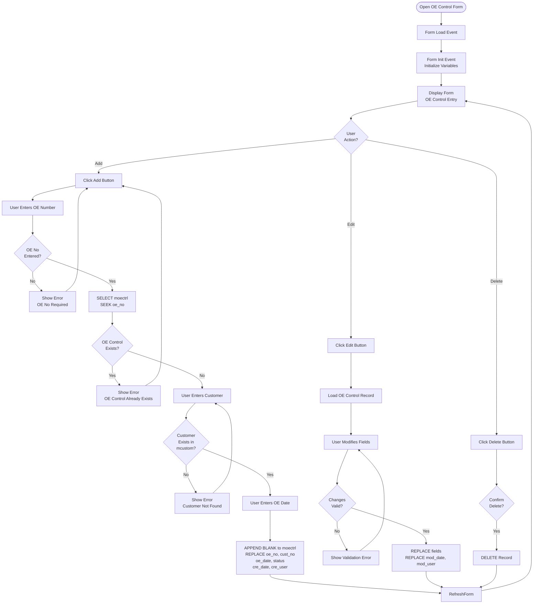
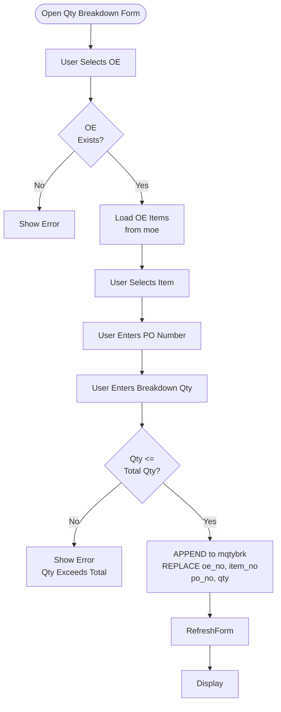

# Order Enquiry Forms

## Overview

Order Enquiry (OE) forms handle the creation, import, validation, and management of customer order enquiries. These forms are the entry point for all orders in the system.

## Form: ioe1@ (Input OE New) - **MOST COMPLEX FORM**

### Form Details

- **Form Name:** `ioe1@`
- **File:** `source/ioe1@.scx` / `source/ioe1@.SCT`
- **Type:** Formset with multiple forms (Form1, Form2, Form3, Form4, Form5)
- **Lines of Code:** 2885+ lines in .SCT file
- **Purpose:** Main OE entry and management form

### Form Layout

**Structure:**
- Formset: `Formset1` with 5 forms
  - Form1: Main OE entry form with grid
  - Form2: Copy OE form
  - Form3: FW Comment form
  - Form4: OE Comment form
  - Form5: Cancel item form

**Form1 Key Controls:**
- `Txtbox1` - OE Number input
- `Txtbox2` - Customer Number (disabled after OE loaded)
- `Txtbox4` - Customer Name (display only)
- `Txtbox5` - OE Date
- `Txtbox10` - From Date (visible = .F.)
- `Txtbox11` - To Date (visible = .F.)
- `Grid1` - OE items grid (21 columns)
- `Command1` - Add Item button
- `Command2` - Exit button
- `Command3` - Copy OE button
- `Command4` - Delete All button
- `Command5` - Update OC/Contract Details button
- `Ser` - Search button (calls zseroe)
- `Label4` - Status label ("Please Wait...............")

**Grid1 Columns:**
1. Item No
2. Qty (with dynamic color for mismatches)
3. Price
4. Ctn
5. Margin % (calculated)
6. Vendor
7. SKN No
8. Remark
9. Cost
10. (empty)
11. PO No
12. Maker
13. FOB Port
14. Maker S From
15. Maker S To
16. Cust S From
17. Cust S To
18. (Cancel button)
19. Cxl Reason
20. LCL
21. Chester

### Detailed Process Flow with Validation

```mermaid
flowchart TD
    Start([Open OE Form]) --> Load[Form Load Event<br/>SET TALK OFF<br/>SET CENTURY ON<br/>SET DELETE ON<br/>SET DATE MDY<br/>Public Variables<br/>use_mcustom, temp_oe_no<br/>temp_cust_no, w_oe_no<br/>p_oe_no, w_oe_prefix]
    Load --> Init[Form Init Event<br/>Public Variables<br/>check_change, record_point<br/>w_cust_no, wnewoe, w_oe_no<br/>default_del_date, default_po_no<br/>default_oc_no<br/>w_oe_fr_date, w_oe_to_date<br/>click_ser, w_ser_oe_no<br/>w_fw_ref, w_cust_first_sd<br/>w_cust_last_sd<br/>w_fw_comment, w_oe_comment]
    
    Init --> CheckINSP{Check<br/>w_password<br/>= INSP?}
    CheckINSP -->|Yes| SetPrefix["w_oe_prefix = IN-<br/>Auto-prefix for INSP"]
    CheckINSP -->|No| SetPrefixEmpty["w_oe_prefix = empty"]
    
    SetPrefix --> InitializeVars
    SetPrefixEmpty --> InitializeVars["Initialize Variables<br/>wnewoe = False<br/>click_ser = False<br/>w_oe_date = empty<br/>w_oe_fr_date = empty<br/>w_oe_to_date = empty<br/>check_change = 0<br/>record_point = empty"]
    
    InitializeVars --> HideForms[Hide Form3, Form4, Form5<br/>Show Form1 Only]
    HideForms --> LoadCurrency[Load Currency Codes<br/>SELECT * FROM zcurcode<br/>INTO CURSOR temp_vendor]
    LoadCurrency --> Display[Display Form1<br/>OE Entry Form]
    
    Display --> UserEntersOE[User Enters OE Number<br/>Txtbox1]
    
    UserEntersOE --> ValidateOE[Txtbox1.Valid Event]
    
    ValidateOE --> CheckExact{Check if<br/>OE Changed<br/>w_exact = .t.?}
    CheckExact -->|No Change| SkipRequery[Skip Requery<br/>Just Refresh]
    CheckExact -->|Changed| ResetDefaults[Reset Default Values<br/>default_del_date = {//}<br/>default_del_po_no = ""<br/>default_del_oc_no = ""]
    
    ResetDefaults --> ShowWait["Set Label4.caption<br/>= Please Wait"]
    ShowWait --> BuildOENo["strOeNo = w_oe_prefix plus Txtbox1.value<br/>w_oe_no = strOeNo"]
    BuildOENo --> RequeryGrid[Call requeryGrid Method<br/>Build voe1 cursor<br/>JOIN with mqtybrk]
    
    RequeryGrid --> CheckHasData{Check<br/>voe1.oe_no<br/>Empty?}
    CheckHasData -->|No| LoadExistingOE[Load Existing OE Data<br/>wnewoe = .F.<br/>Load dates, customer<br/>Load moehd record]
    CheckHasData -->|Yes| CheckOECtrl[Check OE Control<br/>SELECT moectrl<br/>SEEK oe_no]
    
    LoadExistingOE --> LoadCustomer[Load Customer Info<br/>SELECT mcustom<br/>LOCATE FOR cust_no<br/>Display ename in Txtbox4]
    LoadCustomer --> LoadMOEHD[Load moehd Record<br/>Get fw_ref, dates<br/>fw_comment, oe_comment]
    LoadMOEHD --> DisableFields["Disable Fields<br/>Txtbox2.enabled = False<br/>Txtbox10.enabled = False<br/>Txtbox11.enabled = False"]
    DisableFields --> DisplayForm
    
    CheckOECtrl --> OECtrlExists{OE Control<br/>Exists and<br/>status_flag != 2?}
    OECtrlExists -->|No| ShowError1[MessageBox<br/>Invalid OE No.!<br/>Return .F.]
    ShowError1 --> UserEntersOE
    OECtrlExists -->|Yes| CreateNewOE[wnewoe = .T.<br/>Load from moectrl<br/>w_oe_date = moectrl.oe_date<br/>w_cust_no = moectrl.cust_no]
    
    CreateNewOE --> CreateMOEHD[Check/Create moehd<br/>SELECT moehd<br/>SEEK oe_no]
    CreateMOEHD --> MOEHDExists{MOEHD<br/>Exists?}
    MOEHDExists -->|No| AppendMOEHD[APPEND BLANK<br/>REPLACE oe_no<br/>REPLACE oe_date<br/>REPLACE cre_date = DATE<br/>REPLACE cre_user = sysUserId]
    MOEHDExists -->|Yes| UpdateMOEHD[Update moehd<br/>REPLACE fw_comment<br/>REPLACE oe_comment]
    
    AppendMOEHD --> LoadCustomer
    UpdateMOEHD --> LoadCustomer
    
    DisplayForm[Display Form<br/>Enable/Disable Fields<br/>Based on OE State] --> UserAction{User<br/>Action?}
    
    UserAction -->|Add Item| AddItem[Click Add Item Button<br/>Command1.Click]
    UserAction -->|Copy OE| CopyOE[Click Copy OE Button<br/>Command3.Click]
    UserAction -->|Delete All| DeleteAll[Click Delete All Button<br/>Command4.Click]
    UserAction -->|Update OC/Contract| UpdateOC[Click Update OC/Contract<br/>Command5.Click]
    UserAction -->|Search OE| SearchOE[Click Search Button<br/>Ser.Click]
    UserAction -->|Delete Item| DeleteItem[Click Delete in Grid<br/>Column10.Command1.Click]
    UserAction -->|Cancel Item| CancelItem[Click Cancel in Grid<br/>Column18.Command1.Click]
    UserAction -->|Exit| ExitForm[Click Exit Button<br/>Command2.Click]
    
    AddItem --> ValidateOEForAdd{OE No<br/>Entered?}
    ValidateOEForAdd -->|No| ShowError2[MessageBox<br/>Oe No Can not Empty!<br/>SetFocus to Txtbox1<br/>Return .F.]
    ShowError2 --> DisplayForm
    ValidateOEForAdd -->|Yes| ValidateCust{Customer<br/>Entered?}
    ValidateCust -->|No| ShowError3[MessageBox<br/>Invalid Client Code!<br/>SetFocus to Txtbox2<br/>Return .F.]
    ShowError3 --> DisplayForm
    ValidateCust -->|Yes| OpenIOE2["DO FORM ioe2<br/>WITH Parameters:<br/>oe_no = w_oe_prefix plus Txtbox1.value<br/>item_no = empty<br/>cust_no = Txtbox2.value<br/>ename = Txtbox4.value<br/>mode = 0<br/>from_date = Txtbox10.value<br/>to_date = Txtbox11.value<br/>po_no = empty"]
    OpenIOE2 --> ItemAdded[Item Added<br/>check_change = 1]
    ItemAdded --> GotFocus[Form GotFocus Event]
    
    CopyOE --> OpenCopyForm[Show Form2<br/>Copy OE Form]
    OpenCopyForm --> EnterFromOE[User Enters From OE<br/>Txtbox1 in Form2]
    EnterFromOE --> ValidateFromOE{From OE<br/>Valid?}
    ValidateFromOE -->|No| ShowError4[MessageBox<br/>Invalid OE No.!]
    ShowError4 --> OpenCopyForm
    ValidateFromOE -->|Yes| EnterToOE[User Enters To OE<br/>Txtbox2 in Form2]
    EnterToOE --> ValidateToOE{To OE<br/>Valid?}
    ValidateToOE -->|No| ShowError5[MessageBox<br/>Invalid OE No.!]
    ShowError5 --> EnterToOE
    ValidateToOE -->|Yes| CopyOEItems[Copy OE Items<br/>SELECT * FROM moe<br/>WHERE oe_no = w_oe1<br/>INTO CURSOR oe_cursor<br/>Loop through items]
    
    CopyOEItems --> ProcessEachItem["For Each Item in oe_cursor<br/>Check mitemven for vendor<br/>Update vendor_no, maker<br/>Set OC number based on company<br/>REPLACE all fields"]
    ProcessEachItem --> CopyQtyBrk["Copy Qty Breakdown<br/>SELECT FROM mqtybrk<br/>WHERE oe_no equals w_oe1<br/>Copy to w_oe2"]
    CopyQtyBrk --> CopyOERmk["Copy OE Remarks<br/>SELECT FROM moermk<br/>WHERE oe_no equals w_oe1<br/>Copy to w_oe2"]
    CopyOERmk --> CopyMOEHD["Copy moehd Record<br/>SCATTER TO array<br/>GATHER FROM array<br/>Update oe_no"]
    CopyMOEHD --> RefreshAfterCopy[Refresh Form1<br/>Display New OE]
    
    DeleteAll --> ConfirmDelete{Confirm<br/>Delete All<br/>Record?}
    ConfirmDelete -->|No| DisplayForm
    ConfirmDelete -->|Yes| DeleteMOE[DELETE FROM moe<br/>WHERE oe_no = strOeNo<br/>SET FILTER<br/>DELETE ALL]
    DeleteMOE --> DeleteMQTYBRK[DELETE FROM mqtybrk<br/>WHERE oe_no = strOeNo<br/>SET FILTER<br/>DELETE ALL]
    DeleteMQTYBRK --> DeleteMOEBOM[DELETE FROM moebom<br/>WHERE oe_no = strOeNo<br/>SET FILTER<br/>DELETE ALL]
    DeleteMOEBOM --> DeleteMOEHD["DELETE FROM moehd<br/>WHERE oe_no equals strOeNo"]
    DeleteMOEHD --> DeleteMOERMK["DELETE FROM moermk<br/>WHERE oe_no equals strOeNo"]
    DeleteMOERMK --> ClearFields["Clear All Fields<br/>Txtbox1 = empty<br/>Txtbox2 = empty<br/>Txtbox4 = empty<br/>Txtbox5 = empty<br/>Txtbox10 = empty<br/>Txtbox11 = empty"]
    ClearFields --> RequeryGrid
    RequeryGrid --> SetFocus[Txtbox1.setfocus]
    SetFocus --> DisplayForm
    
    DeleteItem --> ConfirmDeleteItem{Confirm<br/>Delete this<br/>Item?}
    ConfirmDeleteItem -->|No| DisplayForm
    ConfirmDeleteItem -->|Yes| GetItemInfo[Get Item Info from Grid<br/>CToe_no = voe1.oe_no<br/>CT_item = voe1.item_no]
    GetItemInfo --> DeleteMOERecord[DELETE FROM moe<br/>WHERE oe_no = CToe_no<br/>AND item_no = CT_item<br/>AND po_no = voe1.po_no]
    DeleteMOERecord --> DeleteMQTYBRKItem[DELETE FROM mqtybrk<br/>WHERE oe_no = strOeNo<br/>AND item_no = CT_item]
    DeleteMQTYBRKItem --> DeleteMOEBOMItem[DELETE FROM moebom<br/>WHERE oe_no = strOeNo<br/>AND item_no = CT_item]
    DeleteMOEBOMItem --> RequeryGrid
    
    CancelItem --> OpenCancelForm[Show Form5<br/>Cancel Item Form]
    OpenCancelForm --> EnterCancelReason[User Enters<br/>Cancel Reason]
    EnterCancelReason --> SaveCancel[Update voe1.cxl_rson<br/>Update moe.cxl_flag = 1]
    SaveCancel --> RequeryGrid
    
    UpdateOC --> CallUpdateProgram[DO uordcont<br/>Update OC/Contract Details]
    CallUpdateProgram --> RefreshForm
    
    SearchOE --> OpenSearchForm[DO FORM zseroe<br/>OE Search Form]
    OpenSearchForm --> SelectOE[User Selects OE<br/>from Search]
    SelectOE --> SetSearchOE[click_ser = .T.<br/>w_ser_oe_no = selected_oe]
    SetSearchOE --> GotFocus
    
    GotFocus --> CheckChange{check_change<br/>= 0?}
    CheckChange -->|No| RequeryGrid
    CheckChange -->|Yes| RefreshOnly[Refresh Grid Only<br/>No Requery]
    
    RequeryGrid --> CheckQtyMatch[Check Qty vs brkQty<br/>Loop through voe1<br/>Check if qty != brkQty]
    CheckQtyMatch --> HasMismatch{Has<br/>Mismatch?}
    HasMismatch -->|Yes| HighlightMismatch[Set Dynamic Colors<br/>Red Background for Mismatch<br/>Show shpHadBrk Label]
    HasMismatch -->|No| NormalDisplay[Normal Display<br/>White Background]
    
    HighlightMismatch --> DisplayGrid
    NormalDisplay --> DisplayGrid[Display Grid1<br/>Set Recordsource = voe1<br/>Set Column Controlsources<br/>Set Dynamic Colors]
    
    DisplayGrid --> CheckClickSer{click_ser<br/>= .T.?}
    CheckClickSer -->|Yes| SetOENo[Txtbox1.value = w_ser_oe_no<br/>Call Txtbox1.Valid]
    CheckClickSer -->|No| DisplayForm
    
    DisplayForm --> RefreshForm[Refresh Form<br/>Update Display]
    RefreshForm --> Display
    
    ExitForm --> Cleanup[Close Cursors<br/>Close temp_vendor<br/>Release Form]
    Cleanup --> End([Form Closed])
```

### requeryGrid Method

**Purpose:** Populate and refresh the OE items grid

**Process:**
1. Clear current grid recordsource
2. Select OE items from `moe` table
3. Aggregate quantity breakdowns from `mqtybrk`
4. Join items with breakdowns
5. Calculate additional fields (ctncost, margin %)
6. Check for quantity mismatches
7. Set grid recordsource and column bindings
8. Apply dynamic formatting for mismatches

**Code:**
```foxpro
PROCEDURE requerygrid
PARAMETER strOENo

SET EXACT ON
thisformset.form1.grid1.recordsource = ""

SELECT * FROM moe INTO CURSOR voe3;
    WHERE oe_no = strOENo;
    ORDER BY item_no

SELECT oe_no, item_no, sum(qty) as BrkQty;
    FROM mqtybrk;
    WHERE oe_no = strOENo;
    GROUP BY 1,2;
    INTO CURSOR voebrk

SELECT a.*, round(a.qty/a.ctn*a.price,2) as ctncost,;
       nvl(b.BrkQty,000000) as brkQty;
    FROM voe3 a LEFT OUTER JOIN voebrk b;
         ON a.oe_no = b.oe_no AND a.item_no = b.item_no;
    INTO CURSOR voe1

lHasBrk = .F.
DO WHILE !eof()
    IF qty # brkQty AND BrkQty > 0
        lHasBrk = .T.
        EXIT
    ENDIF
    SKIP
ENDDO

thisformset.form1.shpHadBrk.visible = lHasBrk
thisformset.form1.lblHasBrk.visible = lHasBrk
GO TOP

thisformset.form1.grid1.recordsource = "voe1"
thisformset.form1.grid1.column1.controlsource = "voe1.item_no"
thisformset.form1.grid1.column2.controlsource = "voe1.qty"
thisformset.form1.grid1.column2.dynamicbackcolor =;
    "iif(qty # brkQty AND BrkQty > 0, RGB(255,221,221), RGB(255,255,255))"
thisformset.form1.grid1.column2.dynamicforecolor =;
    "iif(qty # brkQty AND BrkQty > 0, RGB(255,0,0), RGB(0,0,0))"
* ... set other columns ...
ENDPROC
```

### Validation Rules

#### OE Number Validation (Txtbox1.Valid)

**Rules:**
1. **OE Change Detection:**
   - Compare: `w_oe_prefix + Txtbox1.value <> w_oe_no`
   - If changed, reset default values
   - Set `w_exact = .T.` if different

2. **Existing OE:**
   - If `voe1.oe_no` not empty:
     - Load existing OE data
     - Load customer information
     - Load moehd record
     - Disable fields (Txtbox2, Txtbox10, Txtbox11)

3. **New OE:**
   - If `voe1.oe_no` empty:
     - Check OE Control exists in `moectrl`
     - Validate: `moectrl.status_flag != 2`
     - Error: "Invalid OE No!" if not found or status = 2
     - Load customer from moectrl
     - Create/update moehd record

**Validation Code:**
```foxpro
PROCEDURE Valid
PUBLIC w_exact
w_exact = .F.

IF alltrim(w_oe_prefix) + alltrim(this.value) <> w_oe_no
    default_del_date = {//}
    default_del_po_no = ""
    default_del_oc_no = ""
ENDIF

SET EXACT ON
IF w_oe_no <> alltrim(w_oe_prefix) + alltrim(this.value)
    w_exact = .T.
ENDIF
SET EXACT OFF

p_oe_no = alltrim(w_oe_prefix) + this.value

IF w_exact = .T. AND empty(this.value) = .F.
    thisform.label4.caption = "Please Wait..............."
    w_oe_no = alltrim(w_oe_prefix) + alltrim(this.value)
    strOeNo = alltrim(w_oe_prefix) + thisformset.form1.txtbox1.value
    thisformset.requeryGrid(strOeNo)
    
    IF !empty(voe1.oe_no)
        * Load existing OE
        wnewoe = .F.
        w_oe_fr_date = voe1.from_date
        w_oe_to_date = voe1.to_date
        w_oe_date = voe1.date
        w_cust_no = voe1.cust_no
        thisform.txtbox2.value = w_cust_no
        SELECT cust_no, ename FROM mcustom;
            WHERE alltrim(cust_no) == alltrim(w_cust_no);
            INTO CURSOR temp
        thisform.txtbox4.value = temp.ename
        * Load moehd record
    ELSE
        * New OE - check moectrl
        SELECT moectrl
        SET ORDER TO oe_no
        SEEK alltrim(w_oe_prefix) + alltrim(this.value)
        IF eof() OR moectrl.status_flag = 2
            messagebox("Invalid OE No!", 16, "System Message!")
            return .f.
        ENDIF
        * Create moehd if needed
        SELECT moehd
        SET ORDER TO oe_no
        SEEK alltrim(w_oe_prefix) + alltrim(this.value)
        IF eof()
            APPEND BLANK
            REPLACE moehd.oe_no WITH alltrim(w_oe_prefix) + alltrim(this.value)
        ENDIF
        * Set audit fields
    ENDIF
ENDIF

thisform.label4.caption = ""
THISFORM.TXTBOX2.ENABLED = .F.
ENDPROC
```

#### Customer Validation (Txtbox2.Valid)

**Rules:**
1. **Required Field:**
   - If not empty, must exist in `mcustom` table
   - Error: "Invalid Client No!" if not found

2. **Auto-fill:**
   - If found, display customer name in Txtbox4
   - If not found, clear Txtbox4

**Validation Code:**
```foxpro
PROCEDURE Valid
IF !empty(this.value)
    SELECT mcustom
    LOCATE FOR ALLTRIM(mcustom.cust_no) == ALLTRIM(this.value)
    IF !FOUND()
        Messagebox("Invalid Client No!", 16, "System Message!")
        thisform.txtbox4.value = ""
        return .f.
    ELSE
        thisform.txtbox4.value = mcustom.ename
    ENDIF
ELSE
    thisform.txtbox4.value = ""
ENDIF
ENDPROC
```

#### Date Validation (Txtbox10, Txtbox11)

**Rules:**
1. **From Date (Txtbox10):**
   - Defaults to current date on GotFocus
   - Must be <= To Date if both filled

2. **To Date (Txtbox11):**
   - If empty, defaults to From Date
   - Must be >= From Date
   - Error: "Date Error!" if To Date < From Date

**Validation Code:**
```foxpro
PROCEDURE Txtbox11.Valid
IF empty(this.value)
    this.value = thisform.txtbox10.value
ELSE
    IF thisform.txtbox10.value > thisform.txtbox11.value
        Messagebox("Date Error!", 16, "Date!")
        return .f.
    ENDIF
ENDIF
ENDPROC
```

#### Grid Display Validation

**Rules:**
1. **Quantity Mismatch Detection:**
   - Compare: `qty != brkQty AND BrkQty > 0`
   - Highlight mismatched quantities in red
   - Show warning label if mismatches exist

2. **Dynamic Formatting:**
   - Background: Red (RGB(255,221,221)) for mismatches
   - Foreground: Red (RGB(255,0,0)) for mismatches
   - Normal: White background, black text

### Form Events

#### Load Event
```foxpro
PROCEDURE Load
SET TALK OFF
PUBLIC use_mcustom, temp_oe_no, temp_cust_no, w_oe_no, p_oe_no, w_oe_prefix
SET HOUR TO 24
SET SAFETY OFF
SET CENTURY ON
SET DELETED ON
SET DATE MDY

temp_oe_no = space(10)
temp_cust_no = space(10)
use_mcustom = .F.
IF used("mcustom")
    use_mcustom = .T.
ENDIF
ENDPROC
```

#### Init Event
```foxpro
PROCEDURE Init
PUBLIC check_change, record_point, w_cust_no, wnewoe, w_oe_no
PUBLIC default_del_date, w_oe_no_for_del_date
PUBLIC default_po_no, w_oe_no_for_po_no
PUBLIC default_oc_no, w_oe_no_for_oc_no
PUBLIC w_oe_fr_date, w_oe_to_date, click_ser, w_ser_oe_no
PUBLIC w_fw_ref, w_cust_first_sd, w_cust_last_sd, w_fw_comment, w_oe_comment

IF w_password = "INSP"
    w_oe_prefix = "IN-"
ENDIF

thisformset.form3.hide
thisformset.form4.hide
thisformset.form5.hide
wnewoe = .F.
click_ser = .F.
w_ser_oe_no = ""
* ... initialize other variables ...
ENDPROC
```

#### GotFocus Event
```foxpro
PROCEDURE GotFocus
IF check_change <> 0
    thisform.label4.caption = "Please Wait..............."
    SELECT voe1
    strOeNo = alltrim(w_oe_prefix) + alltrim(thisformset.form1.txtbox1.value)
    thisformset.requeryGrid(strOeNo)
    LOCATE FOR alltrim(item_no) == alltrim(record_point)
    IF !found()
        GO TOP
    ENDIF
    
    thisform.label4.caption = ""
    check_change = 0
    SELECT voe1
    GO TOP
    
    IF Empty(oe_no)
        THISFORM.TXTBOX10.ENABLED = .T.
        THISFORM.TXTBOX11.ENABLED = .T.
        THISFORM.TXTBOX5.ENABLED = .T.
        THISFORM.TXTBOX2.ENABLED = .T.
    ELSE
        THISFORM.TXTBOX5.ENABLED = .F.
        THISFORM.TXTBOX10.ENABLED = .F.
        THISFORM.TXTBOX11.ENABLED = .F.
        THISFORM.TXTBOX2.ENABLED = .F.
    ENDIF
ELSE
    THISFORM.GRID1.REFRESH
    thisform.refresh
ENDIF

IF click_ser = .T.
    click_ser = .F.
    thisform.txtbox1.value = w_ser_oe_no
    thisform.txtbox1.valid
ENDIF
dodefault()
thisform.refresh
ENDPROC
```

### Related Forms

- **ioe2** - Item entry form (called from Add Item button)
- **zseroe** - OE search form (called from Search button)
- **uordcont** - Update OC/Contract program (called from Command5)

### Related Tables

- **moe** - OE items table
- **moehd** - OE header table
- **moectrl** - OE control table
- **mqtybrk** - Quantity breakdown table
- **moebom** - OE BOM table
- **moermk** - OE remarks table
- **mcustom** - Customer master table
- **mitem** - Item master table
- **mitemven** - Item-Vendor relationship table

## Form: ioectrl (Input OE Control)

### Form Details

- **Form Name:** `ioectrl`
- **File:** `source/ioectrl.scx` / `source/ioectrl.SCT`
- **Purpose:** Create and maintain OE Control records

### Process Flow



### Validation Rules

1. **OE Number:**
   - Required field
   - Must be unique in `moectrl` table

2. **Customer:**
   - Must exist in `mcustom` table
   - Validated before saving

3. **Status:**
   - status_flag = 0 (Active)
   - status_flag = 2 (Invalid - prevents OE creation)

## Form: iqtybrk2 (Input Qty Breakdown)

### Form Details

- **Form Name:** `iqtybrk2`
- **Purpose:** Enter quantity breakdowns by PO number

### Process Flow



### Validation Rules

1. **Quantity Validation:**
   - Breakdown quantity must not exceed total OE quantity
   - Sum of breakdowns should match total quantity

2. **PO Number:**
   - Can be empty or have value
   - Used for grouping breakdowns

## Other Order Enquiry Forms

### Enquiry Forms

#### eoectrl (OE Control Enquiry)
- **Purpose:** Search and view OE Control records
- **Process:** Query `moectrl` table with filters

#### eoeact (OE Activity Enquiry)
- **Purpose:** View OE activity and status
- **Process:** Aggregate OE data by activity

#### eoerecord (OE Record Enquiry)
- **Purpose:** View OE records and details
- **Process:** Query and display OE information

#### eoebypo (OE Enquiry By PO)
- **Purpose:** Search OEs by PO number
- **Process:** Query `moe` table filtered by PO

### Import Forms

#### uoexls (Import OE from Excel)
- **Purpose:** Standard Excel import
- **Process:** Read Excel file, validate, import to `moe`

#### uoexls_2013 (Import OE 2013 CSV)
- **Purpose:** Import 2013 CSV format
- **Complexity:** Most complex (1,747 lines in .prg)
- **Process:** Dynamic field detection, validation, import

#### uoexls_2013_xls (Import OE 2013 XLS)
- **Purpose:** Import 2013 XLS format
- **Process:** Similar to CSV but handles XLS structure

#### unewoexls (Import OE New Format)
- **Purpose:** Import new Excel format
- **Process:** Updated import logic for new format

#### uwalxls (Import OE Walmart)
- **Purpose:** Import Walmart-specific format
- **Process:** Custom format handling for Walmart

#### uoexls2 (Import OE Multi Item Block)
- **Purpose:** Import multi-item block format
- **Process:** Handles grouped item blocks

### Print Forms

#### pordenq2 (Print Order Enquiry)
- **Purpose:** Print OE document
- **Process:** Generate report from `moe` and `moehd`

#### poedoc (Print OE Doc)
- **Purpose:** Print OE, OC, or Contract document
- **Process:** Multi-document printing

#### ppobrk (Print OE Qty Breakdown)
- **Purpose:** Print quantity breakdown report
- **Process:** Aggregate and format `mqtybrk` data

### Utility Forms

#### zoexls_batch (Export OE to XLS)
- **Purpose:** Batch export OEs to Excel
- **Process:** Select OEs, export to Excel format

#### ioedeldate (Input OE Shipment Status)
- **Purpose:** Update OE shipment dates
- **Process:** Update delivery dates in OE records

#### ichangecustno (Change Customer No)
- **Purpose:** Change customer number across documents
- **Process:** Update customer in OE, OC, Contract, etc.

## Summary

Order Enquiry forms provide comprehensive OE management:
- **ioe1@** - Main OE entry form (most complex)
- **ioectrl** - OE Control management
- **iqtybrk2** - Quantity breakdown entry
- Multiple import forms for various Excel formats
- Enquiry forms for searching and viewing OEs
- Print forms for document generation

The forms include extensive validation, business logic, and integration with the transaction workflow.
