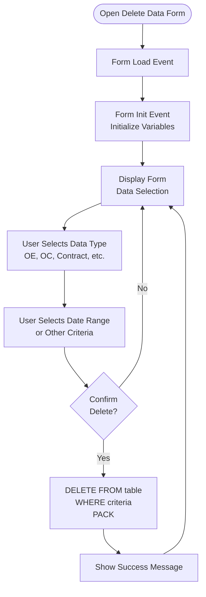

# Utility Forms

## Overview

Utility forms provide data conversion, import/export, and system maintenance functions. These forms handle data migration, cleanup, and utility operations.

## Form: zdel_data (Delete Data)

### Form Details

- **Form Name:** `zdel_data`
- **Purpose:** Delete data from tables
- **Process:** Provide interface for data deletion with confirmation

### Process Flow

## Form: zvencon (Vendor Code Conversion)

### Form Details

- **Form Name:** `zvencon`
- **Purpose:** Convert vendor codes
- **Process:** Update vendor codes across all documents

## Form: zdr_so_conv (Data Conv - DR SO)

### Form Details

- **Form Name:** `zdr_so_conv`
- **Purpose:** Data conversion for DR SO
- **Process:** Convert SO data format

## Form: zdr_dn_conv (Data Conv - DR DN)

### Form Details

- **Form Name:** `zdr_dn_conv`
- **Purpose:** Data conversion for DR DN
- **Process:** Convert DN data format

## Form: zchange_item (Data Conv - Change Item No.)

### Form Details

- **Form Name:** `zchange_item`
- **Purpose:** Change item numbers across all documents
- **Process:** Update item numbers in OE, OC, Contract, SO, DN, Invoice

## Form: uimport_item (Import Item)

### Form Details

- **Form Name:** `uimport_item`
- **Purpose:** Import items from external source
- **Process:** Read source file, validate, import to `mitem`

## Form: uimport_HTS (Import HTS)

### Form Details

- **Form Name:** `uimport_HTS`
- **Purpose:** Import HTS codes
- **Process:** Read HTS file, import to item records

## Form: uimport_upc (Import UPC)

### Form Details

- **Form Name:** `uimport_upc`
- **Purpose:** Import UPC codes
- **Process:** Read UPC file, import to item records

## Form: uqty_breakdown (Import Qty Breakdown CSV)

### Form Details

- **Form Name:** `uqty_breakdown`
- **Purpose:** Import quantity breakdowns from CSV
- **Process:** Read CSV file, validate, import to `mqtybrk`

## Form: uqty_breakdown_xls (Import Qty Breakdown XLS)

### Form Details

- **Form Name:** `uqty_breakdown_xls`
- **Purpose:** Import quantity breakdowns from Excel
- **Process:** Read Excel file, validate, import to `mqtybrk`

## Summary

Utility forms provide system maintenance and data conversion:
- **zdel_data** - Data deletion
- **zvencon** - Vendor code conversion
- **zdr_so_conv, zdr_dn_conv** - Data format conversion
- **zchange_item** - Item number change
- **uimport_item** - Item import
- **uimport_HTS, uimport_upc** - Code imports
- **uqty_breakdown, uqty_breakdown_xls** - Quantity breakdown imports

The forms include validation, error handling, and data integrity checks.
