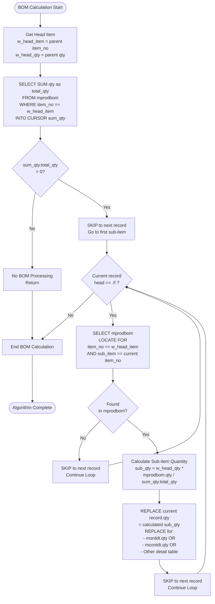
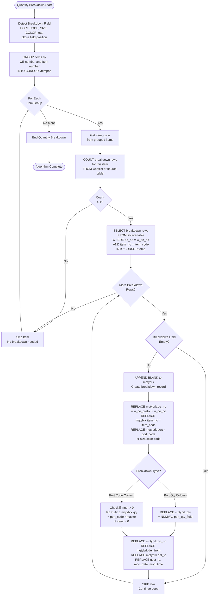
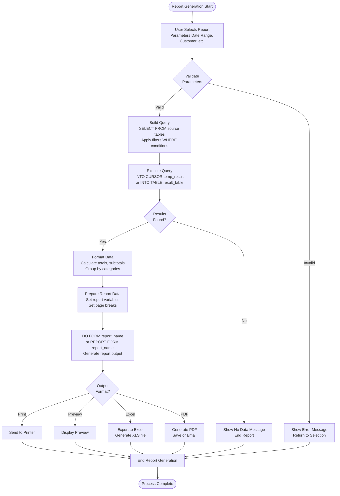

# Core Algorithms

## Overview

This document describes reusable core algorithms used throughout the system for BOM calculations, quantity breakdowns, and other common business logic operations.

## BOM Calculation Algorithm

### Purpose

Calculate sub-item quantities for Bill of Materials (BOM) items. This algorithm is reused in multiple processes:
- OE to OC posting
- OC to Contract generation
- Contract updates
- OC updates

### Algorithm Flow



### Formula

```
sub_item_qty = (head_qty * bom_qty) / total_bom_qty
```

Where:
- `head_qty` = Quantity of parent/head item
- `bom_qty` = Quantity of sub-item per parent from `mprodbom.qty`
- `total_bom_qty` = Sum of all `mprodbom.qty` for the parent item

### Usage Contexts

1. **OE to OC Posting** (`uordcont.prg` lines 40-56)
   - Applied to `morddt` records
   - Processes sub-items after head item is copied

2. **OC to Contract** (`uordcont.prg` lines 63-79)
   - Applied to `mcontdt` records
   - Uses same logic with contract detail table

3. **Contract Updates** (`uordcont.prg`)
   - Recalculates BOM quantities when contract items updated

**Code Reference:** `source/uordcont.prg` (procedures `update_morddt`, `update_mcontdt`)

## Quantity Breakdown Algorithm

### Purpose

Process quantity breakdowns by size, color, style, or port. Used in:
- OE Excel import
- Manual quantity breakdown entry
- Port-based quantity allocation

### Algorithm Flow



### Usage Contexts

1. **Excel Import** (`uoexls_2013.prg`, procedure `update_mqtybrk`)
   - Processes PORT CODE based breakdowns
   - Creates `mqtybrk` records from Excel data

2. **Port-based Breakdown** (`uoexls_2013.prg`, procedure `process_qty_breakdown`)
   - Processes PORT columns from Excel
   - Handles Q-column (quantity) vs code-based breakdowns

3. **Manual Entry** (Form `iqtybrk2`)
   - User enters breakdowns manually
   - Validates totals match item quantity

**Code Reference:** `source/uoexls_2013.prg` (procedures `update_mqtybrk`, `process_qty_breakdown`)

## Report Generation Flow

### Purpose

Generic pattern for report generation used across all report types in the system.

### Algorithm Flow



### Usage Pattern

This pattern is used in:
- Order Enquiry reports
- Order Confirmation reports
- Contract reports
- Invoice reports
- Shipping Order reports
- Analysis and summary reports

**Code Reference:** Multiple report forms (.frx files) and report generation programs


