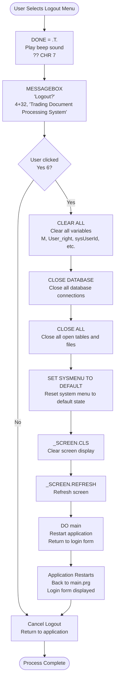
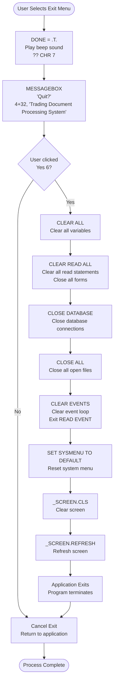

# Authentication

## Overview

The system uses form-based authentication with password validation. Users log in through the `ilogon` form, and authentication status determines menu access.

## Login Process

### Login Form

**Form:** `ilogon.scx` (ILOGON)

**Process:**
1. User enters credentials
2. System validates against `user` table
3. Sets `User_right` (SUPERVISOR/REGULAR_USER)
4. Sets `sysUserId` (user ID)
5. Returns `M = .T.` if successful

**Code Reference:** `main.prg` (lines 25-26)

### Authentication Flow

```mermaid
flowchart TD
    Start([Application Start]) --> ClearAll[CLEAR ALL<br/>Clear all variables and memory]
    ClearAll --> InitPublicVars[Initialize Public Variables<br/>M, User_right, w_shop_no<br/>w_shop_name, sysUserId<br/>syswork, w_sys_language]
    InitPublicVars --> CheckBatworkDir{Directory<br/>C:\Batwork<br/>exists?}
    CheckBatworkDir -->|No| CreateBatworkDir[MD C:\Batwork<br/>Create directory]
    CheckBatworkDir -->|Yes| SetSysLanguage
    CreateBatworkDir --> SetSysLanguage[w_sys_language = E<br/>SET HOUR TO 24<br/>PUBLIC w_password]
    SetSysLanguage --> SetFoxConfig[SET TALK OFF<br/>SET DELETE ON<br/>SET SAFETY OFF<br/>SET STATUS BAR OFF<br/>SET CENTURY ON<br/>SET DATE MDY]
    SetFoxConfig --> SetPaths[SET PATH TO c:\batwork<br/>SET EXCLUSIVE OFF<br/>SET ENGINEBEHAVIOR 70]
    SetPaths --> SetScreenCaption["Set Screen Caption<br/>_SCREEN.CAPTION =<br/>'Trading Management System - V3.0 July 9, 2025)'<br/>_SCREEN.WINDOWSTATE = 2"]
    SetScreenCaption --> DoLoginForm[DO FORM ILOGON<br/>Display login form]
    
    DoLoginForm --> LoginForm[ILOGON Form Displayed<br/>User enters username/password]
    LoginForm --> FormValidate[Form validates credentials<br/>Lookup in user table<br/>Compare password]
    
    FormValidate -->|Invalid| SetMFalse[M = .F.<br/>User_right = empty<br/>sysUserId = empty<br/>Return to main.prg]
    FormValidate -->|Valid| SetMTrue[M = .T.<br/>User_right = SUPERVISOR/REGULAR_USER<br/>sysUserId = user_id<br/>Return to main.prg]
    
    SetMFalse --> CheckMVar{M == .T.?}
    SetMTrue --> CheckMVar
    
    CheckMVar -->|No M = .T.| CancelApp[CANCEL<br/>Exit application]
    CheckMVar -->|M = .T.| CheckUserRight{Upper User_right<br/>== SUPERVISOR?}
    
    CheckUserRight -->|Yes| SetSuperCaption["_screen.Caption +=<br/>'Date: ' + DTOC gettoday<br/>DO BATMENUS.MPX<br/>Load Supervisor Menu"]
    CheckUserRight -->|No| SetRegularCaption["_screen.Caption +=<br/>'Date: ' + DTOC gettoday<br/>DO BATMENU.MPX<br/>Load Regular Menu"]
    
    SetSuperCaption --> CreateUserWorkDir
    SetRegularCaption --> CreateUserWorkDir[syswork = 'c:\' +<br/>ALLTRIM sysUserId + 'work'<br/>Build user work directory path]
    
    CreateUserWorkDir --> CheckUserDir{User Directory<br/>syswork exists?}
    CheckUserDir -->|No| MakeUserDir[MD syswork<br/>Create user directory]
    CheckUserDir -->|Yes| SetPathWithUser
    MakeUserDir --> SetPathWithUser[SET PATH TO<br/>c:\batwork, syswork<br/>Add user directory to path]
    
    SetPathWithUser --> AddUserToCaption["_screen.Caption +=<br/>' ' + ALLTRIM sysUserId<br/>Add user ID to caption]
    AddUserToCaption --> SetSysMenuOn[SET SYSMENU ON<br/>ON SHUTDOWN QUIT<br/>Enable system menu]
    SetSysMenuOn --> ReadEvent[READ EVENT<br/>Enter event loop<br/>Start application]
    ReadEvent --> MainApp[Main Application Running<br/>Event loop active]
    
    CancelApp --> End([Application Exited])
```

**Code Reference:** `source/main.prg` (lines 1-50)

### Logout Process Flow



**Code Reference:** `source/BATMENUS.MPR` (lines 416-428)

### Exit Process Flow



**Code Reference:** `source/BATMENUS.MPR` (lines 445-457)

## Password Handling

### Storage

**Table:** `user.DBF`

**Field:** `password` (likely plain text)

**Security:** No encryption evident in code

### Validation

**Process:**
1. User enters password
2. System looks up user in `user` table
3. Compares entered password with stored password
4. Validates user is active

## Session Management

### Session Variables

**Set During Login:**
- `M` - Authentication status (.T. = authenticated)
- `User_right` - User role (SUPERVISOR/REGULAR_USER)
- `sysUserId` - User ID
- `w_password` - Company password (may be separate)

**Code Reference:** `main.prg` (lines 3, 9, 26-27)

### Session Duration

**Lifetime:** Until logout or application close

**No Timeout:** Sessions do not expire automatically

**Logout:** User must explicitly logout

### Session Validation

**Check:** `IF M = .T.` before loading menu

**If Not Authenticated:** Application cancels/exits

**Code Reference:** `main.prg` (line 26)

## User Identification

### sysUserId

**Purpose:** Identify current user

**Usage:**
- Audit trails (`user_id`, `cre_user` fields)
- User-specific working directories
- Display in screen caption

**Setting:**
```foxpro
syswork="c:\"+alltrim(sysuserid)+"work"
_screen.Caption=_screen.Caption+ "   "+alltrim(sysuserid)
```

**Code Reference:** `main.prg` (lines 35, 37)

## Company Context

### Company Password

**Variable:** `w_password`

**Purpose:** Determines company context

**Values:**
- "HT" - Holiday Times
- "BAT" - Baitin Trading
- "INSP" - InSpirt Designs
- "HFW" - Holiday Funworld

**Setting:** May be set during login or hardcoded

**Code Reference:** `a.prg` (lines 16-32), `uoexls_2013.prg` (lines 145-147)

## Logout Process

### Logout Function

**Menu:** LogOut (ALT+L)

**Process:**
1. Confirmation message: "Logout?"
2. If confirmed:
   - Clear all variables
   - Close database
   - Close all files
   - Reset system menu
   - Clear screen
   - Return to login (`do main`)

**Code Reference:** `BATMENUS.MPR` (lines 416-428)

### Exit Function

**Menu:** Exit (ALT+E)

**Process:**
1. Confirmation message: "Quit?"
2. If confirmed:
   - Clear read all
   - Close database
   - Close all files
   - Clear events
   - Reset system menu
   - Clear screen
   - Exit application

**Code Reference:** `BATMENUS.MPR` (lines 445-457)

## Security Limitations

### Password Storage

**Issue:** Passwords likely stored in plain text

**Risk:** Security vulnerability if database accessed

**Mitigation:** Encrypt passwords in modernization

### No Session Timeout

**Issue:** Sessions last until logout

**Risk:** Unauthorized access if user leaves workstation

**Mitigation:** Implement session timeout

### No Password Policy

**Issue:** No password complexity requirements

**Risk:** Weak passwords

**Mitigation:** Implement password policy

### No Account Lockout

**Issue:** No lockout after failed attempts

**Risk:** Brute force attacks possible

**Mitigation:** Implement account lockout

## User Table Structure

### Inferred Fields

- `user_id` - User ID (Primary Key)
- `password` - Password (plain text)
- `user_name` - User name
- `user_right` - User rights (SUPERVISOR/REGULAR_USER)
- `active` - Active flag (if exists)

### User Management

**Form:** `iuser` (Input User Account)

**Access:** SUPERVISOR only

**Purpose:** Create/edit user accounts

## Authentication Code Flow

### Main Entry Point

```foxpro
DO FORM ILOGON
IF M = .T.    
    IF Upper(User_right) = "SUPERVISOR"
        DO BATMENUS.MPX        	
    ELSE
        DO BATMENU.MPX        	
    Endif  
    Read Event
ELSE
   Cancel
ENDIF
```

**Code Reference:** `main.prg` (lines 25-50)

## Summary

The authentication system uses form-based login with password validation. It sets user roles and company context, but has security limitations including plain text passwords and no session timeout. The system relies on application-level security rather than database-level security.


