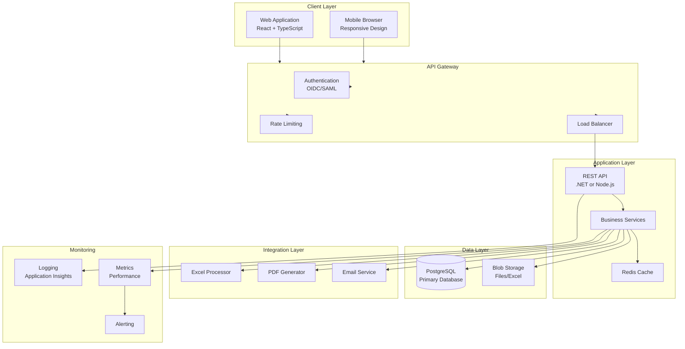
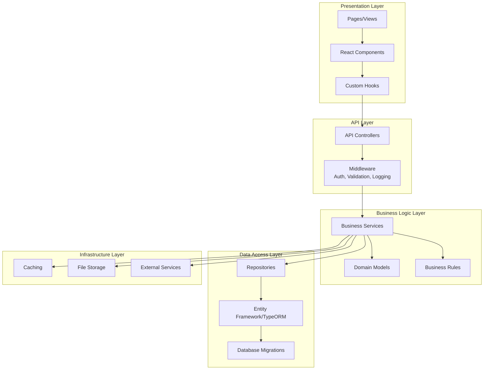
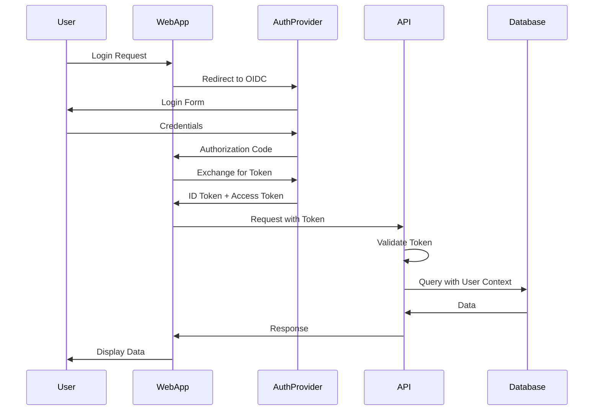

# Target State Architecture

## Overview

This document defines the target architecture for the modernized BAITIN Trading Management System. The architecture is designed to be scalable, maintainable, secure, and provide a superior user experience while preserving all business functionality.

## Architecture Principles

### 1. Web-First Architecture
- Browser-based application accessible from any device
- Responsive design (desktop-first, mobile-ready)
- No client installation required

### 2. API-First Design
- RESTful API for all business operations
- Clear separation between frontend and backend
- API versioning for future compatibility

### 3. Database-Centric
- Relational database with ACID compliance
- Referential integrity enforced at database level
- Proper indexing and query optimization

### 4. Security by Design
- Authentication and authorization built-in
- Data encryption at rest and in transit
- Comprehensive audit logging

### 5. Scalability and Performance
- Horizontal scaling capability
- Caching strategies
- Optimized database queries
- Performance monitoring

### 6. Maintainability
- Modern technology stack
- Clean code architecture
- Comprehensive documentation
- Automated testing

## Overall Architecture

### High-Level Architecture Diagram



## Technology Stack

### Frontend Technology

#### Core Framework
- **Framework:** React 18+ with TypeScript
- **State Management:** React Query + Context API (or Zustand/Redux if needed)
- **UI Library:** Material-UI or Ant Design (keyboard-first components)
- **Form Management:** React Hook Form (fast, performant)
- **Data Grid:** AG Grid Enterprise (Excel-like, keyboard navigation)
- **Routing:** React Router v6

#### Key Libraries
- **HTTP Client:** Axios or Fetch API
- **Date Handling:** date-fns or Day.js
- **Validation:** Zod or Yup
- **Excel:** SheetJS (xlsx) for client-side processing
- **PDF:** jsPDF or PDFKit for client-side generation

#### Build Tools
- **Bundler:** Vite or Webpack
- **Type Checking:** TypeScript
- **Linting:** ESLint + Prettier
- **Testing:** Vitest + React Testing Library

### Backend Technology

#### Option A: .NET Stack (Recommended for Enterprise)
- **Framework:** .NET 8+ (C#)
- **API:** ASP.NET Core Web API
- **ORM:** Entity Framework Core
- **Authentication:** ASP.NET Core Identity + OIDC
- **Validation:** FluentValidation
- **Logging:** Serilog
- **Caching:** Redis

#### Option B: Node.js Stack
- **Framework:** NestJS (TypeScript)
- **ORM:** TypeORM or Prisma
- **Authentication:** Passport.js + OIDC
- **Validation:** class-validator
- **Logging:** Winston or Pino
- **Caching:** Redis

**Recommendation:** .NET stack for enterprise-grade features, better performance, and strong typing.

### Database Technology

#### Primary Database
- **Database:** PostgreSQL 15+
- **Rationale:**
  - ACID compliance
  - Strong referential integrity
  - Excellent performance
  - JSON/JSONB support for flexible data
  - Full-text search
  - Open source, enterprise-ready

#### Database Features
- **Connection Pooling:** PgBouncer or built-in pooling
- **Backup:** Automated daily backups
- **Replication:** Read replicas for scaling
- **Monitoring:** pg_stat_statements for query analysis

### Authentication and Authorization

#### Authentication
- **Method:** OIDC (OpenID Connect) or SAML 2.0
- **Provider Options:**
  - Azure AD / Microsoft Entra ID (if available)
  - Okta
  - Auth0
  - Self-hosted IdentityServer
- **Fallback:** JWT-based authentication with password hashing (bcrypt/Argon2)

#### Authorization
- **Model:** Role-Based Access Control (RBAC)
- **Implementation:**
  - Roles: SUPERVISOR, REGULAR_USER (extensible)
  - Permissions: Fine-grained permissions per module/feature
  - Policy-based authorization
- **Audit:** All authorization decisions logged

### Infrastructure

#### Deployment Options

##### Option 1: Cloud-Native (Recommended)
- **Platform:** Azure, AWS, or Google Cloud
- **Containers:** Docker + Kubernetes
- **Benefits:** Scalability, managed services, global reach

##### Option 2: On-Premises
- **Platform:** Windows Server or Linux
- **Containers:** Docker + Docker Swarm or Kubernetes
- **Benefits:** Data sovereignty, compliance

#### Infrastructure Components
- **Web Server:** Nginx or IIS
- **Application Server:** Containerized (.NET/Node.js)
- **Database Server:** PostgreSQL (managed or self-hosted)
- **Cache:** Redis (managed or self-hosted)
- **File Storage:** Azure Blob Storage, AWS S3, or local storage
- **CDN:** For static assets (optional)

### DevOps and CI/CD

#### Source Control
- **Repository:** Git (GitHub, GitLab, or Azure DevOps)
- **Branching:** Git Flow or GitHub Flow
- **Code Review:** Pull request workflow

#### CI/CD Pipeline
- **Build:** Automated builds on commit
- **Testing:** Unit tests, integration tests, E2E tests
- **Deployment:** Automated deployment to environments
- **Environments:** Dev → Test → Staging → Production

#### Monitoring and Logging
- **Application Monitoring:** Application Insights, New Relic, or Datadog
- **Logging:** Centralized logging (ELK stack or cloud logging)
- **Metrics:** Performance metrics, business metrics
- **Alerting:** Automated alerts for errors, performance issues

## Application Architecture

### Layered Architecture



### Module Structure

#### Frontend Modules
```
src/
├── features/
│   ├── auth/          # Authentication
│   ├── master-data/   # Items, Customers, Vendors
│   ├── order-enquiry/ # OE module
│   ├── order-confirmation/ # OC module
│   ├── contract/      # Contract module
│   ├── shipping/      # SO module
│   ├── delivery-note/ # DN module
│   ├── invoice/       # Invoice module
│   ├── enquiry/       # Enquiry module
│   └── reporting/     # Reports module
├── shared/
│   ├── components/    # Reusable components
│   ├── hooks/         # Shared hooks
│   ├── utils/         # Utilities
│   ├── services/      # API services
│   └── types/         # TypeScript types
└── app/               # App configuration
```

#### Backend Modules
```
src/
├── API/               # API controllers
├── Domain/            # Domain models
├── Services/          # Business services
├── Data/              # Data access
│   ├── Repositories/
│   ├── Entities/
│   └── Migrations/
├── Infrastructure/     # Infrastructure services
└── Shared/           # Shared utilities
```

## Data Architecture

### Database Schema Design

#### Schema Organization
- **Schema per Module:** Logical separation (optional)
- **Naming Convention:** snake_case for tables/columns
- **Primary Keys:** UUID or sequential IDs
- **Foreign Keys:** Enforced at database level
- **Indexes:** Strategic indexing for performance

#### Key Design Decisions

##### 1. Transaction Tables
- **Pattern:** Header/Detail tables with foreign keys
- **Example:**
  - `order_enquiry_header` (id, oe_no, cust_no, oe_date, ...)
  - `order_enquiry_detail` (id, header_id, item_no, qty, price, ...)
- **Benefits:** Referential integrity, cascading deletes

##### 2. Master Data Tables
- **Normalized:** Proper normalization (3NF)
- **Soft Deletes:** `deleted_at` timestamp instead of hard deletes
- **Audit Fields:** `created_at`, `updated_at`, `created_by`, `updated_by`

##### 3. Memo Fields
- **Strategy:** Convert FPT to TEXT or JSONB
- **Large Text:** Use TEXT type (unlimited)
- **Structured Data:** Use JSONB for flexible schema

##### 4. Lookup Tables
- **Reference Data:** Standard codes, origins, ports, etc.
- **Caching:** Frequently accessed lookups cached in Redis

### Data Migration Strategy

#### Migration Approach
1. **ETL Pipeline:** Extract from DBF → Transform → Load to PostgreSQL
2. **Validation:** Data quality checks at each stage
3. **Reconciliation:** Compare source and target data
4. **Verification:** Business user verification

#### Key Mapping
- **Preserve Original Keys:** OE numbers, OC numbers, etc. as unique identifiers
- **Add New IDs:** UUID primary keys for internal use
- **Maintain Relationships:** Foreign keys preserve relationships

## Security Architecture

### Authentication Flow



### Authorization Model

#### Role-Based Access Control (RBAC)
- **Roles:** SUPERVISOR, REGULAR_USER (extensible)
- **Permissions:** Fine-grained per module/feature
- **Policy Enforcement:** API-level and UI-level

#### Permission Matrix
| Module | Feature | SUPERVISOR | REGULAR_USER |
|--------|---------|------------|--------------|
| Master Data | Create Item | ✅ | ❌ |
| Master Data | View Item | ✅ | ✅ |
| Order Enquiry | Import OE | ✅ | ✅ (Limited) |
| Order Enquiry | Delete OE | ✅ | ❌ |
| Reports | All Reports | ✅ | Limited |

### Data Security

#### Encryption
- **At Rest:** Database encryption (PostgreSQL TDE or disk encryption)
- **In Transit:** TLS 1.3 for all connections
- **Sensitive Fields:** Encrypted columns (e.g., payment terms)

#### Audit Logging
- **What:** All data changes, user actions, authorization decisions
- **Where:** Dedicated audit log table
- **Retention:** Configurable (default 7 years)
- **Access:** SUPERVISOR only

## Integration Architecture

### Excel Integration

#### Import Flow
1. **Upload:** User uploads Excel file
2. **Validation:** File format validation
3. **Processing:** Server-side processing (SheetJS or EPPlus)
4. **Mapping:** Dynamic field detection or user mapping
5. **Validation:** Business rule validation
6. **Import:** Bulk insert with transaction
7. **Error Report:** Detailed error report if failures

#### Export Flow
1. **Request:** User requests export
2. **Query:** Database query for data
3. **Generation:** Server-side Excel generation
4. **Download:** File download to user

### PDF Generation

#### Options
- **Server-Side:** PDFSharp, iTextSharp, or Puppeteer
- **Client-Side:** jsPDF (limited, for simple reports)
- **Recommendation:** Server-side for complex reports

#### Report Types
- **Transaction Reports:** OE, OC, Contract, Invoice
- **Summary Reports:** Sales analysis, item enquiry
- **Documents:** Invoices, packing lists, shipping orders

### API Design

#### RESTful API Principles
- **Resources:** Nouns (e.g., `/api/order-enquiries`)
- **HTTP Methods:** GET, POST, PUT, DELETE, PATCH
- **Status Codes:** Proper HTTP status codes
- **Versioning:** `/api/v1/...`

#### API Endpoints Structure
```
/api/v1/
├── auth/              # Authentication
├── master-data/
│   ├── items/
│   ├── customers/
│   └── vendors/
├── order-enquiries/
├── order-confirmations/
├── contracts/
├── shipping-orders/
├── delivery-notes/
├── invoices/
└── reports/
```

## Performance Architecture

### Caching Strategy

#### Client-Side Caching
- **React Query:** Automatic caching of API responses
- **Cache Invalidation:** Smart invalidation on mutations
- **Stale Time:** Configurable per endpoint

#### Server-Side Caching
- **Redis:** Frequently accessed data (master data, lookups)
- **Cache Keys:** Structured keys (e.g., `item:{id}`)
- **TTL:** Time-to-live based on data volatility

### Database Optimization

#### Indexing Strategy
- **Primary Keys:** Automatic indexes
- **Foreign Keys:** Indexed for joins
- **Search Fields:** Indexed for queries (dates, status, codes)
- **Composite Indexes:** For common query patterns

#### Query Optimization
- **ORM Optimization:** Eager loading, query projection
- **Pagination:** All list endpoints paginated
- **Filtering:** Server-side filtering for large datasets

### Performance Targets

#### Response Times
- **Page Load:** < 2 seconds
- **API Response:** < 500ms (p95)
- **Data Entry:** < 100ms (client-side validation)
- **Excel Import:** < 30 seconds for 1000 rows
- **Report Generation:** < 10 seconds for standard reports

## Scalability Architecture

### Horizontal Scaling

#### Application Scaling
- **Stateless Design:** No server-side session state
- **Load Balancing:** Multiple application instances
- **Session Storage:** Redis for shared session (if needed)

#### Database Scaling
- **Read Replicas:** For read-heavy operations
- **Connection Pooling:** Efficient connection management
- **Partitioning:** Large tables partitioned by date (future)

### Vertical Scaling
- **Resource Allocation:** CPU, memory based on load
- **Auto-Scaling:** Automatic scaling based on metrics
- **Resource Monitoring:** Track resource usage

## Monitoring and Observability

### Logging Strategy

#### Log Levels
- **Error:** Application errors, exceptions
- **Warning:** Potential issues, validation failures
- **Info:** Business events, user actions
- **Debug:** Detailed debugging information

#### Log Structure
- **Format:** Structured JSON logs
- **Fields:** Timestamp, level, message, user, request ID, context
- **Retention:** 30 days (configurable)

### Metrics

#### Application Metrics
- **Response Times:** API endpoint response times
- **Error Rates:** Error count by endpoint
- **Throughput:** Requests per second
- **User Activity:** Active users, feature usage

#### Business Metrics
- **Orders Processed:** OE, OC, Invoice counts
- **Data Quality:** Validation error rates
- **User Adoption:** Feature usage statistics

### Alerting

#### Alert Types
- **Critical:** System down, data corruption
- **Warning:** High error rates, performance degradation
- **Info:** Business events, milestones

#### Alert Channels
- **Email:** Critical alerts
- **Slack/Teams:** Team notifications
- **SMS:** Critical system alerts (optional)

## Disaster Recovery

### Backup Strategy

#### Database Backups
- **Frequency:** Daily full backups, hourly incremental
- **Retention:** 30 days (configurable)
- **Testing:** Monthly restore testing

#### Application Backups
- **Code:** Git repository (multiple remotes)
- **Configuration:** Version-controlled config files
- **Files:** Blob storage with versioning

### Recovery Procedures

#### RTO/RPO Targets
- **RTO (Recovery Time Objective):** < 4 hours
- **RPO (Recovery Point Objective):** < 1 hour

#### Recovery Steps
1. **Assess:** Determine scope of failure
2. **Restore:** Restore from backup
3. **Validate:** Verify data integrity
4. **Resume:** Resume normal operations

## Summary

The target architecture provides a modern, scalable, secure foundation for the BAITIN system. It addresses all limitations of the current system while preserving business functionality and improving user experience. The architecture is designed to be:

- **Scalable:** Horizontal and vertical scaling
- **Secure:** Modern authentication, authorization, encryption
- **Maintainable:** Clean architecture, modern stack
- **Performant:** Caching, optimization, monitoring
- **Reliable:** Backup, disaster recovery, monitoring

## Next Steps

1. **Finalize Technology Choices:** Confirm .NET vs Node.js, cloud provider
2. **Design Database Schema:** Detailed schema design
3. **Create API Specifications:** OpenAPI/Swagger specifications
4. **Plan Infrastructure:** Cloud resources, networking
5. **Begin PoC:** Validate architecture with PoC

## Document References

- **Data Migration Strategy:** `../04-data-migration-strategy/`
- **Application Modernization:** `../05-application-modernization/`
- **UX/UI Strategy:** `../06-ux-ui-strategy/`
- **Security and Compliance:** `../07-security-compliance/`
