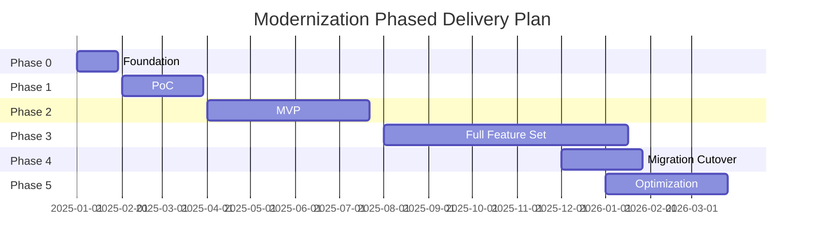

# Phased Delivery Plan

## Overview

This document outlines the phased approach to modernizing the BAITIN Trading Management System. The plan is structured in 5 phases, from foundation setup through production cutover and optimization. Each phase builds upon the previous, ensuring a systematic and de-risked approach to modernization.

## Phase Overview

## Phase 0: Foundation (Weeks 1-4)

### Objectives
- Establish development infrastructure
- Define architecture and standards
- Build core reusable components
- Set up development environment

### Deliverables

#### Week 1-2: Infrastructure Setup
- **Development Environment:**
  - Set up Git repository
  - Configure CI/CD pipeline
  - Set up development database
  - Configure development tools (IDE, linters, formatters)

- **Architecture Design:**
  - Finalize technology stack decisions
  - Design database schema (high-level)
  - Define API structure
  - Create architecture decision records (ADRs)

#### Week 3: Core Components Development
- **Frontend Foundation:**
  - Set up React + TypeScript project
  - Configure build tools (Vite/Webpack)
  - Set up routing (React Router)
  - Create base layout components

- **Backend Foundation:**
  - Set up API project (.NET/Node.js)
  - Configure database connection
  - Set up authentication framework
  - Create base API structure

#### Week 4: UX Kernel Development
- **Keyboard-First Components:**
  - Text input with auto-advance
  - Lookup/select with type-to-search
  - Data grid (AG Grid) setup
  - Form layout components

- **Design System:**
  - Color scheme
  - Typography
  - Component library foundation
  - Style guide

### Success Criteria
- ✅ Development environment fully operational
- ✅ Core components implemented and tested
- ✅ Architecture documented
- ✅ Team trained on standards and tools

### Risks and Mitigation
- **Risk:** Technology stack decisions delayed
- **Mitigation:** Early stakeholder alignment on stack

- **Risk:** Infrastructure setup takes longer than expected
- **Mitigation:** Use cloud templates and automation

## Phase 1: Proof of Concept (PoC) (Weeks 5-12)

### Objectives
- Validate architecture and UX approach
- Demonstrate key capabilities to stakeholders
- Build confidence in modernization approach
- Identify and address early risks

### Scope

#### Selected Modules
1. **Master Data Management:**
   - Item master (view, create, edit)
   - Customer master (view, create, edit)
   - Vendor master (view, create, edit)

2. **Order Enquiry (OE):**
   - OE Control (create, view, search)
   - OE Manual Entry (header + detail grid)
   - OE Enquiry List (search, filter, view)

3. **Excel Import (Basic):**
   - Single format Excel import
   - Field mapping
   - Validation and error reporting

### Deliverables

#### Week 5-6: Master Data Module
- **Item Master:**
  - Item entry form (keyboard-first)
  - Item lookup/search
  - Item list with filtering

- **Customer/Vendor Master:**
  - Entry forms
  - Lookup/search functionality
  - List views

#### Week 7-8: Order Enquiry Module
- **OE Control:**
  - Create OE Control record
  - Search/view OE Control

- **OE Entry:**
  - Header form (OE No, Date, Customer)
  - Detail grid (Item, Qty, Price)
  - Item lookup with auto-fill
  - Auto-save functionality

#### Week 9-10: Excel Import
- **Import Functionality:**
  - File upload
  - Field mapping (auto-detect + manual)
  - Validation
  - Error reporting

#### Week 11-12: Integration and Testing
- **Integration:**
  - Connect all modules
  - End-to-end workflow testing
  - Performance testing

- **Demo Preparation:**
  - Demo script
  - Demo data
  - Presentation materials

### Success Criteria
- ✅ All PoC modules functional
- ✅ UX validated with users (keyboard-first, fast input)
- ✅ Architecture validated (performance, scalability)
- ✅ Stakeholder buy-in achieved
- ✅ Demo successful

### Risks and Mitigation
- **Risk:** UX doesn't meet user expectations
- **Mitigation:** Early user testing, iterative refinement

- **Risk:** Performance issues
- **Mitigation:** Performance testing, optimization

- **Risk:** Scope creep
- **Mitigation:** Strict scope control, change management

## Phase 2: MVP (Minimum Viable Product) (Weeks 13-28)

### Objectives
- Deliver core workflow (OE → OC → Contract)
- Achieve feature parity for critical modules
- Enable parallel run with legacy system
- Prepare for full feature set

### Scope

#### Core Workflow Modules
1. **Order Enquiry (Complete):**
   - All OE features from PoC
   - Additional Excel import formats
   - Quantity breakdown
   - BOM processing

2. **Order Confirmation:**
   - Post OE to OC
   - OC entry and editing
   - OC enquiry and reporting

3. **Contract:**
   - Generate contracts from OC
   - Contract entry and editing
   - Contract enquiry and reporting

4. **Master Data (Complete):**
   - All master data features
   - BOM management
   - Additional lookup tables

### Deliverables

#### Weeks 13-16: Order Enquiry Completion
- **Enhanced Features:**
  - Multiple Excel import formats
  - Quantity breakdown entry
  - BOM processing
  - Advanced validation

#### Weeks 17-20: Order Confirmation Module
- **OC Features:**
  - Post OE to OC workflow
  - OC header/detail entry
  - OC enquiry and reports
  - BOM quantity calculations

#### Weeks 21-24: Contract Module
- **Contract Features:**
  - Generate contracts from OC
  - Vendor grouping
  - Contract entry/editing
  - Contract reports

#### Weeks 25-28: Integration and Testing
- **Integration:**
  - End-to-end workflow (OE → OC → Contract)
  - Data migration tools (for MVP data)
  - User acceptance testing

### Success Criteria
- ✅ Core workflow fully functional
- ✅ Feature parity for OE, OC, Contract modules
- ✅ Data migration tools operational
- ✅ User acceptance testing passed
- ✅ Performance meets targets

### Risks and Mitigation
- **Risk:** Scope expansion beyond MVP
- **Mitigation:** Strict MVP definition, change control

- **Risk:** Data migration complexity
- **Mitigation:** Early migration tool development, testing

- **Risk:** User adoption challenges
- **Mitigation:** Early user involvement, training

## Phase 3: Full Feature Set (Weeks 29-52)

### Objectives
- Complete all remaining modules
- Migrate all reports
- Achieve 100% feature parity
- Performance optimization

### Scope

#### Remaining Modules
1. **Shipping Order (SO):**
   - SO creation from contracts
   - SO entry and editing
   - SO format configuration
   - SO reports

2. **Delivery Note (DN):**
   - DN creation from SO
   - DN entry and editing
   - Loading master/advice
   - DN reports

3. **Invoice:**
   - Invoice creation from SO/DN
   - Invoice entry and editing
   - Packing list generation
   - Invoice reports

4. **Enquiry Module:**
   - Sales analysis
   - Item enquiry
   - SO enquiry
   - Summary enquiries

5. **Reporting Module:**
   - All 116+ reports
   - Report scheduling
   - Report export

6. **Additional Features:**
   - User management
   - System configuration
   - Audit logging
   - Advanced security

### Deliverables

#### Weeks 29-36: Shipping and Delivery
- **Shipping Order:**
  - SO module complete
  - SO format configuration
  - SO reports

- **Delivery Note:**
  - DN module complete
  - Loading features
  - DN reports

#### Weeks 37-44: Invoice Module
- **Invoice Features:**
  - Invoice creation
  - Invoice entry/editing
  - Packing list
  - Invoice reports

#### Weeks 45-48: Enquiry and Reporting
- **Enquiry Module:**
  - All enquiry features
  - Analysis reports

- **Reporting:**
  - Report migration
  - Report scheduling
  - Report export

#### Weeks 49-52: Finalization
- **Integration:**
  - Complete end-to-end workflow
  - Integration testing
  - Performance optimization
  - Security hardening

### Success Criteria
- ✅ All modules complete
- ✅ 100% feature parity achieved
- ✅ All reports migrated
- ✅ Performance optimized
- ✅ Security hardened
- ✅ Comprehensive testing completed

### Risks and Mitigation
- **Risk:** Report migration complexity (116+ reports)
- **Mitigation:** Prioritize reports, automate where possible

- **Risk:** Timeline pressure
- **Mitigation:** Resource allocation, scope prioritization

- **Risk:** Feature parity gaps
- **Mitigation:** Comprehensive feature comparison, gap analysis

## Phase 4: Migration and Cutover (Weeks 53-60)

### Objectives
- Execute data migration
- Conduct parallel run
- Train users
- Execute production cutover

### Deliverables

#### Week 53: Migration Preparation
- **Final Validation:**
  - Complete data validation
  - Final reconciliation
  - User acceptance testing

- **Preparation:**
  - Backup legacy system
  - Prepare rollback plan
  - User communication

#### Week 54: Data Migration Execution
- **Migration:**
  - Execute full data migration
  - Validate migrated data
  - Reconciliation report

#### Weeks 55-58: Parallel Run
- **Parallel Operations:**
  - Run new and legacy systems in parallel
  - Compare results
  - Fix any issues
  - User training

#### Week 59: Final Validation
- **Validation:**
  - Final data validation
  - User acceptance
  - Performance validation
  - Security validation

#### Week 60: Production Cutover
- **Cutover:**
  - Stop legacy system
  - Enable new system
  - Monitor and support
  - Issue resolution

### Success Criteria
- ✅ Data migration successful (100% accuracy)
- ✅ Parallel run successful
- ✅ All users trained
- ✅ Production cutover successful
- ✅ Zero critical issues

### Risks and Mitigation
- **Risk:** Data migration failures
- **Mitigation:** Extensive testing, rollback plan

- **Risk:** User resistance
- **Mitigation:** Comprehensive training, support

- **Risk:** System issues during cutover
- **Mitigation:** Monitoring, rapid response team

## Phase 5: Optimization (Ongoing, Weeks 61+)

### Objectives
- Performance optimization
- User feedback implementation
- Enhancement features
- Continuous improvement

### Focus Areas

#### Performance Optimization
- **Database:**
  - Query optimization
  - Index tuning
  - Caching strategies

- **Application:**
  - Code optimization
  - Bundle size reduction
  - Lazy loading

#### User Experience
- **Feedback Implementation:**
  - User feedback collection
  - UX improvements
  - Feature enhancements

#### Business Value
- **Enhancements:**
  - New features based on business needs
  - Integration with other systems
  - Mobile optimization

### Success Criteria
- ✅ Performance targets met/exceeded
- ✅ User satisfaction high
- ✅ Continuous improvement process established

## Timeline Summary

| Phase | Duration | Start | End |
|-------|----------|-------|-----|
| Phase 0: Foundation | 4 weeks | Week 1 | Week 4 |
| Phase 1: PoC | 8 weeks | Week 5 | Week 12 |
| Phase 2: MVP | 16 weeks | Week 13 | Week 28 |
| Phase 3: Full Feature Set | 24 weeks | Week 29 | Week 52 |
| Phase 4: Migration Cutover | 8 weeks | Week 53 | Week 60 |
| Phase 5: Optimization | Ongoing | Week 61+ | - |

**Total Timeline:** ~15 months from start to production cutover

## Resource Requirements

### Team Structure

#### Phase 0-1 (Foundation + PoC)
- **Team Size:** 4-6 developers
- **Roles:**
  - 1-2 Frontend developers
  - 1-2 Backend developers
  - 1 Architect
  - 1 QA engineer
  - 1 Project Manager

#### Phase 2-3 (MVP + Full Feature Set)
- **Team Size:** 6-8 developers
- **Roles:**
  - 2-3 Frontend developers
  - 2-3 Backend developers
  - 1 Architect
  - 1-2 QA engineers
  - 1 UX Designer
  - 1 Project Manager

#### Phase 4 (Migration)
- **Team Size:** 8-10 people
- **Roles:**
  - Development team (as above)
  - 1-2 Data migration specialists
  - 1-2 Business analysts
  - Training team
  - Support team

## Dependencies

### Critical Dependencies
1. **Technology Stack Decision:** Required before Phase 0
2. **Architecture Approval:** Required before Phase 1
3. **PoC Success:** Required before Phase 2
4. **Data Migration Tools:** Required before Phase 4
5. **User Training:** Required before Phase 4 cutover

### External Dependencies
1. **Stakeholder Availability:** For reviews and approvals
2. **User Availability:** For testing and training
3. **Infrastructure:** Cloud resources, database setup
4. **Third-Party Services:** Authentication provider, monitoring tools

## Risk Management

### High Risks
1. **Timeline Pressure:** 15-month timeline is aggressive
2. **Resource Availability:** Need skilled developers
3. **Data Migration Complexity:** 186 tables, complex relationships
4. **User Adoption:** Change from desktop to web

### Mitigation Strategies
- **Timeline:** Phased approach allows for adjustments
- **Resources:** Early recruitment, training
- **Data Migration:** Extensive testing, parallel run
- **User Adoption:** Early involvement, comprehensive training

## Success Metrics

### Phase 1 (PoC) Metrics
- ✅ PoC modules functional
- ✅ UX validated
- ✅ Stakeholder buy-in

### Phase 2 (MVP) Metrics
- ✅ Core workflow functional
- ✅ Feature parity for critical modules
- ✅ User acceptance testing passed

### Phase 3 (Full Feature Set) Metrics
- ✅ 100% feature parity
- ✅ All reports migrated
- ✅ Performance targets met

### Phase 4 (Cutover) Metrics
- ✅ Data migration 100% accurate
- ✅ Zero critical issues
- ✅ User adoption > 90%

## Summary

The phased delivery plan provides a systematic approach to modernizing the BAITIN system. Each phase builds upon the previous, ensuring de-risked delivery with early validation and stakeholder buy-in. The plan balances speed with quality, ensuring a successful modernization.

## Next Steps

1. **Approve Plan:** Stakeholder approval of phased plan
2. **Assemble Team:** Recruit and onboard team
3. **Begin Phase 0:** Start foundation work
4. **Plan PoC:** Detailed PoC planning
5. **Stakeholder Communication:** Regular updates

## Document References

- **PoC Strategy:** `../15-poc-strategy/`
- **Current State Assessment:** `../02-current-state-assessment/`
- **Target Architecture:** `../03-target-state-architecture/`
- **Data Migration Strategy:** `../04-data-migration-strategy/`
