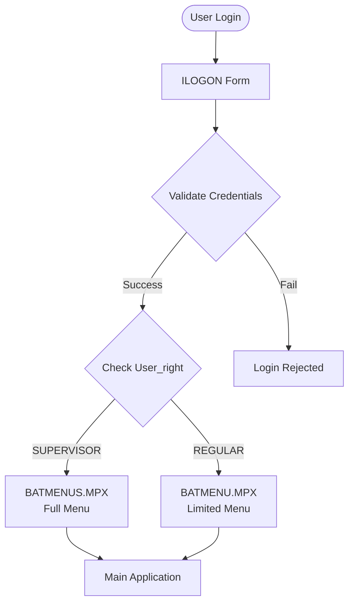

# User Roles and Permissions

## Role Overview

The system supports two primary user roles with different access levels:

1. **SUPERVISOR** - Full system access
2. **REGULAR_USER** - Limited access

## Role Determination

### Authentication Flow



### Code Reference

From `main.prg`:
```foxpro
IF M = .T.    
    IF Upper(User_right) = "SUPERVISOR"
        DO BATMENUS.MPX        	
    ELSE
        DO BATMENU.MPX        	
    Endif  
```

## SUPERVISOR Role

### Capabilities

**Full System Access:**
- All master data management functions
- All transaction entry functions
- All reporting functions
- System administration functions

### Menu Access (BATMENUS.MPX)

**File Menu:**
- Item management (full)
- Customer management (full)
- Vendor management (full)
- User account management
- Company information setup
- Suspended item management
- Data recovery tools
- Reindex utilities
- Delete data functions
- Data conversion tools

**Order Enquiry:**
- OE Control file management
- Import/Input/Print Order Enquiry (all methods)
- Qty Breakdown (all methods)
- Other enquiry functions
- Change Customer No. (all documents)

**Order Confirmation:**
- Post OE/Post OC
- Input Order Confirmation
- Print Order Confirmation
- Print OC Qty Breakdown

**Contract:**
- All contract functions
- Contract amendments
- Contract printing

**Shipping Order:**
- Input Shipping Order
- Print Shipping Order
- Input Shipping Order Format

**DN (Delivery Note):**
- Input D/N
- Create D/N Excel File
- Loading Master
- Loading Advice
- Print functions

**Invoice:**
- All invoice functions
- Packing list (all formats)
- Shipment advice
- Debit note

**Delivery Report:**
- All delivery report functions
- Payment authorization

**Enquiry:**
- All enquiry functions
- Sales analysis (all types)
- Item enquiries
- Summary reports

**Report:**
- All report functions
- Export functions

**Acrobat File:**
- PDF generation for all documents

### Administrative Functions

1. **User Management**
   - Create/edit user accounts
   - Assign user rights
   - Form: `iuser`

2. **System Configuration**
   - Company information setup
   - System parameters
   - Form: `ipara2`

3. **Data Maintenance**
   - Reindex all tables
   - Data recovery
   - Delete data
   - Data conversion tools

4. **Data Conversion**
   - Vendor code conversion
   - Cancel status conversion
   - DR SO conversion
   - DR DN conversion
   - Change Item No.

## REGULAR_USER Role

### Capabilities

**Limited System Access:**
- Basic transaction entry
- Limited master data viewing
- Basic reporting
- No administrative functions

### Menu Access (BATMENU.MPX)

**File Menu:**
- Item management (limited)
- Customer management (view only)
- Vendor management (view only)
- **No access to:**
  - User account management
  - Company information
  - Data recovery
  - Reindex
  - Delete data
  - Data conversion

**Order Enquiry:**
- Import OE from Excel (limited formats)
- Input OE (new)
- Print Order Enquiry
- Print OE Doc
- Qty Breakdown (limited)
- **No access to:**
  - OE Control file management
  - Some import formats
  - Change Customer No.

**Order Confirmation:**
- Post OE/Post OC
- Input Order Confirmation
- Print Order Confirmation
- Print OC Qty Breakdown

**Contract:**
- Contract functions (limited)
- Contract printing

**Shipping Order:**
- Input Shipping Order
- Print Shipping Order
- **No access to:** Format configuration

**DN (Delivery Note):**
- Input D/N
- Loading functions
- Print functions
- **No access to:** Excel file creation

**Invoice:**
- Invoice functions
- Packing list
- **Limited export formats**

**Enquiry:**
- Basic enquiry functions
- **Limited analysis reports**

**Report:**
- Basic reports
- **Limited export functions**

### Restrictions

1. **No Administrative Access**
   - Cannot manage users
   - Cannot configure system
   - Cannot perform data maintenance

2. **Limited Data Modification**
   - Cannot delete data
   - Cannot perform bulk conversions
   - Limited master data editing

3. **Limited Import/Export**
   - Fewer Excel import formats
   - Limited export options
   - No advanced Excel functions

## User Management

### User Table

**Table:** `user.DBF` (or `user#.dbf`)

**Fields (inferred):**
- User ID
- Password
- User rights (SUPERVISOR/REGULAR_USER)
- User name
- Other user attributes

### Rights Table

**Table:** `rights.DBF` (or `rights#.dbf`)

**Purpose:** Additional permission definitions (if used)

### User Identification

**Variable:** `sysUserId`
- Set during login
- Used for audit trails
- Used for user-specific working directories

**Code Reference:**
```foxpro
syswork="c:\"+alltrim(sysuserid)+"work"
_screen.Caption=_screen.Caption+ "   "+alltrim(sysuserid)
```

## Multi-Company Support

### Company Context

The system supports multiple trading companies through password-based selection:

**Companies:**
- **HT** - Holiday Times Unlimited Inc
- **BAT** - Baitin Trading Limited
- **INSP** - InSpirt Designs
- **HFW** - Holiday Funworld Limited (with prefix)

### Company Configuration

**Variable:** `w_password`
- Determines company context
- Affects data filtering
- Affects OE number prefixes

**Code Reference (from `a.prg`):**
```foxpro
w_password = "HT"
w_co_name = "HOLIDAY TIMES UNLIMITED INC"
w_oe_prefix = ""

*w_password = "INSP"
*w_co_name = "InSpirt Designs"

*w_password = "BAT"
*w_co_name = "BAITIN TRADING LIMITED"

*w_password = "HFW"
*w_co_name = "HOLIDAY FUNWORLD LIMITED"
*w_oe_prefix = "HFW"
```

### Company-Specific Behavior

**OE Number Handling:**
- INSP: Adds "IN-" prefix automatically
- HFW: Uses "HFW" prefix
- HT/BAT: No prefix

**Data Filtering:**
- Company code stored in records (`comp_code` field in `moe`)
- Reports filtered by company
- User context determines visible data

## User Working Directories

### Per-User Directories

**Pattern:** `C:\<userid>work`

**Purpose:**
- User-specific temporary files
- User-specific exports
- User-specific working data

**Creation:**
```foxpro
syswork="c:\"+alltrim(sysuserid)+"work"
if !directory(syswork)
   md &syswork
endif   
set path to c:\batwork, &syswork
```

### Shared Working Directory

**Path:** `C:\batwork`

**Purpose:**
- Shared database files
- Shared temporary files
- Common working area

## Audit Trail

### User Tracking Fields

**Common Fields in Transaction Tables:**
- `user_id` - User who created/modified
- `cre_user` - User who created record
- `cre_date` - Creation date

**Example (from `uoexls_2013.prg`):**
```foxpro
replace moehd.user_id with sysuserid
replace moehd.cre_user with sysuserid
replace moehd.cre_date with date()
```

### Activity Logging

**Table:** `mactivity.DBF`

**Purpose:** Track user activities and system events

## Security Considerations

### Authentication

- **Method:** Form-based login (`ilogon.scx`)
- **Password:** Stored in user table
- **Session:** Maintained during application run
- **Logout:** Clears session and returns to login

### Authorization

- **Method:** Role-based (SUPERVISOR vs REGULAR_USER)
- **Enforcement:** Menu structure differences
- **Data Access:** Same tables, different menu options

### Limitations

1. **No Password Encryption:** Passwords likely stored in plain text
2. **No Session Timeout:** Session lasts until logout or application close
3. **No Audit Logging:** Limited activity tracking
4. **File-Based Security:** No database-level security

## Menu Differences Summary

| Feature | SUPERVISOR | REGULAR_USER |
|---------|-----------|--------------|
| User Management | ✅ | ❌ |
| System Configuration | ✅ | ❌ |
| Data Recovery | ✅ | ❌ |
| Reindex | ✅ | ❌ |
| Delete Data | ✅ | ❌ |
| Data Conversion | ✅ | ❌ |
| OE Control Management | ✅ | ❌ |
| Change Customer No. | ✅ | ❌ |
| SO Format Configuration | ✅ | ❌ |
| Advanced Reports | ✅ | Limited |
| Excel Export (Advanced) | ✅ | Limited |


