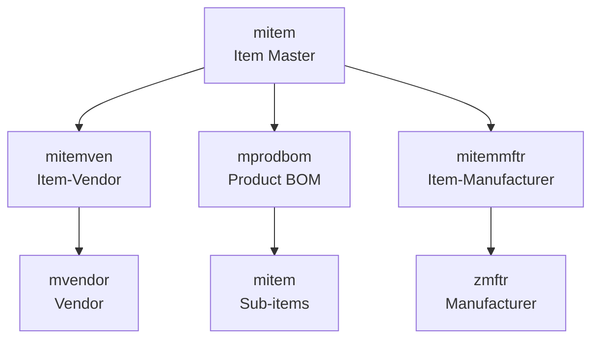
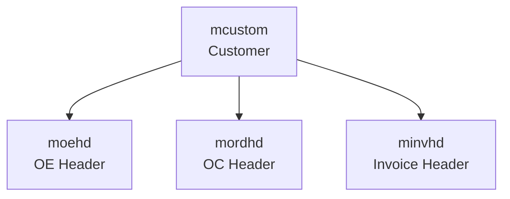
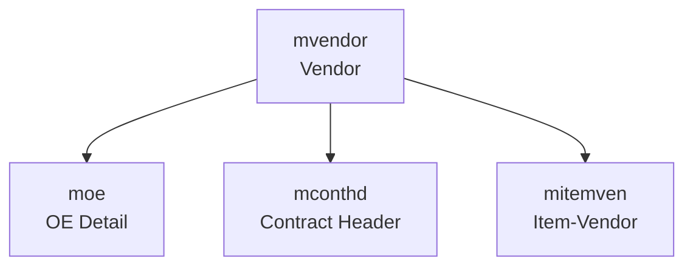

# Master Data Tables - Detailed Schemas

## Item Master Tables

### mitem (Item Master)

**Purpose:** Central item/product catalog

**Key Fields (inferred from `xitem.prg`):**
- `item_no` (C) - Item number (Primary Key)
- `item_type` (C) - Item type/category
- `date` (D) - Item creation/update date
- `short_name` (C) - Short item name
- `desp` (M) - Full description (memo field, stored in mitem.FPT)
- `origin` (C) - Country of origin
- `grp_code` (C) - Group/class code
- `material` (C) - Material description
- `upc_no` (C) - UPC barcode number
- `htc_no` (C) - HTC/Harmonized Tariff Code
- `std_code` (C) - Standard code (links to zstdcode)
- `price` (N) - Standard price
- `price_cur` (C) - Price currency code
- `pack_pc_1` (N) - Pack pieces level 1
- `pack_desp_1` (C) - Pack description level 1
- `pack_pc_2` (N) - Pack pieces level 2
- `pack_desp_2` (C) - Pack description level 2
- `pack_pc_3` (N) - Pack pieces level 3
- `pack_desp_3` (C) - Pack description level 3
- `pack_pc_4` (N) - Pack pieces level 4
- `pack_desp_4` (C) - Pack description level 4
- `wt` (N) - Weight
- `net` (N) - Net weight
- `cube` (N) - Cube measurement
- `duty` (N) - Duty rate

**Business Rules:**
- `item_no` must be unique
- `std_code` validated against `zstdcode`
- `htc_no` extracted from origin fields
- UPC constructed from multiple fields

**Indexes:**
- Primary: `item_no`
- Secondary: `std_code`, `grp_code`

**File Size:** 11MB
**Memo File:** 24MB (mitem.FPT - descriptions)

**Code Reference:** `xitem.prg` (lines 20-71)

### mitemmftr (Item Manufacturer)

**Purpose:** Links items to manufacturers

**Key Fields:**
- `item_no` (C) - Item number (links to mitem)
- `mftr_no` (C) - Manufacturer number (links to zmftr)
- Manufacturer-specific fields

**Business Rules:**
- Many-to-many relationship between items and manufacturers
- One item can have multiple manufacturers

**Indexes:**
- Primary: `item_no` + `mftr_no`

### mitemven (Item Vendor)

**Purpose:** Links items to vendors (who can supply the item)

**Key Fields:**
- `item_no` (C) - Item number (links to mitem)
- `vendor_no` (C) - Vendor number (links to mvendor)
- Vendor-specific pricing or terms

**Business Rules:**
- Many-to-many relationship
- Used to determine which vendors can supply items
- Referenced during OE import and contract generation

**File Size:** 6.7MB

**Indexes:**
- Primary: `item_no` + `vendor_no`
- Secondary: `vendor_no`

**Code Reference:** `uoexls_2013.prg` (lines 61-65)

### mprodbom (Product Bill of Materials)

**Purpose:** Defines product BOM structure (parent items and sub-items)

**Key Fields:**
- `item_no` (C) - Parent item number (links to mitem)
- `sub_item` (C) - Sub-item number (links to mitem)
- `qty` (N) - Quantity of sub-item per parent

**Business Rules:**
- Defines how parent items break down into sub-items
- Used for quantity calculation when processing BOM items
- Referenced in `uordcont.prg` for BOM propagation

**Indexes:**
- Primary: `item_no` + `sub_item` (index name: `iprodbom`)

**File Size:** 385KB

**Code Reference:** `uordcont.prg` (lines 40-43, 49-55), `uoexls_2013.prg` (lines 80-86)

### moebom (Order Enquiry BOM)

**Purpose:** BOM details for specific OEs

**Key Fields:**
- `oe_no` (C) - Order Enquiry number (links to moe)
- `item_no` (C) - Parent item number
- `sub_item` (C) - Sub-item number
- `qty` (N) - Quantity
- `price` (N) - Price
- `retail` (N) - Retail price
- `remark` (M) - Remarks

**Business Rules:**
- Created when OE has BOM items
- Quantities calculated from `mprodbom`
- Links to specific OE

**File Size:** 649KB
**Memo File:** 1.2MB (moebom.FPT)

**Indexes:**
- Primary: `oe_no` + `item_no` + `sub_item`

**Code Reference:** `uoexls_2013.prg` (lines 73-78)

## Customer Master Tables

### mcustom (Customer Master)

**Purpose:** Customer database

**Key Fields (inferred from `xcustom.prg`):**
- `cust_no` (C) - Customer number (Primary Key)
- `date` (D) - Customer creation/update date
- `ename` (C) - English name
- `sname` (C) - Short name
- `addr1` (C) - Address line 1
- `addr2` (C) - Address line 2
- `addr3` (C) - Address line 3
- `addr4` (C) - Address line 4
- `cont_name` (C) - Contact name
- `tel` (C) - Telephone
- `tel2` (C) - Telephone 2
- `fax` (C) - Fax
- `fax2` (C) - Fax 2
- `term` (C) - Payment terms
- `per_a` (C) - Person A
- `per_b` (C) - Person B
- `per_c` (C) - Person C
- `per_d` (C) - Person D
- `per_e` (C) - Person E
- `shipmark` (M) - Shipping mark (memo field, constructed from multiple fields)
- `show_sub_item_detail` (C) - Flag to show sub-item details

**Business Rules:**
- `cust_no` must be unique
- `shipmark` constructed from multiple memo fields (M11-M26)
- Used for validation during OE import
- `show_sub_item_detail` affects OE display

**Indexes:**
- Primary: `cust_no`

**File Size:** 576KB
**Memo File:** 394KB (mcustom.FPT)

**Code Reference:** `xcustom.prg` (lines 2-54), `uoexls_2013.prg` (lines 30-34, 185-190)

## Vendor Master Tables

### mvendor (Vendor Master)

**Purpose:** Vendor/supplier database

**Key Fields (inferred from `xvendor.prg`):**
- `vendor_no` (C) - Vendor number (Primary Key)
- `date` (D) - Vendor creation/update date
- `ename` (C) - English name
- `sname` (C) - Short name
- `addr1` (C) - Address line 1
- `addr2` (C) - Address line 2
- `addr3` (C) - Address line 3
- `addr4` (C) - Address line 4
- `cont_name` (C) - Contact name
- `tel` (C) - Telephone
- `tel2` (C) - Telephone 2
- `fax` (C) - Fax
- `fax2` (C) - Fax 2
- `type` (N) - Vendor type (1=Vendor, 2=Maker)

**Business Rules:**
- `vendor_no` must be unique
- `type` distinguishes between vendors and makers
- Used for contract generation (grouping by vendor)
- Referenced in OE and contract records

**Indexes:**
- Primary: `vendor_no`

**File Size:** 228KB

**Code Reference:** `xvendor.prg` (lines 1-49), `uoexls_2013.prg` (lines 121-125)

### zmftr (Manufacturer)

**Purpose:** Manufacturer information

**Key Fields:**
- `mftr_no` (C) - Manufacturer number (Primary Key)
- Manufacturer details

**Business Rules:**
- Separate from vendors
- Linked to items via `mitemmftr`

**File Size:** Small (zmftr.dbf)

**Code Reference:** `uoexls_2013.prg` (lines 115-119)

## Master Data Relationships

### Item Relationships

### Customer Usage

### Vendor Usage

## Data Import Patterns

### Item Import (from `xitem.prg`)

**Source:** Legacy `item.dbf` table
**Process:**
1. Extract item number (`i_no`)
2. Combine description fields (`desc1-desc4`) into `desp`
3. Extract HTC from `origin2` field (after "#" character)
4. Combine UPC fields (`upc` + `upc2`)
5. Map standard code from `zstdcode` using `STDNAME`
6. Set packing information (4 levels)
7. Set weight, cube, duty

### Customer Import (from `xcustom.prg`)

**Source:** Legacy `cus.dbf` table
**Filter:** `C_cname = "CUSTOMER" or "TRADING"`
**Process:**
1. Extract customer number (`c_no`)
2. Map address fields (`c_add1` to `c_add4`)
3. Map contact information
4. Construct `shipmark` from memo fields (M11-M26)
5. Map payment terms

### Vendor Import (from `xvendor.prg`)

**Source:** Legacy `cus.dbf` table
**Filter:** `C_CNAME="VENDOR" or "MAKER"`
**Process:**
1. Extract vendor number (`c_no`)
2. Map address and contact fields
3. Set `type` based on `C_CNAME` (1=Vendor, 2=Maker)

## Validation Rules

### Item Validation
- `item_no` must exist in `mitem` before use in transactions
- `std_code` validated against `zstdcode`
- UPC format validation

### Customer Validation
- `cust_no` must exist in `mcustom` before OE creation
- Customer code validated during OE import
- Must match OE Control record customer

### Vendor Validation
- `vendor_no` must exist in `mvendor` before contract creation
- Vendor type checked (Vendor vs Maker)
- Used for contract grouping

## Index Strategy

### Primary Indexes
- All master tables indexed on primary key (`item_no`, `cust_no`, `vendor_no`)

### Foreign Key Indexes
- `mitemven` indexed on both `item_no` and `vendor_no`
- `mprodbom` indexed on `item_no` (iprodbom index)

### Search Indexes
- Item searches by `std_code`, `grp_code`
- Customer searches by name fields
- Vendor searches by name and type

## File Sizes Summary

| Table | DBF Size | FPT Size | Notes |
|-------|----------|----------|-------|
| mitem | 11MB | 24MB | Large descriptions |
| mcustom | 576KB | 394KB | Moderate |
| mvendor | 228KB | - | Small |
| mitemven | 6.7MB | - | Many relationships |
| mprodbom | 385KB | - | Small |
| moebom | 649KB | 1.2MB | Per-OE BOM |

