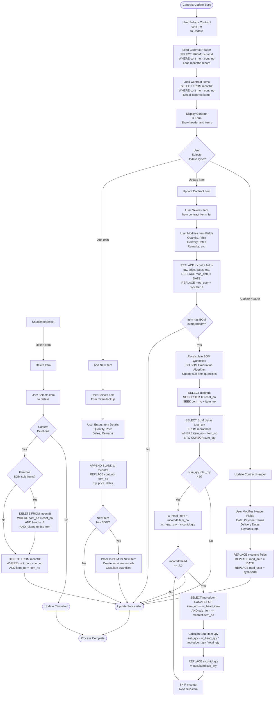

# Contract Process

## Overview

Contracts are purchase orders sent to vendors. They are generated from Order Confirmations (OC), grouped by vendor, and include payment terms, delivery dates, and item details.

## Contract Generation from OC

### Contract Generation Detailed Flow

```mermaid
flowchart TD
    Start([Generate Contract from OC]) --> SelectOC[User Selects OC Number<br/>conf_no from form isetcont@@_2018]
    SelectOC --> RetrieveOCItems[SELECT FROM morddt<br/>WHERE conf_no == selected OC<br/>Retrieve all OC items]
    
    RetrieveOCItems --> GroupByVendor[GROUP BY vendor_no<br/>from morddt<br/>Create vendor groups]
    GroupByVendor --> VendorLoop{For Each<br/>Unique Vendor}
    
    VendorLoop -->|No More| Complete[Contracts Created]
    VendorLoop -->|Yes| GetVendorNo[Get vendor_no<br/>for this vendor group]
    
    GetVendorNo --> GenerateContNo[Generate Contract Number<br/>cont_no<br/>Based on OC and vendor]
    GenerateContNo --> CreateContHeader[APPEND BLANK to mconthd<br/>Create Contract Header]
    
    CreateContHeader --> SetContHeaderFields[REPLACE mconthd.cont_no<br/>= generated cont_no<br/>REPLACE mconthd.conf_no = OC conf_no<br/>REPLACE mconthd.date = DATE<br/>REPLACE mconthd.vendor_no = vendor_no]
    
    SetContHeaderFields --> GetVendorInfo[SELECT mvendor<br/>LOCATE FOR vendor_no<br/>Get vendor details<br/>ename, addr1-4, payment terms]
    GetVendorInfo --> SetPaymentTerms[REPLACE mconthd.payment<br/>= vendor payment terms<br/>or user-specified terms]
    
    SetPaymentTerms --> SetDates[REPLACE mconthd.req_date_fr<br/>REPLACE mconthd.req_date_to<br/>from OC delivery dates]
    SetDates --> SetOtherFields[REPLACE mconthd.cur_code<br/>REPLACE mconthd.ship_to<br/>REPLACE mconthd.remark]
    
    SetOtherFields --> ItemLoop{For Each Item<br/>in morddt<br/>with this vendor_no}
    
    ItemLoop -->|No More| ProcessBOM
    ItemLoop -->|Yes| GetOCItem[Get next item<br/>from morddt<br/>for this vendor]
    
    GetOCItem --> CopyToContract[APPEND BLANK to mcontdt<br/>REPLACE mcontdt.cont_no = cont_no<br/>REPLACE mcontdt.conf_no = conf_no]
    CopyToContract --> CopyItemFields[REPLACE mcontdt.item_no<br/>= morddt.item_no<br/>REPLACE mcontdt.qty = morddt.qty<br/>REPLACE mcontdt.ctn = morddt.ctn<br/>REPLACE mcontdt.price = morddt.cost<br/>or morddt.price]
    
    CopyItemFields --> CopyMemoFields[REPLACE mcontdt.desc_memo<br/>= morddt.desc_memo<br/>REPLACE mcontdt.item_memo<br/>= morddt.item_memo<br/>REPLACE mcontdt.head = morddt.head]
    
    CopyMemoFields --> CheckHeadItem{mcontdt.head<br/>== .T.?}
    CheckHeadItem -->|Yes| MarkBOMItem[Mark as BOM head item<br/>Will process sub-items next]
    CheckHeadItem -->|No| ItemLoop
    MarkBOMItem --> ItemLoop
    
    ProcessBOM[Process BOM Items<br/>For Each Contract] --> SelectMcontdt[SELECT mcontdt<br/>SET ORDER TO cont_no<br/>SEEK cont_no]
    
    SelectMcontdt --> BOMLoop{More mcontdt<br/>records<br/>for this contract?}
    BOMLoop -->|No| NextVendor
    BOMLoop -->|Yes| GetContItem[Get next mcontdt record]
    
    GetContItem --> CheckItemBOM{Item has BOM<br/>in mprodbom?}
    CheckItemBOM -->|No| SkipContItem[SKIP mcontdt<br/>Continue Loop]
    CheckItemBOM -->|Yes| CalcBOMTotal[SELECT SUM qty as total_qty<br/>FROM mprodbom<br/>WHERE item_no == mcontdt.item_no<br/>INTO CURSOR sum_qty]
    
    CalcBOMTotal --> CheckBOMTotal{sum_qty.total_qty<br/>> 0?}
    CheckBOMTotal -->|No| SkipContItem
    CheckBOMTotal -->|Yes| SetHeadItemVars[w_head_item = mcontdt.item_no<br/>w_head_qty = mcontdt.qty]
    
    SetHeadItemVars --> SkipToSubItems[SKIP mcontdt<br/>Go to Next Record]
    SkipToSubItems --> BOMSubLoop{mcontdt.head<br/>== .F.?}
    
    BOMSubLoop -->|Yes| LocateBOM[SELECT mprodbom<br/>LOCATE FOR<br/>item_no == w_head_item<br/>AND sub_item == mcontdt.item_no]
    
    LocateBOM --> CalcSubQty[Calculate Sub-item Qty<br/>sub_qty = w_head_qty *<br/>mprodbom.qty / total_qty]
    CalcSubQty --> ReplaceContSubQty[REPLACE mcontdt.qty<br/>= calculated sub_qty]
    ReplaceContSubQty --> SkipNextSub[SKIP mcontdt<br/>Next Sub-item]
    SkipNextSub --> BOMSubLoop
    
    BOMSubLoop -->|No| SkipContItem
    SkipContItem --> BOMLoop
    
    NextVendor[Next Vendor<br/>from vendor groups] --> VendorLoop
```



**Code Reference:** Logic based on contract generation pattern from `uordcont.prg` and vendor grouping from `uwcontract.prg`

## Contract Update Flow

### Contract Update/Adjustment Detailed Flow



**Code Reference:** `source/uordcont.prg` (contract update logic similar to OC updates)

### Step 1: Select OC

**Form:** `isetcont@@_2018` or `isetcont@@_2018` (Input Contract 2018 Fast)

**Process:**
1. User selects OC number (`conf_no`)
2. System retrieves all OC items from `morddt`
3. System groups items by `vendor_no`

### Step 2: Vendor Grouping Logic

**Process:**
1. Select all items from `morddt` where `conf_no` matches
2. Group by `vendor_no` field
3. Create one contract per vendor

**Code Reference:** `uwcontract.prg` (lines 18-23)

**SQL Logic:**
```foxpro
SELECT mconthd.cont_no, mconthd.conf_no, mconthd.date, mconthd.vendor_no, ...
FROM  baitin!mconthd INNER JOIN baitin!mcontdt 
   ON  mconthd.cont_no = mcontdt.cont_no
   where alltrim(mconthd.cont_no) == alltrim(pw_cont_no)
```

### Step 3: Create Contract Header

**Table:** `mconthd` (Contract Header)

**Fields Created:**
- `cont_no` - Contract number (generated)
- `conf_no` - Order Confirmation number (from OC)
- `date` - Contract date
- `vendor_no` - Vendor number (from grouped items)
- `payment` - Payment terms
- `remark` - Remarks (memo)
- `req_date_fr` - Required date from
- `req_date_to` - Required date to
- `cur_code` - Currency code
- `ship_to` - Ship to location

**Code Reference:** `uwcontract.prg` (lines 18-23, 35-48)

### Step 4: Copy OC Items to Contract

**Tables:** `morddt` → `mcontdt`

**Fields Copied:**
- `item_no` - Item number
- `qty` - Quantity
- `price` - Price (may use cost from OE)
- `desc_memo` - Description memo
- `item_memo` - Item memo
- `conf_no` - OC number (reference)
- `head` - Head item flag (for BOM)

**Code Reference:** `uordcont.prg` (lines 58-79), `uwcontract.prg` (lines 35-48)

### Step 5: BOM Propagation

**Process:**
1. Check if OC item has BOM
2. If yes, propagate BOM to contract
3. Calculate sub-item quantities

**Quantity Calculation:**
```foxpro
SELECT sum(qty) as total_qty
FROM baitin!mprodbom 
WHERE alltrim(Mprodbom.item_no) == alltrim(mcontdt.item_no)

if sum_qty.total_qty > 0
    w_head_item = mcontdt.item_no
    w_head_qty = mcontdt.qty
    select mcontdt
    skip
    do while mcontdt.head = .f.
        select mprodbom
        locate for alltrim(mprodbom.item_no)==alltrim(w_head_item) and;
                    alltrim(mprodbom.sub_item)==alltrim(mcontdt.item_no)
        select mcontdt        
        replace mcontdt.qty with w_head_qty * mprodbom.qty / sum_qty.total_qty
        skip
    enddo     
endif
```

**Code Reference:** `uordcont.prg` (lines 63-79)

**Note:** Uses same logic as OC BOM calculation, but applies to `mcontdt` instead of `morddt`

## Vendor Grouping Logic

### Grouping Criteria

**Primary:** `vendor_no` from `morddt`

**Process:**
1. Select all `morddt` records for OC
2. Group by `vendor_no`
3. Create one `mconthd` per unique vendor
4. Copy all items for that vendor to `mcontdt`

### Multiple Contracts per OC

**Result:**
- One OC can generate multiple contracts
- Each contract contains items from one vendor
- All contracts reference same `conf_no`

**Example:**
- OC has items from Vendor A and Vendor B
- Result: 2 contracts (one per vendor)
- Both contracts have `conf_no` = OC number

## Payment Terms Handling

### Payment Terms Source

**Sources:**
1. Vendor default terms (from `mvendor`)
2. Contract-specific terms (user input)
3. System default terms

### Payment Terms Field

**Field:** `mconthd.payment`

**Values:**
- Payment term codes (from `zpayterm`)
- Free-form text
- Payment term descriptions

**Code Reference:** `uwcontract.prg` (line 44)

## Contract Amendment Process

### Amendment Table

**Table:** `mcontamdrmk` (Contract Amendment Remark)

**Purpose:** Track contract amendments and changes

**Process:**
1. User creates amendment
2. System records amendment details
3. Amendment linked to original contract

**Form:** `pcontamdrmk` (Print Contract Amendment)

## Delivery Date Handling

### Date Fields

**Fields:**
- `req_date_fr` - Required date from
- `req_date_to` - Required date to

**Source:**
- From OE delivery dates
- From OC requirements
- User input

**Usage:**
- Vendor delivery scheduling
- Shipping coordination
- Invoice timing

## Contract Numbering

### Number Generation

**Methods:**
1. **Sequential:** Generate next contract number
2. **OC-based:** Use OC number as base
3. **Vendor-based:** Include vendor code
4. **Custom:** User-defined format

### Number Format

- Format varies by company
- May include vendor codes
- Must be unique per vendor

## Data Transformation Rules

### OC to Contract Field Mappings

| OC Field (morddt) | Contract Field (mcontdt) | Transformation |
|-------------------|-------------------------|----------------|
| `conf_no` | `conf_no` | Direct copy (reference) |
| `item_no` | `item_no` | Direct copy |
| `qty` | `qty` | Direct copy (may adjust for BOM) |
| `price` | `price` | May use cost from OE instead |
| `head` | `head` | Direct copy (for BOM) |

### Price Transformation

**Option 1:** Use OC price directly
**Option 2:** Use cost from OE (`moe.cost`)
**Option 3:** Use vendor-specific pricing

**Code Reference:** `uordcont.prg` (line 61) - uses `voe1.cost` for contract price

## Contract Updates

### Update Process

**Form/Program:** Contract entry forms

**Allowed Updates:**
- Quantities
- Prices
- Delivery dates
- Payment terms
- Remarks

### BOM Recalculation

**If quantities change:**
- BOM quantities recalculated
- Sub-item quantities adjusted proportionally
- Same logic as OC updates

## Contract Printing

### Contract Reports

1. **Contract Report (2018):**
   - Form: `pcontract@_2018`
   - Standard contract format
   - Includes header and details

2. **Contract Qty Breakdown:**
   - Form: `pcontbrk`
   - Shows quantity breakdowns by vendor

3. **Contract Amendment:**
   - Form: `pcontamdrmk`
   - Shows amendment details

4. **Item Description for Carton:**
   - Form: `pitname`
   - Item descriptions for carton making

## Vendor Information

### Vendor Lookup

**Process:**
1. Get `vendor_no` from grouped items
2. Look up vendor in `mvendor`
3. Copy vendor details to contract display

**Code Reference:** `uwcontract.prg` (lines 16, 25-26, 54-59)

**Vendor Fields Used:**
- `vendor_no`
- `ename` - English name
- `addr1-4` - Address lines

## Currency Handling

### Currency Code

**Field:** `mconthd.cur_code`

**Source:**
- From OC currency
- From vendor default
- User input

**Usage:**
- Contract pricing
- Payment processing
- Reporting

## Contract Status

### Status Values

**Initial:** Created
**After Vendor Confirmation:** Confirmed
**After Shipping:** Shipped
**After Invoice:** Invoiced

### Status Transitions

```
Created → Sent → Confirmed → Shipped → Invoiced
```

## Error Handling

### Generation Errors

**No Items:**
- Error: OC has no items
- Action: Cannot generate contract

**No Vendor:**
- Error: Items have no vendor
- Action: Cannot generate contract

**BOM Errors:**
- Error: BOM data inconsistent
- Action: Use default quantities or error

## Summary

The Contract process generates purchase orders to vendors from confirmed customer orders. It groups items by vendor, handles BOM propagation, sets payment terms and delivery dates, and creates vendor-specific contracts. The process supports multiple contracts per OC when items come from different vendors.


