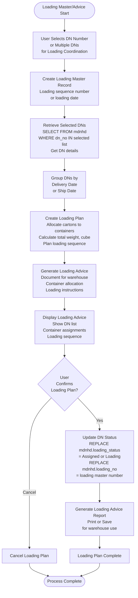

# Delivery Note Process

## Overview

Delivery Notes (DN) are shipping documents that track delivery of goods. They are created from Shipping Orders (SO) and serve as the basis for invoice generation.

## DN Creation Flow

### DN Creation Detailed Flow

```mermaid
flowchart TD
    Start([DN Creation Start]) --> UserSelectSource[User Selects Source Document<br/>SO so_no OR<br/>Existing DN dn_no]
    UserSelectSource --> CheckSourceType{Source<br/>Type?}
    
    CheckSourceType -->|SO| SelectSOItems[SELECT FROM mso<br/>WHERE so_no = selected SO<br/>Retrieve SO items<br/>Get quantities, item_no]
    CheckSourceType -->|DN| SelectDNItems[SELECT FROM mdndt<br/>WHERE dn_no = selected DN<br/>Retrieve DN items<br/>for copy/amendment]
    
    SelectSOItems --> GetCustomerInfo[Get Customer Information<br/>FROM mcustom<br/>WHERE cust_no = SO customer<br/>Get customer details]
    SelectDNItems --> GetCustomerInfo
    
    GetCustomerInfo --> DisplayItems[Display Items in Form<br/>Show quantities from SO<br/>User can adjust quantities]
    
    DisplayItems --> UserEnterDetails[User Enters DN Details<br/>DN Date<br/>Delivery Address<br/>Delivery Date<br/>Remarks]
    
    UserEnterDetails --> UserConfirm{User<br/>Confirms<br/>Creation?}
    UserConfirm -->|Cancel| EndCancel[Cancel DN Creation]
    UserConfirm -->|Yes| GenerateDNNo[Generate DN Number<br/>dn_no<br/>Sequential or custom format]
    
    GenerateDNNo --> CreateDNHeader[APPEND BLANK to mdnhd<br/>Create DN Header]
    
    CreateDNHeader --> SetDNHeaderFields[REPLACE mdnhd.dn_no = dn_no<br/>REPLACE mdnhd.date = DN date<br/>REPLACE mdnhd.cust_no = cust_no<br/>REPLACE mdnhd.so_no = so_no<br/>if from SO]
    
    SetDNHeaderFields --> SetDNHeaderAddr[REPLACE mdnhd.del_addr1-4<br/>= delivery address<br/>REPLACE mdnhd.del_date<br/>= delivery date]
    
    SetDNHeaderAddr --> ItemLoop{For Each<br/>Item from Source}
    
    ItemLoop -->|No More| ProcessBreakdown
    ItemLoop -->|Yes| CreateDNDetail[APPEND BLANK to mdndt<br/>Create DN Detail Record]
    
    CreateDNDetail --> SetDNDetailFields[REPLACE mdndt.dn_no = dn_no<br/>REPLACE mdndt.item_no = item_no<br/>REPLACE mdndt.qty = qty<br/>REPLACE mdndt.unit = unit]
    
    SetDNDetailFields --> SetDNDetailSource[REPLACE mdndt.so_no = so_no<br/>if from SO<br/>REPLACE mdndt.oc_no = oc_no<br/>REPLACE mdndt.conf_no = conf_no]
    
    SetDNDetailSource --> GetItemDesc[SELECT FROM mitem<br/>LOCATE FOR item_no<br/>Get item description<br/>Get packing info]
    
    GetItemDesc --> SetItemInfo[REPLACE mdndt.item_desc<br/>= item description<br/>REPLACE mdndt.ctn = carton qty<br/>REPLACE mdndt.pack_pc = packing]
    
    SetItemInfo --> SetAuditFields[REPLACE mdndt.cre_date = DATE<br/>REPLACE mdndt.cre_user = sysUserId<br/>REPLACE mdndt.user_id = sysUserId]
    
    SetAuditFields --> NextItem[Next Item<br/>Continue Loop]
    NextItem --> ItemLoop
    
    ProcessBreakdown[Process Quantity Breakdown] --> CheckHasBreakdown{Has Quantity<br/>Breakdown?}
    
    CheckHasBreakdown -->|Yes| SelectBreakdownSource[SELECT FROM mqtybrk<br/>WHERE oe_no = linked OE<br/>AND item_no = item_no<br/>Get breakdown records]
    
    SelectBreakdownSource --> BreakdownLoop{For Each<br/>Breakdown<br/>Record}
    
    BreakdownLoop -->|More| CreateDNBreakdown[APPEND BLANK to mdnbrk<br/>REPLACE dn_no, item_no<br/>port, qty, po_no<br/>del_from, del_to]
    
    CreateDNBreakdown --> BreakdownLoop
    BreakdownLoop -->|No More| Complete
    CheckHasBreakdown -->|No| Complete
    
    Complete[DN Creation Complete] --> EndCancel
    EndCancel --> End([Process Complete])
```



**Code Reference:** Form `idn` - Delivery Note creation form

## Loading Master/Advice Flow

### Loading Master/Advice Detailed Flow



**Code Reference:** Loading coordination forms and procedures

## DN to Invoice Link

### Relationship

**DN → Invoice:**
- `mdnhd.dn_no` can be used as source for invoice creation
- DN quantities used for invoicing
- Invoice references DN in `minvdt` or `minvhd`

## DN Status

### Status Values

**Created:** DN created, not yet loaded
**Loading:** DN assigned to loading plan
**Shipped:** Items shipped
**Delivered:** Items delivered to customer
**Invoiced:** Invoice created from DN

### Status Transitions

```
Created → Loading → Shipped → Delivered → Invoiced
```

## DN Breakdown Processing

### Purpose

Track quantities by port, PO, or other breakdown criteria within DN items.

### Processing

DN breakdowns (`mdnbrk`) are typically copied from OE quantity breakdowns (`mqtybrk`) when DN is created from SO that links back to OE.

## Summary

The Delivery Note process creates shipping documentation for goods delivery. It links SO to actual delivery tracking, supports quantity breakdowns, and serves as source for invoice generation. Loading coordination helps manage warehouse operations and container allocation.


