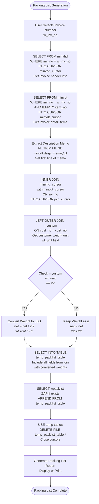
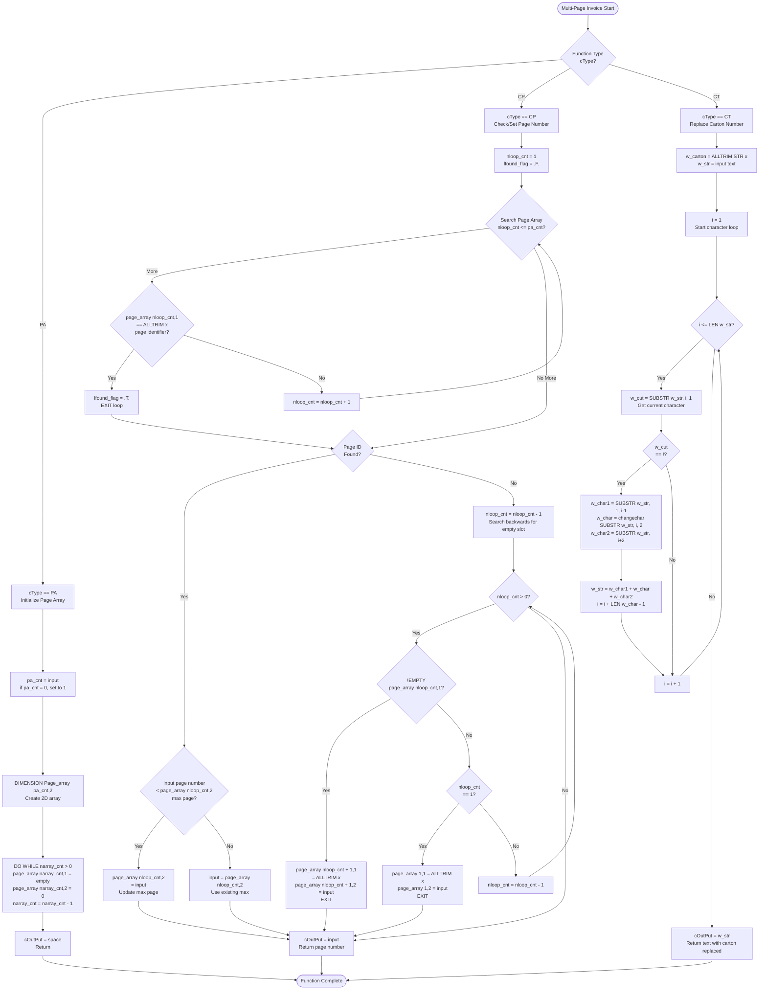
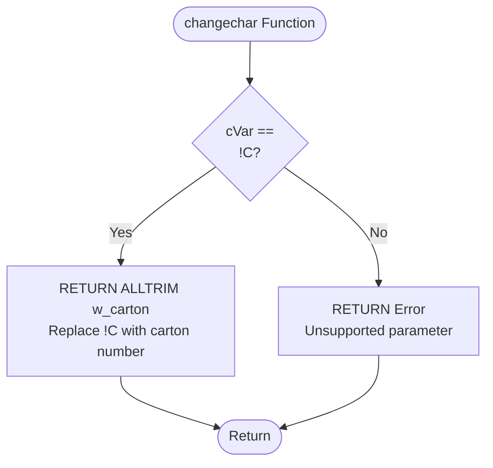
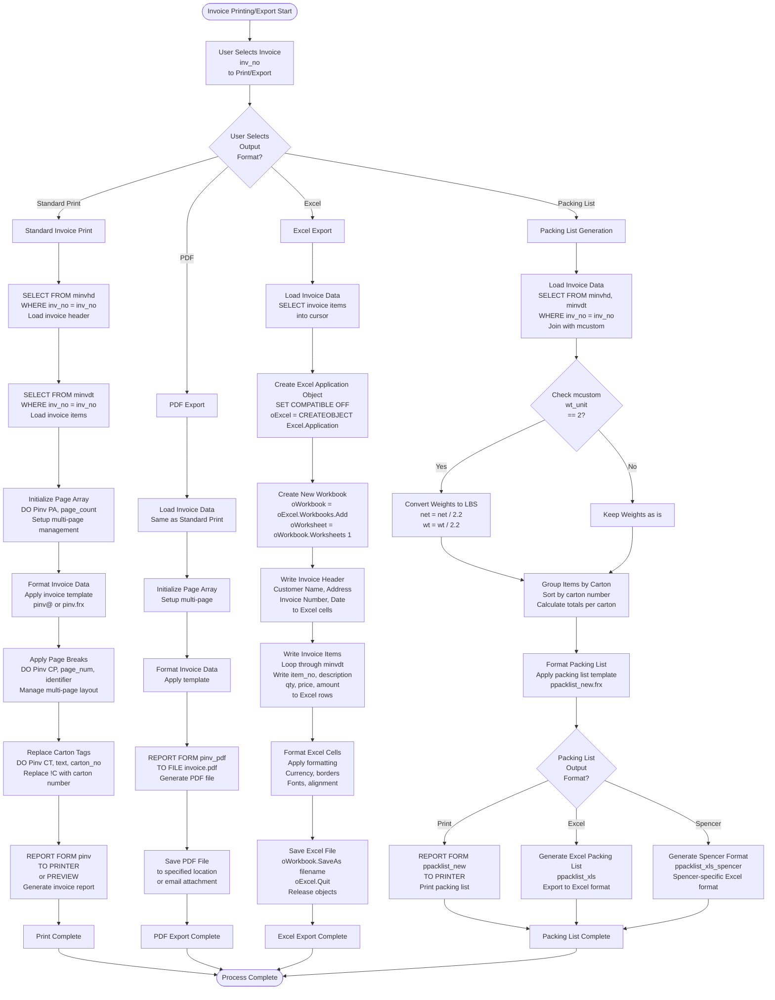

# Invoice Process

## Overview

Invoices are customer billing documents created from Shipping Orders (SO) or Delivery Notes (DN). They include packing lists, support multi-page formats, and can be exported to Excel or PDF.

## Invoice Creation from SO/DN

### Source Documents

**Primary Sources:**
1. Shipping Order (SO) - `mso.so_no`
2. Delivery Note (DN) - `mdnhd.dn_no`

### Creation Process

**Form:** `iinvhd@` (Input Invoice New)

### Invoice Creation from SO/DN Detailed Flow

```mermaid
flowchart TD
    Start([Invoice Creation Start]) --> UserSelectSource[User Selects Source Document<br/>SO so_no OR<br/>DN dn_no]
    UserSelectSource --> CheckSourceType{Source<br/>Type?}
    
    CheckSourceType -->|SO| SelectSOItems[SELECT FROM mso<br/>WHERE so_no = selected SO<br/>Retrieve SO items<br/>Get quantities, item_no]
    CheckSourceType -->|DN| SelectDNItems[SELECT FROM mdndt<br/>WHERE dn_no = selected DN<br/>Retrieve DN items<br/>Get quantities, item_no]
    
    SelectSOItems --> GetCustomerInfo[Get Customer Information<br/>FROM mcustom<br/>WHERE cust_no = SO/DN customer<br/>Get customer details]
    SelectDNItems --> GetCustomerInfo
    
    GetCustomerInfo --> DisplayItems[Display Items in Form<br/>Show quantities<br/>Show prices from source<br/>User can adjust]
    
    DisplayItems --> UserEnterDetails[User Enters Invoice Details<br/>Invoice Date<br/>Delivery Date<br/>Shipment Info<br/>Loading Port<br/>Destination]
    
    UserEnterDetails --> UserConfirm{User<br/>Confirms<br/>Creation?}
    UserConfirm -->|Cancel| EndCancel[Cancel Invoice Creation]
    UserConfirm -->|Yes| GenerateInvNo[Generate Invoice Number<br/>inv_no<br/>Sequential or custom format]
    
    GenerateInvNo --> CreateInvHeader[APPEND BLANK to minvhd<br/>Create Invoice Header]
    
    CreateInvHeader --> SetInvHeaderFields[REPLACE minvhd.inv_no = inv_no<br/>REPLACE minvhd.cust_no = cust_no<br/>REPLACE minvhd.date = invoice date<br/>REPLACE minvhd.del_date = delivery date]
    
    SetInvHeaderFields --> SetInvHeaderSource[REPLACE minvhd.oc_no = oc_no<br/>if from OC<br/>REPLACE minvhd.ship = ship info<br/>REPLACE minvhd.loading = loading port<br/>REPLACE minvhd.dest = destination]
    
    SetInvHeaderSource --> SetInvHeaderAddr[REPLACE minvhd.cust_name<br/>= customer name<br/>REPLACE minvhd.addr_1-4<br/>= customer address]
    
    SetInvHeaderAddr --> ItemLoop{For Each<br/>Item from Source}
    
    ItemLoop -->|No More| Complete
    ItemLoop -->|Yes| CreateInvDetail[APPEND BLANK to minvdt<br/>Create Invoice Detail Record]
    
    CreateInvDetail --> SetInvDetailFields[REPLACE minvdt.inv_no = inv_no<br/>REPLACE minvdt.item_no = item_no<br/>REPLACE minvdt.qty = qty<br/>REPLACE minvdt.price = price]
    
    SetInvDetailFields --> SetInvDetailSource[REPLACE minvdt.so_no = so_no<br/>if from SO<br/>REPLACE minvdt.oc_no = oc_no<br/>REPLACE minvdt.conf_no = conf_no]
    
    SetInvDetailSource --> GetItemDesc[SELECT FROM mitem<br/>LOCATE FOR item_no<br/>Get item description<br/>Get packing info]
    
    GetItemDesc --> SetItemInfo[REPLACE minvdt.desp_memo<br/>= item description memo<br/>REPLACE minvdt.ctn = carton qty<br/>REPLACE minvdt.qctn = qty per carton]
    
    SetItemInfo --> CalcWeights[Calculate Net Weight<br/>Calculate Gross Weight<br/>Calculate Cube/Dimensions<br/>REPLACE minvdt.net, wt, cube, dim]
    
    CalcWeights --> NextItem[Next Item<br/>Continue Loop]
    NextItem --> ItemLoop
    
    Complete[Invoice Creation Complete] --> EndCancel
    EndCancel --> End([Process Complete])
```



**Code Reference:** Form `iinvhd@` - Invoice creation logic

### Invoice Table Structure

**Header Table:** `minvhd` (Invoice Header)

**Key Fields:**
- `inv_no` - Invoice number (Primary Key)
- `cust_no` - Customer number (links to mcustom)
- `date` - Invoice date
- `oc_no` - Order Confirmation number (links to mordhd)
- `ship` - Shipment information
- `del_date` - Delivery date

**Detail Table:** `minvdt` (Invoice Detail)

**Key Fields:**
- `inv_no` - Invoice number (links to minvhd)
- `item_no` - Item number (links to mitem)
- `qty` - Invoice quantity
- `price` - Invoice price
- `so_no` - Shipping Order number (links to mso)
- `oc_no` - Order Confirmation number (links to mordhd)

**File Sizes:**
- `minvhd.dbf` - 93MB
- `minvdt.dbf` - 123MB
- `minvdt.FPT` - 178MB (large memo fields)

## Packing List Generation

### Packing List Purpose

**Purpose:** Detailed list of items packed in cartons for shipping

**Form:** `ppacklist_new` (Print Packing List New)

### Packing List Generation Detailed Flow



**Code Reference:** `source/uwpacklist.prg` (packing list generation logic)

### Packing List Logic

**Carton Breakdown:**
- Items grouped by carton number
- Quantities per carton
- Total cartons calculated
- Carton dimensions and weight
- Weight unit conversion (kg to lbs if wt_unit = 2)

### Packing List Formats

**Standard Format:** `ppacklist_new`
**Spencer Format:** `ppacklist_xls_spencer`
**Excel Format:** `ppacklist_xls`

## Multi-Page Invoice Logic

### Page Management

**Function:** `Pinv()` in `pinv.prg`

**Purpose:** Manage multi-page invoices with page arrays

### Multi-Page Invoice Logic Detailed Flow



### Page Array Structure

**Array:** `Page_array(pa_cnt, 2)`

**Fields:**
- `Page_array(n, 1)` - Page identifier (string)
- `Page_array(n, 2)` - Maximum page number (numeric)

**Usage:**
- Track which items on which page
- Calculate page breaks
- Manage page numbering
- Handle multiple items per page identifier

### Carton Replacement Function

**Function:** `changechar()` in `pinv.prg`

**Purpose:** Replace "!C" with carton number in text



**Code Reference:** `source/pinv.prg` (lines 1-88)

## Carton Breakdown

### Carton Calculation

**Process:**
1. Calculate items per carton from packing
2. Group items by carton
3. Calculate total cartons
4. Generate carton-level details

### Carton Information

**Fields:**
- Carton number
- Items in carton
- Quantity per carton
- Carton weight
- Carton dimensions

## Export Formats

### Excel Export

**Form:** `pinv_xls` (Print Invoice to XLS)

**Process:**
1. Select invoice number
2. Generate Excel file
3. Include all invoice details
4. Format for customer use

### PDF Export

**Form:** `pinv_pdf` (Print Invoice PDF)

**Process:**
1. Generate invoice report
2. Convert to PDF format
3. Save or email PDF

### Packing List Export

**Form:** `ppacklist_xls` (Print Packing List to XLS)

**Process:**
1. Generate packing list
2. Export to Excel format
3. Include carton breakdown

## Shipment Advice

### Shipment Advice Report

**Form:** `pshadvice` (Print Shipment Advice)

**Purpose:** Document sent to customer before shipment

**Contents:**
- Shipment details
- Item list
- Shipping dates
- Delivery information

## Invoice Printing & Export

### Invoice Printing & Export Detailed Flow



### Invoice Reports

1. **Invoice Report (New):**
   - Form: `pinv@`
   - Standard invoice format
   - Multi-page support
   - Uses Pinv() function for page management

2. **Invoice PDF:**
   - Form: `pinv_pdf`
   - PDF format for email/printing
   - Same layout as standard print

3. **Packing List:**
   - Form: `ppacklist_new`
   - Detailed packing information
   - Carton breakdown
   - Weight unit conversion

4. **Packing List Excel:**
   - Form: `ppacklist_xls`
   - Excel format for customer
   - Standard Excel format

5. **Packing List Spencer:**
   - Form: `ppacklist_xls_spencer`
   - Spencer-specific format
   - Custom Excel layout

**Code Reference:** `source/pinv.prg`, `source/uwpacklist.prg`, Report forms (.frx files)

## Debit Note

### Debit Note Process

**Form:** `pdebitnote` (Print Debit Note)

**Purpose:** Adjust invoices (additional charges, corrections)

**Process:**
1. Create debit note from invoice
2. Adjust quantities or prices
3. Generate debit note document

## Invoice Enquiry

### Invoice Enquiry Forms

1. **By Invoice:**
   - Form: `einvoice`
   - Search by invoice number
   - View invoice details

2. **Invoice Summary:**
   - Form: `einvsumry`
   - Summary by date/customer
   - Analysis reports

## Invoice Status

### Status Values

**Created:** Invoice created
**Sent:** Invoice sent to customer
**Paid:** Invoice paid

### Status Transitions

```
Created → Sent → Paid
```

## Data Flow

### SO to Invoice

```
mso (Shipping Order)
  ↓
minvhd (Invoice Header)
  ↓
minvdt (Invoice Detail)
  ↓
Packing List
  ↓
Shipment Advice
```

### DN to Invoice

```
mdnhd (DN Header)
  ↓
mdndt (DN Detail)
  ↓
minvhd (Invoice Header)
  ↓
minvdt (Invoice Detail)
```

## Error Handling

### Creation Errors

**No SO/DN:**
- Error: Source document not found
- Action: Cannot create invoice

**Invalid Items:**
- Error: Item not found
- Action: Item line skipped or error

**Quantity Errors:**
- Error: Quantity mismatch
- Action: Validation error shown

## Summary

The Invoice process creates customer billing documents from shipping orders or delivery notes. It supports multi-page invoices, generates packing lists with carton breakdowns, and exports to multiple formats (Excel, PDF). The process handles complex formatting requirements and customer-specific formats.


