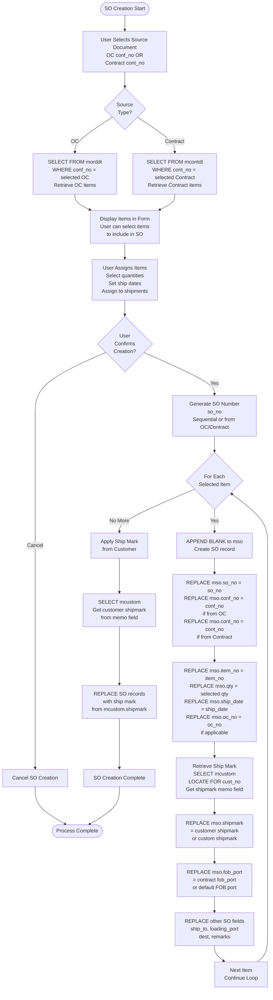
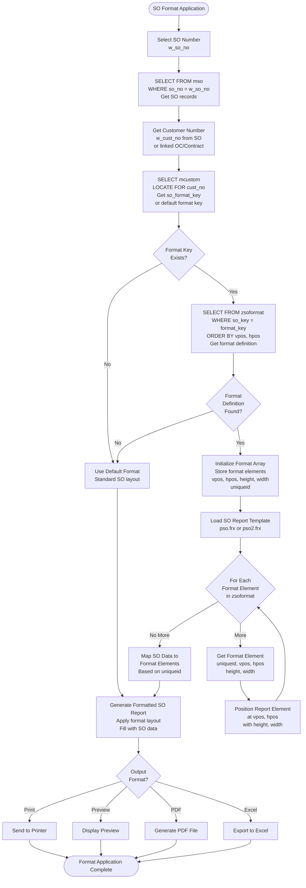

# Shipping Process

## Overview

Shipping Orders (SO) are created to coordinate the shipping of confirmed orders. They link contracts and OCs to actual shipments and support customizable formats per customer.

## SO Creation Rules

### Source Documents

**Primary Sources:**
1. Order Confirmation (OC) - `mordhd.conf_no`
2. Contract - `mconthd.cont_no`

### Creation Process

**Form:** `isetso` (Input Shipping Order)

### SO Creation Detailed Flow



**Code Reference:** Form `isetso` - Shipping Order creation logic

### SO Table Structure

**Table:** `mso` (Shipping Order)

**Key Fields:**
- `so_no` - Shipping Order number (Primary Key)
- `conf_no` - Order Confirmation number (links to mordhd)
- `cont_no` - Contract number (links to mconthd)
- `item_no` - Item number (links to mitem)
- `qty` - Shipping quantity
- `ship_date` - Shipping date
- Other shipping-specific fields

**File Size:** 279MB (largest transaction table)

## Format-Based SO Generation

### Customizable Formats

**Table:** `zsoformat` (Shipping Order Format)

**Purpose:** Store customer-specific SO format definitions

**Fields:**
- `so_key` - Format key (e.g., "GLOBE")
- `uniqueid` - Unique identifier for format element
- `vpos` - Vertical position
- `hpos` - Horizontal position
- `height` - Height
- `width` - Width

**Code Reference:** `pso.prg` (lines 4-7)

### Format Application

### SO Format Application Detailed Flow



**Code Reference:** `source/pso.prg` (lines 1-29)

### Format Configuration

**Form:** `isoformat` or `isoformat2` (Input Shipping Order Format)

**Process:**
1. User selects customer
2. User defines format layout
3. System saves format to `zsoformat`
4. Format used for future SOs

## Ship Mark Handling

### Ship Mark Source

**Table:** `mshipmark` (Shipping Mark)

**Customer Field:** `mcustom.shipmark` (memo field)

**Construction:** From multiple memo fields (M11-M26) in legacy system

**Code Reference:** `xcustom.prg` (lines 45-50)

### Ship Mark Usage

**Process:**
1. Retrieve customer's ship mark from `mcustom.shipmark`
2. Apply to SO document
3. Include in shipping labels
4. Print on shipping documents

## FOB Terms

### FOB Port

**Table:** `zfobport` (FOB Port)

**Purpose:** Define FOB (Free On Board) ports

**Usage:**
- Specified in contracts
- Used in SO generation
- Printed on shipping documents

### FOB Terms

**Table:** `zfobterm` (FOB Terms)

**Purpose:** Define FOB terms (e.g., FOB Hong Kong, FOB Shanghai)

**Usage:**
- Contract terms
- SO terms
- Shipping documentation

## SO Printing

### SO Report

**Form:** `pso` (Print Shipping Order)

**Process:**
1. Select SO number
2. Apply customer format (if custom)
3. Generate formatted SO document
4. Print or save as PDF

**Code Reference:** `pso.prg`

### Format Application

**Process:**
1. Load format from `zsoformat`
2. Apply format to report template
3. Generate formatted output

## SO to Invoice Link

### Relationship

**SO → Invoice:**
- `minvdt.so_no` links to `mso.so_no`
- Invoices created from SO
- SO quantities used for invoicing

## SO Status

### Status Values

**Created:** SO created, not yet shipped
**Shipped:** Items shipped
**Invoiced:** Invoice created from SO

### Status Transitions

```
Created → Shipped → Invoiced
```

## Summary

The Shipping Order process coordinates the physical shipment of goods. It supports customizable formats per customer, handles ship marks and FOB terms, and links contracts to actual shipments. SOs serve as the basis for invoice generation.


