# Authentication Forms

## Overview

The system uses form-based authentication with password validation. Users log in through the `ilogon` form, which validates credentials against the `user` table and sets user rights and company context.

## Login Form: ilogon

### Form Details

- **Form Name:** `ilogon`
- **File:** `source/ilogon.scx` / `source/ilogon.SCT`
- **Type:** Modal form (WindowType = 1)
- **Called From:** `main.prg` (line 25)

### Form Layout

**Controls:**
- `Text1` - User ID input field
- `Text2` - Password input field  
- `Text3` - User Name display (read-only)
- `Appoptgroup1` - Company selection option group (4 options)
- `Command1` - Login button
- `Command2` - Cancel/Exit button

**Form Properties:**
- Height: 339
- Width: 600
- AutoCenter: .T.
- BorderStyle: 2 (Fixed Dialog)
- ControlBox: .F.
- Closable: .F.
- Movable: .F.
- WindowType: 1 (Modal)

### Authentication Process Flow

```mermaid
flowchart TD
    Start([Application Start<br/>main.prg]) --> InitMain[Initialize Public Variables<br/>M, User_right, sysUserId<br/>w_shop_no, w_shop_name<br/>syswork, w_sys_language]
    InitMain --> CheckDir{"Directory<br/>C drive Batwork<br/>exists?"}
    CheckDir -->|No| CreateDir["MD C drive Batwork<br/>Create directory"]
    CheckDir -->|Yes| SetConfig
    CreateDir --> SetConfig["Set Environment<br/>SET TALK OFF<br/>SET DELETE ON<br/>SET CENTURY ON<br/>SET DATE MDY<br/>SET PATH TO c drive batwork"]
    SetConfig --> SetScreen["Set Screen Caption<br/>Trading Management System V3.0<br/>WINDOWSTATE = 2"]
    SetScreen --> DoLogin["DO FORM ILOGON<br/>Display login form"]
    
    DoLogin --> FormInit["Form Init Event<br/>Initialize Variables<br/>Intime = 1<br/>W_password = empty<br/>W_USER_ID = empty<br/>supervisor = False"]
    FormInit --> DisplayForm["Display Login Form<br/>User ID, Password Fields<br/>Company Selection"]
    
    DisplayForm --> UserEntersID[User Enters User ID<br/>Text1 Field]
    UserEntersID --> ValidateUserID[Text1.Valid Event]
    
    ValidateUserID --> CheckSpecialID{"User ID<br/>equals 801?"}
    CheckSpecialID -->|Yes| SkipValidation["Skip Validation<br/>Special Admin Access"]
    CheckSpecialID -->|No| LookupUser["SELECT user and Rights<br/>FROM user INNER JOIN rights<br/>ON right_id matches<br/>INTO CURSOR Temp<br/>WHERE User_id equals Text1.value"]
    
    LookupUser --> UserFound{"User<br/>Found?"}
    UserFound -->|No| ShowUserError["MessageBox<br/>User Not Found<br/>Clear Text1"]
    ShowUserError --> UserEntersID
    UserFound -->|Yes| DisplayUserName["Set Text3.value<br/>= Temp.User_Name<br/>Display User Name"]
    
    SkipValidation --> UserEntersPassword
    DisplayUserName --> UserEntersPassword["User Enters Password<br/>Text2 Field"]
    
    UserEntersPassword --> ClickLogin["User Clicks Login Button<br/>Command1.Click"]
    
    ClickLogin --> CheckSpecialLogin{"User ID<br/>equals 801?"}
    CheckSpecialLogin -->|Yes| SetSuperAdmin["M = True<br/>User_right = SUPERVISOR<br/>Release Form"]
    CheckSpecialLogin -->|No| GetPassword["W_password = Temp.User_paw<br/>Get stored password"]
    
    GetPassword --> DecryptPassword["Call Check Method<br/>Decrypt password using<br/>BitXOR algorithm"]
    DecryptPassword --> ComparePassword{"Decrypted Password<br/>equals Text2.value?"}
    
    ComparePassword -->|No| ShowPassError["Show Password Error<br/>Clear Password Field"]
    ShowPassError --> UserEntersPassword
    ComparePassword -->|Yes| SetAuthSuccess["M = True<br/>User_right = Temp.Rights<br/>sysUserId = Text1.value"]
    
    SetAuthSuccess --> SelectCompany["User Selects Company<br/>Appoptgroup1.value"]
    SelectCompany --> SetCompanyVars{"Company<br/>Selection?"}
    
    SetCompanyVars -->|Option 1| SetHT["w_password = HT<br/>w_company_code = HT<br/>w_oe_prefix = empty<br/>_SCREEN.PICTURE = HT.BMP"]
    SetCompanyVars -->|Option 2| SetBAT["w_password = BAT<br/>w_company_code = BAT<br/>w_oe_prefix = empty<br/>_SCREEN.PICTURE = BTL.BMP"]
    SetCompanyVars -->|Option 3| SetHFW["w_password = HFW<br/>w_company_code = HFW<br/>w_oe_prefix = HFW<br/>_SCREEN.PICTURE = HFW.BMP"]
    SetCompanyVars -->|Option 4| SetINSP["w_password = INSP<br/>w_company_code = INSP<br/>w_oe_prefix = empty<br/>_SCREEN.PICTURE = INSP.BMP"]
    
    SetHT --> GetCompanyName
    SetBAT --> GetCompanyName
    SetHFW --> GetCompanyName
    SetINSP --> GetCompanyName
    
    GetCompanyName["SELECT zpara<br/>LOCATE FOR co_code equals w_company_code<br/>w_co_name = zpara.co_name"]
    GetCompanyName --> ReleaseForm["Release Form<br/>Return to main.prg"]
    
    SetSuperAdmin --> ReleaseForm
    
    ReleaseForm --> CheckMVar{"M equals True?"}
    CheckMVar -->|No| CancelApp["CANCEL<br/>Exit Application"]
    CheckMVar -->|Yes| CheckUserRight{"Upper User_right<br/>equals SUPERVISOR?"}
    
    CheckUserRight -->|Yes| LoadSuperMenu["DO BATMENUS.MPX<br/>Load Supervisor Menu"]
    CheckUserRight -->|No| LoadRegularMenu["DO BATMENU.MPX<br/>Load Regular Menu"]
    
    LoadSuperMenu --> CreateWorkDir
    LoadRegularMenu --> CreateWorkDir["syswork = c drive plus sysUserId plus work<br/>Create user work directory"]
    
    CreateWorkDir --> CheckWorkDir{"Directory<br/>exists?"}
    CheckWorkDir -->|No| MakeWorkDir["MD syswork<br/>Create directory"]
    CheckWorkDir -->|Yes| SetPath
    MakeWorkDir --> SetPath["SET PATH TO<br/>c drive batwork, syswork"]
    
    SetPath --> AddUserToCaption["_screen.Caption plus equals<br/>Date plus sysUserId"]
    AddUserToCaption --> SetSysMenu["SET SYSMENU ON<br/>ON SHUTDOWN QUIT"]
    SetSysMenu --> ReadEvent["READ EVENT<br/>Enter event loop"]
    ReadEvent --> MainApp["Main Application Running"]
    
    CancelApp --> End([Application Exited])
```



### Password Encryption/Decryption

**Algorithm:** BitXOR encryption based on user name

**Process:**
1. Get first 3 characters of user name (W_Name)
2. Calculate average ASCII value: `N = Int((N1+N2+N3)/3)`
3. For each character in password:
   - Apply BitXOR with N: `Tempchr = BitXOR(Asc(Substr(W_Password,I,1)),N)`
   - Convert back to character: `Pas = Pas + Chr(Tempchr)`

**Code:**
```foxpro
PROCEDURE check
Pas = ""
W_Name = ThisForm.Text3.Value
N1 = Asc(Substr(W_name,1,1))
N2 = Asc(Substr(W_Name,2,1))
N3 = Asc(Substr(W_Name,3,1))

Do Case
    Case Len(w_name) = 1
        N2 = Asc("A")
        N3 = Asc("Z")
    Case Len(w_name) = 2
        N3 = Asc("Z")
Endcase

N = Int((N1+N2+N3)/3)

For I = 1 To Len(W_Password)
    Tempchr = Bitxor(Asc(Substr(W_Password,I,1)),N)
    Pas = Pas + Chr(Tempchr)
EndFor
ENDPROC
```

### Validation Rules

#### User ID Validation (Text1.Valid)

**Rules:**
1. **Special Admin Access:**
   - User ID "801" bypasses all validation
   - Automatically grants SUPERVISOR rights
   - No password required

2. **Normal User Validation:**
   - User ID cannot be empty
   - Must exist in `user` table
   - Must have associated record in `rights` table
   - JOIN: `user INNER JOIN rights ON User.right_id = Rights.right_id`

**Validation Code:**
```foxpro
PROCEDURE Valid
IF !Empty(This.Value)
    IF This.Value <> "801"
        SELECT User.*, Rights.rights;
        FROM user INNER JOIN rights;
        ON User.right_id = Rights.right_id;
        INTO CURSOR Temp;
        WHERE Alltrim(User.User_id) == Alltrim(This.value)
        
        IF !Eof()
            ThisForm.Text3.Value = alltrim(Temp.User_Name)
        Else
            =Messagebox("User Not Found!", 0+48, "Error")
            This.Value = ""
            Return 0
        Endif
    Endif
Endif
RETURN .T.
ENDPROC
```

#### Password Validation (Command1.Click)

**Rules:**
1. **Special Admin (801):**
   - No password validation
   - Immediate authentication

2. **Normal Users:**
   - Password must match decrypted stored password
   - Decryption uses Check() method
   - Comparison: `Alltrim(Text2.Value) == pas`

**Validation Code:**
```foxpro
PROCEDURE Click
IF Alltrim(ThisForm.Text1.Value) = "801"
    M = .T.
    User_right = "SUPERVISOR"
    Thisform.Release
Else
    SELECT Temp
    W_password = Alltrim(Temp.User_paw)
    ThisForm.Check()
    
    IF Alltrim(ThisForm.Text2.Value) == pas
        M = .T.
        Old_pwd = Alltrim(thisform.text1.value)
        User_right = Temp.Rights
        * ... set company variables ...
        sysUserId = Thisform.text1.value
        Thisform.Release
    ELSE
        * Password error handling
    ENDIF
ENDIF
ENDPROC
```

### Company Selection

**Option Group:** `Appoptgroup1` with 4 options

| Option | Company Code | Password | OE Prefix | Background Image |
|--------|--------------|----------|-----------|-----------------|
| 1 | HT | HT | "" | HT.BMP |
| 2 | BAT | BAT | "" | BTL.BMP |
| 3 | HFW | HFW | "HFW" | HFW.BMP |
| 4 | INSP | INSP | "" | INSP.BMP |

**Company Name Lookup:**
```foxpro
SELECT zpara
LOCATE FOR alltrim(zpara.co_code) == alltrim(w_company_code)
w_co_name = zpara.co_name
```

### Form Events

#### Init Event
**Purpose:** Initialize form variables

**Code:**
```foxpro
PROCEDURE Init
LPARAMETERS M, User_right, User_Name
PUBLIC Intime, Old_pwd, W_password, W_name, pas, supervisor, W_USER_ID, w_company_code, w_co_name, w_oe_prefix

w_shop_no = ""
w_shop_name = ""
Intime = 1
W_password = ""
W_USER_ID = ""
W_name = ""
pas = ""
supervisor = .F.
w_company_code = ""
w_co_name = ""
ENDPROC
```

#### Unload Event
**Purpose:** Cleanup when form closes

**Code:**
```foxpro
PROCEDURE Unload
CLOSE TABLES ALL
ENDPROC
```

### Return Values

**Public Variables Set:**
- `M` - Authentication status (.T. = success, .F. = failure)
- `User_right` - User rights ("SUPERVISOR" or "REGULAR_USER")
- `sysUserId` - User ID from Text1
- `w_password` - Company password (HT, BAT, HFW, INSP)
- `w_company_code` - Company code
- `w_co_name` - Company name from zpara table
- `w_oe_prefix` - OE prefix (empty or "HFW")

### Error Handling

#### User Not Found
- **Error:** "User Not Found!"
- **Action:** Clear Text1 field, return .F.
- **User Action:** Re-enter User ID

#### Password Mismatch
- **Error:** Password validation fails
- **Action:** Clear password field
- **User Action:** Re-enter password

### Security Features

1. **Password Encryption:** Passwords stored encrypted using BitXOR
2. **Special Admin:** User ID "801" for emergency access
3. **User Rights:** Determined from `rights` table
4. **Company Context:** Multi-company support with separate contexts
5. **Modal Form:** Prevents access to other windows during login

### Integration with Main Application

**Call Sequence:**
1. `main.prg` calls `DO FORM ILOGON`
2. Form validates credentials
3. Form sets `M = .T.` if successful
4. Form releases and returns to `main.prg`
5. `main.prg` checks `M` variable
6. If `M = .T.`, loads appropriate menu (BATMENUS or BATMENU)
7. Creates user work directory
8. Enters event loop with `READ EVENT`

**Code Reference:** `source/main.prg` (lines 25-50)

### Related Forms

- **iuser** - Input User Account (user management)
- **ipara2** - Input Company Info (company configuration)

### Related Tables

- **user** - User accounts
- **rights** - User rights definitions
- **zpara** - Company parameters

### Business Rules

1. **User ID "801":**
   - Special administrative access
   - Bypasses all validation
   - Always grants SUPERVISOR rights
   - No password required

2. **Company Selection:**
   - User must select company after authentication
   - Company determines:
     - OE prefix (HFW uses "HFW" prefix)
     - Background image
     - Company-specific settings

3. **User Rights:**
   - SUPERVISOR: Full access (BATMENUS.MPX)
   - REGULAR_USER: Limited access (BATMENU.MPX)

4. **Work Directory:**
   - Created per user: `c:\<userid>work`
   - Added to system path
   - Used for user-specific temporary files

## Summary

The `ilogon` form provides secure authentication with:
- User ID and password validation
- Password encryption/decryption
- Company context selection
- User rights assignment
- Integration with main application flow

The form uses a modal dialog to ensure authentication before allowing access to the main application.
