# Delivery Note Forms

## Overview

Delivery Note (DN) forms handle the creation and management of delivery notes from shipping orders. DNs track actual shipments and are used for invoice generation.

## Form: idn (Input D/N)

### Form Details

- **Form Name:** `idn`
- **File:** `source/idn.scx` / `source/idn.SCT`
- **Type:** Single form with grids
- **Purpose:** Create and manage delivery notes

### Form Layout

**Key Controls:**
- `cboCustCode` - Customer selection
- `cboPort` - Port selection
- `txtFromDate` - From Date
- `txtToDate` - To Date
- `grdSelDn` - DN selection grid
- `grdCont` - Container grid
- `grdOc_no` - OC number grid

### Process Flow

```mermaid
flowchart TD
    Start([Open DN Form]) --> Load[Form Load Event<br/>Initialize Variables]
    Load --> Init[Form Init Event<br/>Initialize Variables<br/>seq_no = 1<br/>dn_no = ""<br/>cust_no = ""]
    Init --> Display[Display Form<br/>DN Entry Form]
    
    Display --> UserSelectsCustomer[User Selects Customer<br/>cboCustCode]
    UserSelectsCustomer --> UserSelectsPort[User Selects Port<br/>cboPort Optional]
    UserSelectsPort --> UserSelectsDates[User Selects Date Range<br/>txtFromDate, txtToDate]
    
    UserSelectsDates --> ExtractData[Click Extract Data<br/>Call extractdata Method]
    
    ExtractData --> BuildOCQuery[Build OC Query<br/>SELECT mordhd, morddt<br/>WHERE cust_no, date range<br/>AND head = .T.<br/>AND cxl_flag = 0]
    
    BuildOCQuery --> LoadSOItems[Load SO Items<br/>SELECT mso<br/>WHERE conf_no<br/>AND cxl_flag = 0]
    
    LoadSOItems --> BuildContainerQuery[Build Container Query<br/>SELECT mso<br/>JOIN with mload<br/>Get container info]
    
    BuildContainerQuery --> CalculateShipped[Calculate Already Shipped<br/>SELECT mdndt<br/>SUM ship_ctn<br/>GROUP BY so_no]
    
    CalculateShipped --> BuildDNSelection[Build DN Selection Grid<br/>SELECT items with<br/>oc_ctn > ship_ctn<br/>HAVING available qty]
    
    BuildDNSelection --> DisplaySelectionGrid[Display Selection Grid<br/>grdSelDn]
    
    DisplaySelectionGrid --> UserSelectsItems[User Selects Items<br/>Check selFlag in Grid]
    
    UserSelectsItems --> UserEntersDN[User Enters DN Number]
    UserEntersDN --> ValidateDN{DN No<br/>Entered?}
    ValidateDN -->|No| ShowError[Show Error<br/>DN No Required]
    ValidateDN -->|Yes| CreateDN[Click Create DN Button]
    
    CreateDN --> ValidateHasItems{Has Selected<br/>Items?}
    ValidateHasItems -->|No| ShowError1[Show Error<br/>No Items Selected]
    ValidateHasItems -->|Yes| CreateDNHeader[Create DN Header<br/>APPEND to mdnhd<br/>REPLACE dn_no, date<br/>cust_no, etc.]
    
    CreateDNHeader --> LoopSelectedItems[Loop Through Selected Items<br/>For Each Item]
    
    LoopSelectedItems --> CreateDNItem[Create DN Item<br/>APPEND to mdndt<br/>REPLACE dn_no, oc_no<br/>item_no, po_no<br/>ship_ctn, ship_qty]
    
    CreateDNItem --> UpdateSOStatus[Update SO Status<br/>if needed]
    UpdateSOStatus --> NextItem{More<br/>Items?}
    
    NextItem -->|Yes| LoopSelectedItems
    NextItem -->|No| ShowSuccess[Show Success Message]
    ShowSuccess --> RefreshForm[Refresh Form<br/>Clear Selection]
    
    RefreshForm --> Display
```

### extractdata Method

**Purpose:** Extract available items for DN creation

**Process:**
1. Select OC items from `mordhd` and `morddt`
2. Filter by customer, date range, port
3. Load SO items from `mso`
4. Calculate already shipped quantities from `mdndt`
5. Calculate available quantities (oc_ctn - ship_ctn)
6. Display items with available quantity > 0

## Form: idnbrk (DN Breakdown)

### Form Details

- **Form Name:** `idnbrk`
- **Purpose:** Enter DN quantity breakdowns
- **Process:** Similar to OE quantity breakdown

## Form: iload (Input Loading Master)

### Form Details

- **Form Name:** `iload`
- **Purpose:** Manage loading master records
- **Table:** `mload`
- **Process:** Create and maintain container/loading information

## Form: isetla (Input Loading Advice)

### Form Details

- **Form Name:** `isetla`
- **Purpose:** Create loading advice documents
- **Process:** Generate loading advice from DN data

## Form: pla (Print Loading Advice)

### Form Details

- **Form Name:** `pla`
- **Purpose:** Print loading advice document
- **Process:** Generate report from loading advice data

## Form: pdnorg (Print D/N Original List)

### Form Details

- **Form Name:** `pdnorg`
- **Purpose:** Print DN original list
- **Process:** Generate DN list report

## Form: pdn_xls (Create D/N Excel File)

### Form Details

- **Form Name:** `pdn_xls`
- **Purpose:** Export DN to Excel
- **Process:** Generate Excel file from DN data

## Summary

Delivery Note forms provide:
- **idn** - DN creation from SO items
- **idnbrk** - DN quantity breakdown entry
- **iload** - Loading master management
- **isetla** - Loading advice creation
- **pla** - Loading advice printing
- **pdnorg** - DN list printing
- **pdn_xls** - DN Excel export

The forms include quantity validation, container tracking, and integration with invoice workflow.
