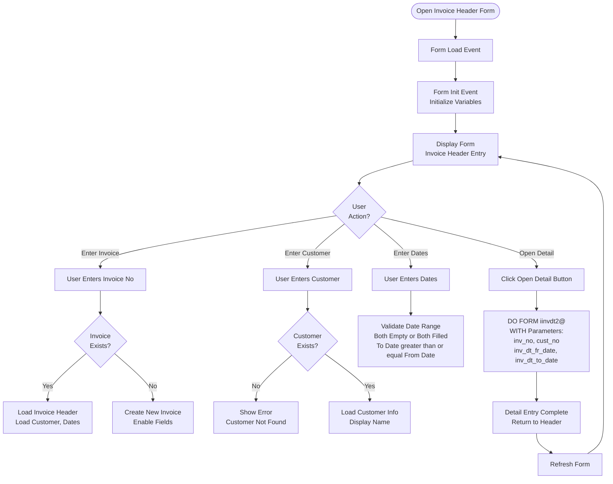

# Invoice Forms

## Overview

Invoice forms handle the creation and management of invoices from delivery notes. Invoices are the final documents in the order-to-invoice workflow and include container logic, quantity validation, and carton validation.

## Form: iinvdt2@ (Input Invoice Detail New) - **COMPLEX FORM**

### Form Details

- **Form Name:** `iinvdt2@`
- **File:** `source/iinvdt2@.scx` / `source/iinvdt2@.SCT`
- **Type:** Formset with multiple forms (Form1, Form2)
- **Lines of Code:** 2182+ lines in .SCT file
- **Purpose:** Invoice detail entry by container number

### Form Layout

**Structure:**
- Formset: `Formset2` with 2 forms
  - Form1: Container selection and item grid
  - Form2: Item detail entry form

**Form1 Key Controls:**
- `Txtbox1` - Invoice Number (display only)
- `Txtbox2` - Customer Number (display only)
- `Txtbox3` - Customer Name (display only)
- `Txtbox4` - Invoice Date From (inv_dt_fr_date)
- `Txtbox5` - Invoice Date To (inv_dt_to_date)
- `Txtbox6` - Container Number (w_cntr_no)
- `Combofield1` - Container selection dropdown
- `Grid1` - Invoice items grid (winvdtgrid)
- `Grid2` - Available items grid (vinvdt)
- `Command1` - Select All button
- `Command3` - Reset button
- `Command4` - Item Mftr button (calls iinvdtmftr)
- `OptionGroup1` - Filter option (1=Head items only, 2=All items)

**Form2 Key Controls:**
- `Txtbox1` - Invoice Number
- `Txtbox4` - Carton (ctn)
- `Txtbox5` - Quantity (qty)
- `Txtbox6` - Price
- `Txtbox7` - Amount (calculated)
- `Edboxdesp3` - Description memo
- `Command1` - Save button
- `Command2` - Cancel button

### Detailed Process Flow with Validation

```mermaid
flowchart TD
    Start([Open Invoice Detail Form]) --> Load["Form Load Event<br/>Create winvdtgrid table<br/>FREE TABLE<br/>Index on ship_no and item_no<br/>Index on item_no<br/>Index on vendor_no"]
    Load --> Init[Form Init Event<br/>Initialize Variables<br/>w_show_subitem = .F.<br/>Load minvbd<br/>Call update_winvqty<br/>Call getcntrno<br/>Call update_winvdt]
    
    Init --> LoadInvoiceData[Load Invoice Data<br/>SELECT minvbd<br/>WHERE cust_no<br/>Load invoice breakdown]
    LoadInvoiceData --> GetContainers[Call getcntrno Method<br/>Get Available Containers]
    
    GetContainers --> BuildContainerList[SELECT vinvqty, mdndt<br/>JOIN with mload<br/>Get container numbers<br/>Populate Combofield1]
    BuildContainerList --> Display[Display Form1<br/>Container Selection]
    
    Display --> UserSelectsContainer[User Selects Container<br/>Txtbox6 or Combofield1]
    UserSelectsContainer --> ValidateContainer[Txtbox6.Valid Event]
    
    ValidateContainer --> CheckContainerEmpty{Container<br/>Empty?}
    CheckContainerEmpty -->|Yes| Display
    CheckContainerEmpty -->|No| GetItems[Call getitemno Method<br/>Get Items for Container]
    
    GetItems --> SelectContainerItems["Select Container Items<br/>WHERE cntr_no matches<br/>AND ref_no matches<br/>INTO CURSOR cursor_loop"]
    
    SelectContainerItems --> LoopItems["Loop Through cursor_loop<br/>For Each Item"]
    
    LoopItems --> FindSOItem["Find SO Item<br/>SELECT mso<br/>SEEK by cust_no, conf_no, item_no"]
    
    FindSOItem --> CheckItemExists{Item Already<br/>in winvdtgrid?}
    CheckItemExists -->|Yes| SkipItem[Skip Item<br/>Already Added]
    CheckItemExists -->|No| AddToGrid[APPEND BLANK to winvdtgrid<br/>REPLACE conf_no, item_no<br/>ctn, qty, wt, cube<br/>ship_mark, ship_no<br/>po_no, cntr_no, ref_no]
    
    AddToGrid --> GetVendor[Get Vendor from mconthd<br/>SEEK cont_no<br/>REPLACE vendor_no]
    GetVendor --> GetNetWeight[Get Net Weight from mitem<br/>SEEK item_no<br/>REPLACE net]
    GetNetWeight --> NextItem{More<br/>Items?}
    
    NextItem -->|Yes| LoopItems
    NextItem -->|No| DisplayGrid1[Display Grid1<br/>winvdtgrid<br/>Show Available Items]
    
    SkipItem --> NextItem
    
    DisplayGrid1 --> UserAction{User<br/>Action?}
    
    UserAction -->|Select Items| SelectItems[User Selects Items<br/>Check Select checkbox<br/>in Grid1]
    UserAction -->|Edit Item| EditItem[Click Item in Grid1<br/>or Right Click]
    UserAction -->|Add Item| AddItem[Click Add Button]
    UserAction -->|Delete All| DeleteAll[Click Delete All Button]
    UserAction -->|Save| SaveInvoice[Click >> >> Button<br/>Command4.Click]
    
    SelectItems --> ToggleSelect[Toggle Select Flag<br/>REPLACE winvdtgrid.select<br/>Refresh Grid]
    ToggleSelect --> DisplayGrid1
    
    EditItem --> OpenEditForm[DO FORM iinvdtmftr<br/>WITH Item Details<br/>Edit Mode]
    OpenEditForm --> ValidateQty[Validate Quantity<br/>Txtbox5.Valid Event]
    
    ValidateQty --> CheckQtyChanged{Qty<br/>Changed?}
    CheckQtyChanged -->|No| ValidateCarton
    CheckQtyChanged -->|Yes| CheckQtyMatch{"Invoice Qty<br/>equals SO Qty?"}
    
    CheckQtyMatch -->|No| ShowQtyWarning[MessageBox<br/>Qty. not Match With<br/>Shipping Order Qty.!<br/>Continue?]
    CheckQtyMatch -->|Yes| ValidateCarton
    
    ShowQtyWarning --> UserConfirmQty{User<br/>Confirms?}
    UserConfirmQty -->|No| ReturnFalse[Return .F.<br/>Prevent Save]
    UserConfirmQty -->|Yes| ValidateCarton[Validate Carton<br/>Txtbox4.Valid Event]
    
    ValidateCarton --> CheckCartonChanged{Carton<br/>Changed?}
    CheckCartonChanged -->|No| CalculateAmount
    CheckCartonChanged -->|Yes| CheckCartonMatch{"Carton<br/>equals SO Carton?"}
    
    CheckCartonMatch -->|No| ShowCartonWarning[MessageBox<br/>Carton no not Match With<br/>Shipping Order Carton no.!<br/>Continue?]
    CheckCartonMatch -->|Yes| CalculateAmount["Calculate Amount<br/>Txtbox7.value =<br/>round qty times price, 2"]
    
    ShowCartonWarning --> UserConfirmCarton{User<br/>Confirms?}
    UserConfirmCarton -->|No| ReturnFalse
    UserConfirmCarton -->|Yes| CalculateAmount
    
    CalculateAmount --> SaveItem["Save Item Changes<br/>TABLEUPDATE True"]
    SaveItem --> RefreshGrid["Refresh Grid1<br/>Refresh Grid2"]
    
    AddItem --> OpenAddForm["DO FORM iinvdtmftr<br/>Add Mode"]
    OpenAddForm --> AddComplete["Item Added<br/>Refresh Grid"]
    AddComplete --> DisplayGrid1
    
    DeleteAll --> ConfirmDelete{"Confirm<br/>Delete All<br/>Item?"}
    ConfirmDelete -->|No| DisplayGrid1
    ConfirmDelete -->|Yes| DeleteAllItems["DELETE FROM winvdtgrid<br/>WHERE inv_no matches<br/>DELETE FROM vinvdt<br/>DELETE FROM vinvjoin<br/>DELETE FROM vinvqty"]
    DeleteAllItems --> RefreshGrid
    
    SaveInvoice --> ValidateHasItems{Has Selected<br/>Items?}
    ValidateHasItems -->|No| ShowError1[Show Error<br/>No Items Selected]
    ValidateHasItems -->|Yes| ValidateDateRange[Validate Date Range<br/>Txtbox5.Valid Event]
    
    ValidateDateRange --> CheckBothEmpty{Both Dates<br/>Empty?}
    CheckBothEmpty -->|Yes| ValidEmpty[Valid: Both Empty]
    CheckBothEmpty -->|No| CheckBothFilled{Both Dates<br/>Filled?}
    
    CheckBothFilled -->|No| ShowDateError[MessageBox<br/>Invalid Date!<br/>Both must be empty<br/>or both filled]
    ShowDateError --> SaveInvoice
    CheckBothFilled -->|Yes| CheckDateRange{"To Date<br/>greater than or equal<br/>From Date?"}
    
    CheckDateRange -->|No| ShowDateRangeError[MessageBox<br/>Invalid Date!<br/>To Date < From Date]
    ShowDateRangeError --> SaveInvoice
    CheckDateRange -->|Yes| ValidDates[Valid: Date Range OK]
    
    ValidEmpty --> ProcessItems
    ValidDates --> ProcessItems[Process Selected Items<br/>Command4.Click]
    
    ProcessItems --> LoopSelectedItems["Loop Through winvdtgrid<br/>WHERE select = True<br/>ORDER BY cntr_no, ref_no, item_no"]
    
    LoopSelectedItems --> DeleteOldInvoiceItem["Delete Old Invoice Item<br/>SELECT minvdt<br/>SEEK by inv_no, item_no, po_no, ship_no<br/>DELETE<br/>DELETE sub-items"]
    
    DeleteOldInvoiceItem --> CreateInvoiceItem["APPEND BLANK to minvdt<br/>REPLACE inv_no, item_no<br/>ctn, qty, price<br/>ship_no, wt, cube, net<br/>conf_no, ship_mark, disc<br/>po_no, cntr_no, ref_no<br/>head_item, head = True"]
    
    CreateInvoiceItem --> GetItemData["Get Item Data<br/>SELECT mitem<br/>SEEK item_no<br/>REPLACE mftr_code"]
    
    GetItemData --> GetSKNData["Get SKN Data<br/>SELECT moe<br/>SEEK by conf_no, item_no<br/>Get skn_no, no_desc"]
    
    GetSKNData --> SetItemDescription["Set Item Description<br/>item_desp = Item No plus item_no<br/>plus no_desc plus skn_no"]
    
    SetItemDescription --> GetOCData["Get OC Data<br/>SELECT morddt<br/>SEEK by conf_no, item_no<br/>Get price, desc_memo"]
    
    GetOCData --> SetOCData["Set OC Data<br/>REPLACE price = morddt.price<br/>REPLACE desp_memo = morddt.desc_memo"]
    
    SetOCData --> CheckBOM{"Item Has<br/>BOM?"}
    CheckBOM -->|Yes| ProcessBOM["Process BOM Sub-items<br/>SELECT morddt<br/>Loop through sub-items<br/>Calculate sub-item qty"]
    CheckBOM -->|No| NextSelectedItem
    
    ProcessBOM --> CalculateSubQty["Calculate Sub-item Qty<br/>sub_qty = temp_qty divided by qty_rate<br/>sub_ctn = sub_qty divided by ctn_per_item"]
    CalculateSubQty --> CreateSubItem["APPEND BLANK to minvdt<br/>REPLACE item_no = sub_item<br/>REPLACE qty = sub_qty<br/>REPLACE ctn = sub_ctn<br/>REPLACE head = False"]
    CreateSubItem --> NextBOMSub{More<br/>Sub-items?}
    
    NextBOMSub -->|Yes| ProcessBOM
    NextBOMSub -->|No| NextSelectedItem
    
    NextSelectedItem{More<br/>Selected Items?}
    NextSelectedItem -->|Yes| LoopSelectedItems
    NextSelectedItem -->|No| UpdateLineNumbers["Update Line Numbers<br/>SET FILTER TO inv_no<br/>Loop through minvdt<br/>REPLACE line_no = i<br/>i = i plus 1"]
    
    UpdateLineNumbers --> UpdateAudit["Update Audit Fields<br/>REPLACE minvhd.user_id<br/>REPLACE minvhd.l_mod_date<br/>REPLACE minvhd.l_mod_time"]
    
    UpdateAudit --> RefreshViews["Refresh Views<br/>Call update_winvdt<br/>REQUERY vinvdt"]
    
    RefreshViews --> ClearSelection["Clear Selection<br/>REPLACE ALL winvdtgrid.select = False"]
    ClearSelection --> RefreshGrids[Refresh Grids<br/>Grid1.refresh<br/>Grid2.refresh]
    
    RefreshGrids --> ShowSuccess[Show Success Message]
    ShowSuccess --> DisplayGrid1
    
    ReturnFalse --> DisplayGrid1
    RefreshGrid --> DisplayGrid1
```



### Validation Rules

#### Quantity Validation (Txtbox5.Valid)

**Rules:**
1. **SO Quantity Match:**
   - Invoice quantity should match SO quantity
   - Check: `vinvdtform2.qty == mso.qty`
   - Warning: "Qty. not Match With Shipping Order Qty.! Continue?"
   - User can override with confirmation

2. **Auto-calculation:**
   - Amount auto-calculated: `Txtbox7.value = round(qty * price, 2)`

**Validation Code:**
```foxpro
PROCEDURE Valid
IF in_qty <> this.value
    SELECT mso
    LOCATE FOR alltrim(mso.conf_no) == alltrim(vinvdtform2.conf_no);
        AND alltrim(mso.item_no) == alltrim(vinvdtform2.item_no)
    IF found()
        IF mso.qty <> this.value
            IF messagebox("Qty. not Match With Shipping Order Qty.!" +;
                chr(10) + "Continue?", 64+4, "System Message!") = 6
                * User confirmed, allow override
            ELSE
                return .f.
            ENDIF
        ENDIF
    ENDIF
ENDIF
thisform.txtbox7.value = round(this.value * thisform.txtbox6.value, 2)
ENDPROC
```

#### Carton Validation (Txtbox4.Valid)

**Rules:**
1. **SO Carton Match:**
   - Invoice carton should match SO carton
   - Check: `vinvdtform2.ctn == mso.ctn`
   - Warning: "Carton no not Match With Shipping Order Carton no.! Continue?"
   - User can override with confirmation

**Validation Code:**
```foxpro
PROCEDURE Valid
IF in_ctn <> this.value
    SELECT mso
    LOCATE FOR alltrim(mso.conf_no) == alltrim(vinvdtform2.conf_no);
        AND alltrim(mso.item_no) == alltrim(vinvdtform2.item_no)
    IF found()
        IF mso.ctn <> this.value
            IF messagebox("Carton no not Match With Shipping Order Carton no.!" +;
                chr(10) + "Continue?", 64+4, "System Message!") = 6
                * User confirmed, allow override
            ELSE
                return .f.
            ENDIF
        ENDIF
    ENDIF
ENDIF
ENDPROC
```

#### Date Range Validation (Txtbox5.Valid for Dates)

**Rules:**
1. **Both Empty or Both Filled:**
   - If `inv_dt_fr_date` empty, `inv_dt_to_date` must be empty
   - If `inv_dt_fr_date` filled, `inv_dt_to_date` must be filled
   - Error: "Invalid Date !" if mismatch

2. **Date Range:**
   - `inv_dt_to_date` must be >= `inv_dt_fr_date`
   - Error: "Invalid Date !" if To Date < From Date

**Validation Code:**
```foxpro
PROCEDURE Txtbox5.Valid
IF empty(thisform.txtbox4.value) AND !empty(thisform.txtbox5.value)
    Messagebox("Invalid Date !", 16, "Error!")
    return .f.
ENDIF

IF !empty(thisform.txtbox4.value) AND empty(thisform.txtbox5.value)
    Messagebox("Invalid Date !", 16, "Error!")
    return .f.
ENDIF

IF !empty(thisform.txtbox4.value) OR !empty(thisform.txtbox5.value)
    IF this.value < thisform.txtbox4.value
        Messagebox("Invalid Date !", 16, "System Message!")
        this.value = {//}
    ENDIF
ENDIF
ENDPROC
```

### getcntrno Method

**Purpose:** Get available container numbers for selection

**Process:**
1. Select from `vinvqty` and `mdndt`
2. Join with `mload` to get container info
3. Populate `Combofield1` with container list

**Code:**
```foxpro
PROCEDURE getcntrno
SELECT vinvqty.conf_no, mdndt.oc_no, mdndt.cntr_no, mdndt.item_no, mdndt.po_no;
    FROM vinvqty INNER JOIN mdndt;
    ON alltrim(vinvqty.conf_no) == alltrim(mdndt.oc_no);
    INTO CURSOR cntr_cursor

SELECT cntr_cursor.*, ref_no;
    FROM cntr_cursor INNER JOIN mload;
    ON alltrim(cntr_cursor.cntr_no) + alltrim(cntr_cursor.item_no);
    == alltrim(mload.cntr_no) + alltrim(mload.item_no);
    INTO CURSOR cntr_cursor;
    ORDER BY mload.cntr_no, mload.item_no

thisformset.form1.Combofield1.rowsource = ";
    SELECT cntr_no, ref_no FROM cntr_cursor;
    ORDER BY cntr_no, ref_no;
    INTO CURSOR temp;
    GROUP BY cntr_no, ref_no"
ENDPROC
```

### getitemno Method

**Purpose:** Get items for selected container

**Process:**
1. Select items from `cntr_cursor` matching container and ref_no
2. For each item, find SO item in `mso`
3. Add to `winvdtgrid` if not already exists
4. Get vendor from `mconthd`
5. Get net weight from `mitem`

### update_winvdt Method

**Purpose:** Update invoice detail view

**Process:**
1. Refresh `vinvdt` view
2. Update Grid2 recordsource

### update_winvqty Method

**Purpose:** Update invoice quantity view

**Process:**
1. Refresh `vinvqty` view
2. Calculate invoice quantities

## Form: iinvhd@ (Input Invoice Header New)

### Form Details

- **Form Name:** `iinvhd@`
- **File:** `source/iinvhd@.scx` / `source/iinvhd@.SCT`
- **Purpose:** Invoice header entry and management

### Process Flow



## Form: pinv@ (Print Invoice New)

### Form Details

- **Form Name:** `pinv@`
- **Purpose:** Print invoice document (new format)
- **Process:** Generate report from `minvhd` and `minvdt`

## Form: ppacklist_new (Print Packing List New)

### Form Details

- **Form Name:** `ppacklist_new`
- **Purpose:** Print packing list (new format)
- **Process:** Generate packing list report

## Form: ppacklist_xls (Print Packing List to XLS)

### Form Details

- **Form Name:** `ppacklist_xls`
- **Purpose:** Export packing list to Excel
- **Process:** Generate Excel file from packing list data

## Form: ppacklist_xls_spencer (Packing List Spencer Format)

### Form Details

- **Form Name:** `ppacklist_xls_spencer`
- **Purpose:** Export packing list in Spencer-specific format
- **Process:** Custom Excel format for Spencer customer

## Form: pinv_xls (Print Invoice to XLS)

### Form Details

- **Form Name:** `pinv_xls`
- **Purpose:** Export invoice to Excel
- **Process:** Generate Excel file from invoice data

## Form: pshadvice (Print Shipment Advice)

### Form Details

- **Form Name:** `pshadvice`
- **Purpose:** Print shipment advice document
- **Process:** Generate shipment advice report

## Form: pdebitnote (Print Debit Note)

### Form Details

- **Form Name:** `pdebitnote`
- **Purpose:** Print debit note document
- **Process:** Generate debit note report

## Form: einvoice (Enquiry By Invoice)

### Form Details

- **Form Name:** `einvoice`
- **Purpose:** Search and view invoices
- **Process:** Query and display invoice information

## Form: PPACKLIST (Print Packing List Legacy)

### Form Details

- **Form Name:** `PPACKLIST`
- **Purpose:** Print packing list (legacy format)
- **Process:** Generate legacy packing list report

## Summary

Invoice forms provide:
- **iinvhd@** - Invoice header management
- **iinvdt2@** - Invoice detail entry by container (complex)
- **pinv@** - Invoice document printing
- **ppacklist_new** - Packing list printing (new format)
- **ppacklist_xls** - Packing list Excel export
- **ppacklist_xls_spencer** - Packing list Spencer format
- **pinv_xls** - Invoice Excel export
- **pshadvice** - Shipment advice printing
- **pdebitnote** - Debit note printing
- **einvoice** - Invoice enquiry

The forms include extensive container logic, quantity/carton validation, BOM processing, and integration with the complete order-to-invoice workflow.
