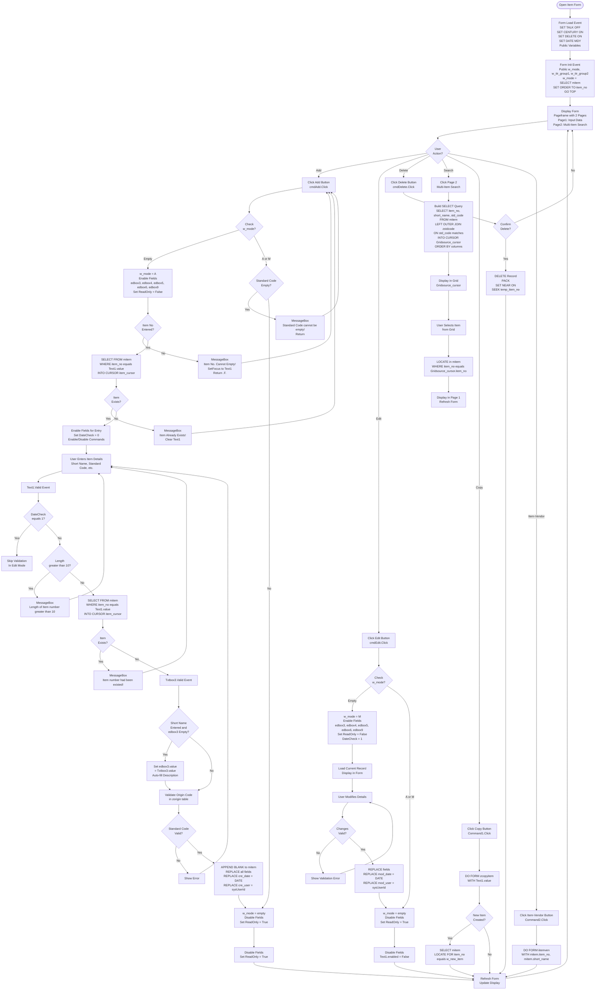
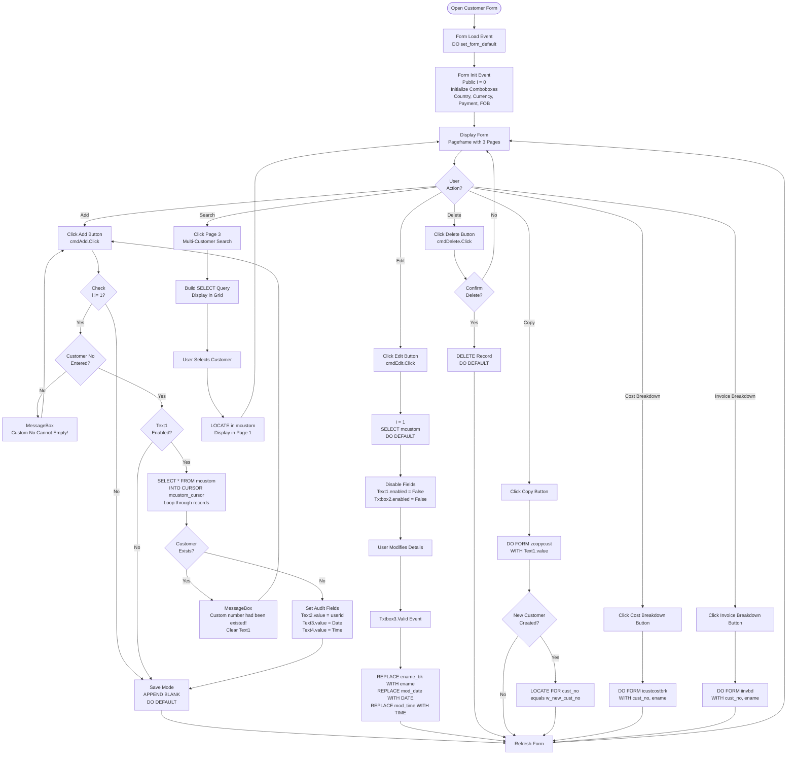
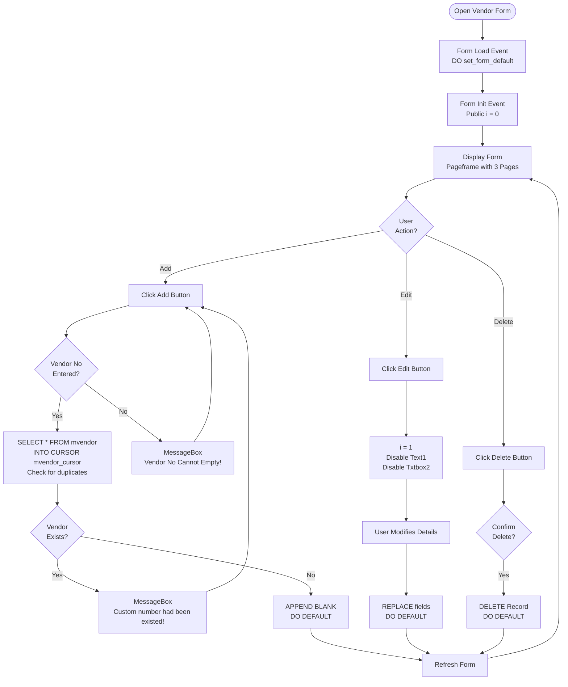

# Master Data Forms

## Overview

Master data forms handle the creation and maintenance of foundational business data: items, customers, vendors, and supporting reference data. These forms provide the data foundation for all transaction processing.

## Form: iitem (Input Item)

### Form Details

- **Form Name:** `iitem`
- **File:** `source/iitem.scx` / `source/iitem.SCT`
- **Type:** Formset with Pageframe (2 pages)
- **Purpose:** Create and maintain item master data

### Form Layout

**Structure:**
- Formset: `fmsmall2` (Smallform2)
- Pageframe with 2 pages:
  - Page1: "Input Data" - Item entry form
  - Page2: "Multi-Item Search" - Search/browse grid

**Key Controls:**
- `Text1` - Item No. (ControlSource: mitem.item_no)
- `Txtbox3` - Short Name (ControlSource: mitem.short_name)
- `Txtbox2` - Date (ControlSource: mitem.date)
- `edbox3` - Standard Code (readonly, validated)
- `edbox4` - Origin (readonly, validated)
- `edbox5` - Item Group (readonly)
- `edbox6` - Material (readonly)
- `edbox9` - TTR Group (readonly)
- `Txtbox4` - Weight (ControlSource: mitem.wt)
- `Txtbox5` - Net (ControlSource: mitem.net)
- `Txtbox6` - Cube (ControlSource: mitem.cube)
- `Txtbox7` - Duty (ControlSource: mitem.duty)
- `Txtbox9` - Price (ControlSource: mitem.price)
- `Image1` - Item photo display
- `Command1` - Copy button (calls zcopyitem)
- `Command2` - Item-Vendor button (calls iitemven)

### Detailed Process Flow with Validation



### Validation Rules

#### Item Number Validation (Text1.Valid)

**Rules:**
1. **Length Validation:**
   - Maximum length: 10 characters
   - Error: "Length of Item number > 10"

2. **Uniqueness Validation:**
   - Must not already exist in `mitem` table
   - Check: `SELECT * FROM mitem WHERE item_no == Text1.value`
   - Error: "Item number had been existed!"

3. **Edit Mode Exception:**
   - If `DateCheck = 1` (edit mode), skip validation
   - Allows editing existing items

**Validation Code:**
```foxpro
PROCEDURE Valid
IF Datecheck <> 1
    IF !empty(this.value)
        IF len(alltrim(this.value)) > 10
            messagebox("Length of Item number > 10", 16, "Error Message!")
            return .f.
        ENDIF
        SELECT * FROM mitem WHERE item_no == alltrim(this.parent.text1.value) INTO CURSOR item_cursor
        IF !eof()
            messagebox("Item number had been existed!", 16, "Error Message!")
            return .f.
        ENDIF
    ENDIF
ENDIF
RETURN .T.
ENDPROC
```

#### Short Name Validation (Txtbox3.Valid)

**Rules:**
- If short name entered and description (edbox3) empty, auto-fill description
- Logic: `IF !empty(this.value) AND empty(this.parent.edbox3.value) THEN edbox3.value = this.value`

#### Standard Code Validation

**Rules:**
- Standard Code cannot be empty when saving
- Validated against `zstdcode` table
- Error: "Standard Code cannot be empty!"

#### Origin Code Validation

**Rules:**
- Must exist in `zorigin` table
- Validated when origin code entered

#### Add Mode Validation (cmdAdd.Click)

**Rules:**
1. **Item Number Required:**
   - Cannot be empty when adding
   - Error: "Item No. Cannot Empty!"

2. **Standard Code Required:**
   - Cannot be empty when saving
   - Error: "Standard Code cannot be empty!"

3. **Item Existence Check:**
   - Check if item already exists
   - Only when `Text1.enabled = .T.` and not in edit mode

**Validation Code:**
```foxpro
PROCEDURE cmdAdd.Click
DO CASE
    CASE empty(w_mode)
        w_mode = "A"
        thisform.pageframe1.page1.edbox3.readonly = .f.
        thisform.pageframe1.page1.edbox4.readonly = .f.
        thisform.pageframe1.page1.edbox5.readonly = .f.
        thisform.pageframe1.page1.edbox6.readonly = .f.
        thisform.pageframe1.page1.edbox9.readonly = .f.
    CASE w_mode = "A" OR w_mode = "M"
        IF empty(mitem.std_code)
            messagebox("Standard Code cannot be empty!", 0+16, "System Message")
            return
        ENDIF
        w_mode = ""
        thisform.pageframe1.page1.edbox3.readonly = .t.
        thisform.pageframe1.page1.edbox4.readonly = .t.
        thisform.pageframe1.page1.edbox5.readonly = .t.
        thisform.pageframe1.page1.edbox6.readonly = .t.
        thisform.pageframe1.page1.edbox9.readonly = .t.
ENDCASE

IF EMPTY(thisform.pageframe1.page1.text1.VALUE) AND thisform.pageframe1.page1.text1.enabled = .t.
    MESSAGEBOX("Item No. Cannot Empty!", 16, "Error")
    ThisForm.PageFrame1.Page1.Text1.SetFocus
    Return .F.
ELSE
    SELECT * FROM mitem WHERE alltrim(item_no) == alltrim(thisform.pageframe1.page1.text1.value) AND !empty(item_no) INTO CURSOR item_cursor
    IF eof() OR DateCheck <> 0 OR thisform.pageframe1.page1.text1.enabled = .f.
        SELECT mitem
        Datecheck = 0
        * Enable/disable commands based on state
    ENDIF
ENDIF
Dodefault()
ENDPROC
```

### Form Events

#### Load Event
```foxpro
PROCEDURE Load
SET TALK OFF
SET HOUR TO 24
SET SAFETY OFF
SET CENTURY ON
SET DELETE ON
SET DATE MDY

PUBLIC w_ttr_group1, w_ttr_group2, w_mode
w_mode = ""
w_ttr_group1 = ""
w_ttr_group2 = ""
ENDPROC
```

#### Init Event
```foxpro
PROCEDURE Init
PUBLIC DateCheck, grid_click_value, w_new_item
DateCheck = 0
grid_click_value = ""
w_new_item = ""
ENDPROC
```

#### Page1.Refresh Event
```foxpro
PROCEDURE Page1.Refresh
LOCAL FileName
FileName = curdir() + "photo\" + alltrim(mitem.item_no) + ".jpg"
thisform.pageframe1.page1.image1.Picture = filename
ENDPROC
```

#### Page2.Click Event (Search Grid)
```foxpro
PROCEDURE Page2.Click
this.grid1.recordsource = ';
    SELECT Mitem.item_no, Mitem.short_name, mitem.std_code,;
           nvl(Zstdcode.std_desp,"");
    FROM baitin!mitem LEFT OUTER JOIN baitin!zstdcode;
         ON Mitem.std_code = Zstdcode.std_code;
    INTO CURSOR Gridsource_cursor;
    ORDER BY 1'

SELECT Gridsource_cursor
LOCATE FOR alltrim(Gridsource_cursor.item_no) == alltrim(mitem.item_no)
thisform.refresh
this.grid1.setfocus
ENDPROC
```

### Related Forms

- **zcopyitem** - Copy item form (called from Command1)
- **iitemven** - Item-Vendor relationship form (called from Command2)
- **zphotoview** - Photo viewer (called from Image1.Click)

### Related Tables

- **mitem** - Item master table
- **zstdcode** - Standard code lookup
- **zorigin** - Origin code lookup
- **zttrgp** - TTR group lookup
- **zcountry** - Country lookup

## Form: icustom (Input Customer)

### Form Details

- **Form Name:** `icustom`
- **File:** `source/icustom.scx` / `source/icustom.SCT`
- **Type:** Formset with Pageframe (3 pages)
- **Purpose:** Create and maintain customer master data

### Form Layout

**Structure:**
- Formset: `fmsmall2` (Smallform2)
- Pageframe with 3 pages:
  - Page1: "Input Data" - Customer entry form
  - Page2: "Browse" - Customer search
  - Page3: "Multi-Item Search" - Multi-customer search grid

**Key Controls:**
- `Text1` - Customer No. (ControlSource: mcustom.cust_no)
- `Txtbox3` - English Name (ControlSource: mcustom.ename)
- `Txtbox4` - Chinese Name (ControlSource: mcustom.cname)
- `Txtbox5` - Short Name (ControlSource: mcustom.sname)
- `Txtbox6-8` - Address lines (ControlSource: mcustom.addr1-3)
- `Txtbox17` - Country Code
- `Txtbox18` - Country Name (display only)
- `Combo1` - Country selection
- `Combo2` - Currency code
- `Combo3` - Payment terms
- `Combo4` - FOB terms
- `Check1-3` - Testing/Inspection/Sample checkboxes
- `Command1` - Copy button (calls zcopycust)
- `Command2` - Cost Breakdown button (calls icustcostbrk)
- `Command3` - Invoice Breakdown button (calls iinvbd)

### Detailed Process Flow with Validation



### Validation Rules

#### Customer Number Validation (Text1.LostFocus)

**Rules:**
1. **Required Field:**
   - Cannot be empty
   - Error: "Custom No Cannot Empty!"

2. **Uniqueness Check:**
   - Must not already exist in `mcustom` table
   - Check: Loop through `mcustom_cursor` comparing `cust_no`
   - Error: "Custom number had been existed!"

3. **Edit Mode Exception:**
   - If `i = 1` (edit mode), skip validation
   - If `Text1.enabled = .F.`, skip validation

**Validation Code:**
```foxpro
PROCEDURE LostFocus
PRIVATE x
x = 0
SELECT * FROM mcustom INTO CURSOR mcustom_cursor

IF i != 1
    IF thisform.pageframe1.page1.text1.enabled = .t.
        IF empty(thisform.pageframe1.page1.text1.value) != .T.
            DO WHILE !eof() AND x = 0
                IF Thisform.pageframe1.page1.text1.value == mcustom_cursor.cust_no
                    messagebox("Custom number had been existed!", 16, "Error Message!")
                    x = 1
                ELSE
                    SKIP
                ENDIF
            ENDDO
            
            IF Thisform.pageframe1.page1.text1.value != mcustom_cursor.cust_no
                SELECT mcustom
                dodefault()
            ELSE
                Thisform.pageframe1.page1.text1.value = ""
            ENDIF
        ELSE
            messagebox("Custom No Cannot Empty!", 16, "Input Error!!")
        ENDIF
    ELSE
        SELECT mcustom
        dodefault()
    ENDIF
ELSE
    SELECT mcustom
    dodefault()
ENDIF
x = 0
i = 0
ENDPROC
```

#### English Name Validation (Txtbox3.Valid)

**Rules:**
- Auto-update audit fields when name changes
- Update: `ename_bk`, `mod_date`, `mod_time`

**Validation Code:**
```foxpro
PROCEDURE Valid
REPLACE mcustom.ename_bk WITH mcustom.ename
REPLACE mcustom.mod_date WITH DATE()
REPLACE mcustom.mod_time WITH TIME()
ENDPROC
```

#### Country Code Lookup (Page1.Refresh)

**Rules:**
- When country code (txtbox17) entered, lookup country name
- Display in txtbox18 (read-only)
- Query: `SELECT zcoun_cursor WHERE coun_co == txtbox17.value`

### Form Events

#### Page1.Init Event
```foxpro
PROCEDURE Page1.Init
this.combo1.rowsource = ";
    SELECT * FROM zcountry ORDER BY coun_name;
    INTO CURSOR zcoun_cursor"

this.combo2.rowsource = ";
    SELECT cur_code FROM zcurcode INTO CURSOR cur_cursor"

this.combo4.rowsource = ";
    SELECT fob_code, fob_terms FROM zfobterm INTO CURSOR fob_cursor"

this.combo3.rowsource = ";
    SELECT pay_code, pay_term FROM zpayterm INTO CURSOR pay_cursor"
ENDPROC
```

#### Page1.Refresh Event
```foxpro
PROCEDURE Page1.Refresh
dodefault()
thisform.pageframe1.page1.txtbox18.value = ""
IF !empty(thisform.pageframe1.page1.txtbox17.value)
    SELECT zcoun_cursor
    LOCATE FOR alltrim(zcoun_cursor.coun_co) == alltrim(thisform.pageframe1.page1.txtbox17.value)
    thisform.pageframe1.page1.txtbox18.value = zcoun_cursor.coun_name
ENDIF
ENDPROC
```

### Related Forms

- **zcopycust** - Copy customer form
- **icustcostbrk** - Customer cost breakdown form
- **iinvbd** - Invoice breakdown form

### Related Tables

- **mcustom** - Customer master table
- **zcountry** - Country lookup
- **zcurcode** - Currency code lookup
- **zpayterm** - Payment terms lookup
- **zfobterm** - FOB terms lookup

## Form: ivendor (Input Vendor)

### Form Details

- **Form Name:** `ivendor`
- **File:** `source/ivendor.scx` / `source/ivendor.SCT`
- **Type:** Formset with Pageframe (3 pages)
- **Purpose:** Create and maintain vendor/maker master data

### Form Layout

**Structure:**
- Formset: `fmsmall2` (Smallform2)
- Pageframe with 3 pages:
  - Page1: "Input Data" - Vendor entry form
  - Page2: "Browse" - Vendor search
  - Page3: "Address 2" - Additional address

**Key Controls:**
- `Text1` - Vendor No. (ControlSource: mvendor.vendor_no)
- `Txtbox2` - Date (ControlSource: mvendor.date)
- `Txtbox3` - English Name (ControlSource: mvendor.ename)
- `Txtbox6-9` - Address lines (ControlSource: mvendor.addr1-4)
- `Txtbox10-11` - Contact name, telephone
- `Txtbox12-13` - Fax numbers
- Type field (1=Vendor, 2=Maker)

### Process Flow



### Validation Rules

#### Vendor Number Validation (Text1.LostFocus)

**Rules:**
1. **Required Field:**
   - Cannot be empty
   - Error: "Vendor No Cannot Empty!"

2. **Uniqueness Check:**
   - Must not already exist in `mvendor` table
   - Error: "Custom number had been existed!" (note: uses "Custom" in error message)

**Validation Code:**
```foxpro
PROCEDURE LostFocus
SELECT * FROM mvendor INTO CURSOR mvendor_cursor

IF i != 1
    IF thisform.pageframe1.page1.text1.enabled = .t.
        IF empty(thisform.pageframe1.page1.text1.value) != .T.
            DO WHILE !eof() AND x = 0
                IF Thisform.pageframe1.page1.text1.value == mvendor_cursor.vendor_no
                    messagebox("Custom number had been existed!", 16, "Error Message!")
                ENDIF
                SKIP
            ENDDO
        ENDIF
    ENDIF
ENDIF

IF i != 1
    IF thisform.pageframe1.page1.text1.enabled = .t.
        IF empty(thisform.pageframe1.page1.text1.value) = .T.
            messagebox("Vendor No Cannot Empty!", 16, "Input Error!!")
        ENDIF
    ELSE
        dodefault()
    ENDIF
ELSE
    dodefault()
ENDIF
ENDPROC
```

### Related Tables

- **mvendor** - Vendor master table
- **mitemven** - Item-Vendor relationship table

## Other Master Data Forms

### Supporting Forms

#### izstdcode (Standard Code)
- **Purpose:** Maintain standard code master data
- **Table:** `zstdcode`
- **Usage:** Referenced by items for categorization

#### izorigin (Country of Origin)
- **Purpose:** Maintain origin code master data
- **Table:** `zorigin`
- **Usage:** Referenced by items for origin tracking

#### iprodbom (Product BOM)
- **Purpose:** Define Bill of Materials for items
- **Table:** `mprodbom`
- **Process:** Link parent items to sub-items with quantities

#### ipurunit (Purchase Unit)
- **Purpose:** Define purchase units
- **Table:** Purchase unit reference table

#### iskn (SKN No.)
- **Purpose:** Maintain SKN numbers for customers
- **Table:** `mskn`
- **Usage:** Customer-specific item numbering

#### ishipmark (Ship Mark)
- **Purpose:** Maintain shipping marks
- **Table:** Ship mark reference table

#### ipayterm (Payment Terms)
- **Purpose:** Maintain payment terms
- **Table:** `zpayterm`

#### ifobport (FOB Port)
- **Purpose:** Maintain FOB port codes
- **Table:** FOB port reference table

#### ifobterm (FOB Terms)
- **Purpose:** Maintain FOB terms
- **Table:** `zfobterm`

#### ittrgp (TTR Group)
- **Purpose:** Maintain TTR group codes
- **Table:** `zttrgp`

#### itest (Testing/Inspection/Sample Approval)
- **Purpose:** Maintain testing/inspection requirements
- **Table:** Testing reference table

#### ishippara (Customer Shipment Parameter)
- **Purpose:** Maintain customer-specific shipment parameters
- **Table:** Customer shipment parameter table

#### icustinv (Customer Invoice Parameter)
- **Purpose:** Maintain customer invoice parameters
- **Table:** Customer invoice parameter table

#### imftr (Input Manufacturer)
- **Purpose:** Maintain manufacturer master data
- **Table:** `zmftr`

#### iuser (Input User Account)
- **Purpose:** Maintain user accounts
- **Table:** `user`
- **Related:** `rights` table for user permissions

#### ipara2 (Input Company Info)
- **Purpose:** Maintain company information
- **Table:** `zpara`
- **Usage:** Company code, name, and settings

#### isuspended_item (Input Suspended Item)
- **Purpose:** Mark items as suspended
- **Table:** `mitem` (suspend_flag field)
- **Usage:** Prevent use of suspended items in transactions

## Common Patterns Across Master Data Forms

### Add/Edit/Delete Pattern

All master data forms follow similar patterns:

1. **Add Mode:**
   - Enable fields for entry
   - Validate required fields
   - Check for duplicates
   - Set audit fields (cre_date, cre_user)
   - Save record

2. **Edit Mode:**
   - Load existing record
   - Enable fields for modification
   - Validate changes
   - Update audit fields (mod_date, mod_user)
   - Save changes

3. **Delete Mode:**
   - Confirm deletion
   - Delete record
   - Refresh display

### Validation Patterns

1. **Primary Key Validation:**
   - Required field check
   - Uniqueness check
   - Length/format validation

2. **Foreign Key Validation:**
   - Lookup table existence
   - Reference integrity

3. **Business Rule Validation:**
   - Required fields
   - Format validation
   - Range validation

### Audit Trail

All master data forms maintain audit trails:
- `cre_date` - Creation date
- `cre_user` - Creation user
- `mod_date` - Modification date
- `mod_user` - Modification user
- `user_id` - User ID

## Summary

Master data forms provide comprehensive data management with:
- Add/Edit/Delete functionality
- Validation rules (required, uniqueness, format)
- Foreign key validation
- Audit trail maintenance
- Search and browse capabilities
- Related form integration

These forms establish the data foundation for all transaction processing in the system.
