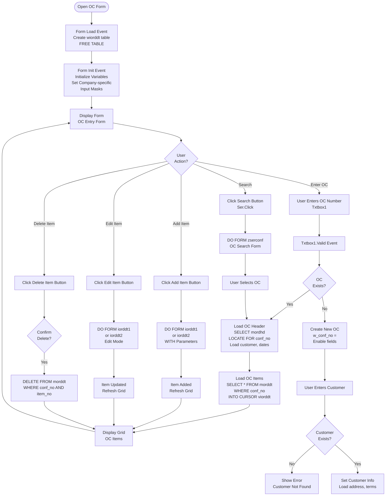
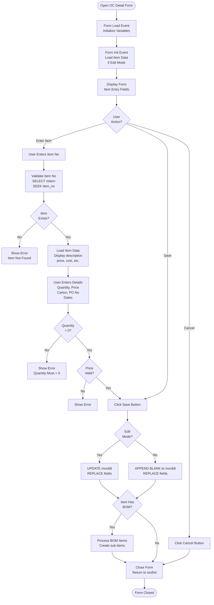

# Order Confirmation Forms

## Overview

Order Confirmation (OC) forms handle the posting of Order Enquiries to Order Confirmations, manual OC entry, and OC management. OCs serve as confirmed customer orders and are the basis for contract generation.

## Form: upostoe (Post OE/Post OC)

### Form Details

- **Form Name:** `upostoe`
- **File:** `source/upostoe.scx` / `source/upostoe.SCT`
- **Type:** Single form with grid
- **Purpose:** Post Order Enquiries to Order Confirmations

### Form Layout

**Key Controls:**
- `OptionGroup1` - Status selection (1=Unposted, 2=Posted)
- `OptionGroup2` - User filter (1=Current User, 2=All Users)
- `Txtbox1` - User ID filter
- `Txtbox2` - From Date
- `Txtbox3` - To Date
- `Grid1` - OE selection grid (wupostoegrid cursor)
- `Command1` - Post button
- `Command2` - Exit button

### Detailed Process Flow with Validation

```mermaid
flowchart TD
    Start([Open Post OE Form]) --> Load[Form Load Event<br/>Initialize Variables]
    Load --> Init[Form Init Event<br/>Set Default Dates<br/>w_fr_date = DATE<br/>w_to_date = DATE]
    Init --> Display[Display Form<br/>OE Selection Grid]
    
    Display --> UserSelectsFilter[User Selects Filters<br/>OptionGroup1: Status<br/>OptionGroup2: User Filter<br/>Txtbox1: User ID<br/>Txtbox2: From Date<br/>Txtbox3: To Date]
    
    UserSelectsFilter --> BuildGrid[Call ugrid Method<br/>Build OE List]
    
    BuildGrid --> BuildQuery[Build SELECT Query<br/>Based on Filters]
    
    BuildQuery --> QueryCase{Filter<br/>Combination?}
    
    QueryCase -->|"Unposted + Current User"| Query1["Query OEs: Unposted<br/>Current User Filter<br/>Date Range<br/>Status = 0"]
    
    QueryCase -->|"Unposted + All Users"| Query2["Query OEs: Unposted<br/>All Users<br/>Date Range<br/>Status = 0"]
    
    QueryCase -->|"Posted + Current User"| Query3["Query OEs: Posted<br/>Current User Filter<br/>Date Range<br/>Status = 1"]
    
    QueryCase -->|"Posted + All Users"| Query4["Query OEs: Posted<br/>All Users<br/>Date Range<br/>Status = 1"]
    
    Query1 --> PopulateGrid
    Query2 --> PopulateGrid
    Query3 --> PopulateGrid
    Query4 --> PopulateGrid
    
    PopulateGrid[Populate wupostoegrid<br/>ZAP wupostoegrid<br/>Loop through Temp<br/>APPEND BLANK<br/>REPLACE oe_no, cust_no<br/>REPLACE Select = IIF status = 0, .T., .F.]
    PopulateGrid --> DisplayGrid[Display Grid1<br/>Recordsource = wupostoegrid]
    
    DisplayGrid --> UserSelectsOE[User Selects OEs<br/>Check Select checkbox<br/>in Grid]
    
    UserSelectsOE --> ClickPost[User Clicks Post Button<br/>Command1.Click]
    
    ClickPost --> ValidateSelection{Has Selected<br/>OEs?}
    ValidateSelection -->|No| ShowError1[MessageBox<br/>No OEs Selected]
    ShowError1 --> DisplayGrid
    ValidateSelection -->|Yes| LoopSelectedOEs["Loop Through Selected OEs<br/>SELECT wupostoegrid<br/>WHERE Select = True"]
    
    LoopSelectedOEs --> CheckOEStatus{Check<br/>OE Status<br/>Already Posted?}
    CheckOEStatus -->|Yes| ShowError2[MessageBox<br/>OE Already Posted<br/>Skip This OE]
    ShowError2 --> NextOE
    CheckOEStatus -->|No| ValidateOE{Validate<br/>OE Has Items?}
    
    ValidateOE -->|No| ShowError3[MessageBox<br/>OE Has No Items<br/>Skip This OE]
    ShowError3 --> NextOE
    ValidateOE -->|Yes| CreateOCHeader[Call umordhd Method<br/>Create OC Header]
    
    CreateOCHeader --> BuildOCNo["Build OC Number<br/>Based on Company Code<br/>HT: HT-OC/prefix<br/>BAT: BTL-prefix<br/>HFW: HFW-OC/prefix<br/>INSP: IN-OC/prefix"]
    
    BuildOCNo --> CheckOCExists{OC Header<br/>Exists?}
    CheckOCExists -->|Yes| UpdateOCHeader[UPDATE mordhd<br/>REPLACE fields]
    CheckOCExists -->|No| CreateOCHeaderRecord[APPEND BLANK to mordhd<br/>REPLACE conf_no, oe_no<br/>date, cust_no<br/>req_date_fr, req_date_to]
    
    UpdateOCHeader --> CopyOEItems
    CreateOCHeaderRecord --> CopyOEItems[Call umorddt Method<br/>Copy OE Items to OC]
    
    CopyOEItems --> SelectOEItems["Select OE Items<br/>FROM moe table<br/>WHERE oe_no matches<br/>INTO CURSOR Tempor"]
    
    SelectOEItems --> LoopItems[Loop Through Tempor<br/>For Each Item]
    
    LoopItems --> CheckOCItemExists{OC Item<br/>Exists?}
    CheckOCItemExists -->|Yes| UpdateOCItem[UPDATE morddt<br/>REPLACE qty, ctn, price<br/>po_no, dates]
    CheckOCItemExists -->|No| CreateOCItem[APPEND BLANK to morddt<br/>REPLACE conf_no, oe_no<br/>item_no, qty, ctn<br/>price, po_no, dates]
    
    UpdateOCItem --> CheckBOM{Item Has<br/>BOM?}
    CreateOCItem --> CheckBOM
    
    CheckBOM -->|Yes| ProcessBOM[Process BOM Items<br/>SELECT mprodbom<br/>Calculate sub-item quantities<br/>Create sub-item records]
    CheckBOM -->|No| NextItem
    
    ProcessBOM --> SetHeadItem["Set Head Item Variables<br/>w_head_item = item_no<br/>w_head_qty = qty<br/>Set head = True"]
    SetHeadItem --> CalculateTotalBOM["Calculate Total BOM Qty<br/>SUM qty from mprodbom<br/>WHERE item_no matches<br/>INTO CURSOR sum_qty"]
    
    CalculateTotalBOM --> LoopBOMSubs["Loop Through BOM Sub-items<br/>SELECT mprodbom<br/>LOCATE FOR item_no"]
    
    LoopBOMSubs --> CalculateSubQty["Calculate Sub-item Qty<br/>sub_qty = head_qty times<br/>bom_qty divided by total_qty"]
    CalculateSubQty --> CreateSubItem["APPEND BLANK to morddt<br/>REPLACE item_no = sub_item<br/>REPLACE qty = sub_qty<br/>REPLACE head = False"]
    CreateSubItem --> NextBOMSub{More<br/>Sub-items?}
    
    NextBOMSub -->|Yes| LoopBOMSubs
    NextBOMSub -->|No| NextItem
    
    NextItem{More<br/>Items?}
    NextItem -->|Yes| LoopItems
    NextItem -->|No| UpdateOEStatus[UPDATE moehd<br/>REPLACE status = 1<br/>Mark as Posted]
    
    UpdateOEStatus --> NextOE{More<br/>Selected OEs?}
    NextOE -->|Yes| LoopSelectedOEs
    NextOE -->|No| RefreshGrid[Refresh Grid<br/>Call ugrid Method]
    
    RefreshGrid --> ShowSuccess[Show Success Message<br/>Posting Complete]
    ShowSuccess --> DisplayGrid
```



### Validation Rules

#### Pre-Posting Validation

1. **OE Selection:**
   - At least one OE must be selected
   - Error: "No OEs Selected" if none selected

2. **OE Status:**
   - OE must not already be posted (status = 0)
   - Error: "OE Already Posted" if status = 1

3. **OE Has Items:**
   - OE must have items in `moe` table
   - Error: "OE Has No Items" if empty

4. **Date Range:**
   - From Date must be <= To Date
   - Dates used to filter OEs for posting

#### Post-Posting Validation

1. **OC Created:**
   - OC header exists in `mordhd`
   - OC details created in `morddt`

2. **BOM Calculated:**
   - BOM quantities calculated correctly
   - Sub-items created with proper quantities

### umordhd Method (Create OC Header)

**Purpose:** Create or update OC header record

**Process:**
1. Select OE header data from `moe`
2. Select customer data from `mcustom`
3. Build OC number based on company
4. Check if OC header exists
5. Create or update `mordhd` record

**Code:**
```foxpro
PROCEDURE umordhd
SELECT DISTINCT oe_no, date, from_date, to_date, cust_no, cur_code;
    FROM moe;
    INTO CURSOR Temporhd;
    WHERE alltrim(oe_no) == alltrim(woeno);
    AND alltrim(comp_code) == w_password

SELECT ename, pay_term, fob_terms, conf_remark, addr1, addr2, addr3, addr4, cur_code;
    FROM mcustom;
    INTO CURSOR Tempcust;
    WHERE alltrim(cust_no) == alltrim(wcustno)

DO CASE
    CASE alltrim(w_password) = "HT"
        w_conf_no = "HT-OC/" + woeno
    CASE alltrim(w_password) = "BAT"
        w_conf_no = "BTL-" + woeno
    CASE alltrim(w_password) = "HFW"
        w_conf_no = "HFW-OC/" + ALLTRIM(STRTRAN(woeno, "HFW", "   "))
    CASE alltrim(w_password) = "INSP"
        w_conf_no = "IN-OC/" + woeno
ENDCASE

SELECT mordhd
LOCATE FOR alltrim(mordhd.conf_no) == w_conf_no

IF !found()
    APPEND BLANK
    REPLACE mordhd.conf_no WITH w_conf_no
ENDIF

REPLACE mordhd.oe_no WITH woeno
REPLACE mordhd.date WITH Temporhd.date
REPLACE mordhd.cust_no WITH Temporhd.cust_no
REPLACE mordhd.req_date_fr WITH Temporhd.from_date
REPLACE mordhd.req_date_to WITH Temporhd.to_date
* ... replace other fields ...
ENDPROC
```

### umorddt Method (Copy OE Items to OC)

**Purpose:** Copy OE items to OC detail table

**Process:**
1. Select OE items from `moe`
2. For each item:
   - Check if OC item exists
   - Create or update `morddt` record
   - Process BOM if item has BOM

**Code:**
```foxpro
PROCEDURE umorddt
SELECT * FROM moe;
    INTO CURSOR Tempor;
    WHERE alltrim(oe_no) == alltrim(woeno);
    AND alltrim(comp_code) == w_password

SELECT Tempor
GO TOP
DO WHILE !eof()
    SELECT morddt
    LOCATE FOR alltrim(conf_no) == alltrim(w_conf_no);
        AND alltrim(item_no) == alltrim(Tempor.item_no)
    
    IF !found()
        APPEND BLANK
        REPLACE morddt.conf_no WITH w_conf_no
        REPLACE morddt.item_no WITH Tempor.item_no
    ENDIF
    
    REPLACE morddt.qty WITH Tempor.qty
    REPLACE morddt.ctn WITH Tempor.ctn
    REPLACE morddt.price WITH Tempor.price
    REPLACE morddt.po_no WITH Tempor.po_no
    * ... replace other fields ...
    
    * Check for BOM
    SELECT SUM(qty) as total_qty;
        FROM mprodbom;
        WHERE item_no == Tempor.item_no;
        INTO CURSOR sum_qty
    
    IF sum_qty.total_qty > 0
        * Process BOM sub-items
        w_head_item = Tempor.item_no
        w_head_qty = Tempor.qty
        REPLACE morddt.head WITH .T.
        
        * Create sub-items
        SELECT mprodbom
        LOCATE FOR item_no == w_head_item
        DO WHILE !eof() AND item_no == w_head_item
            sub_qty = w_head_qty * mprodbom.qty / sum_qty.total_qty
            
            SELECT morddt
            APPEND BLANK
            REPLACE morddt.conf_no WITH w_conf_no
            REPLACE morddt.item_no WITH mprodbom.sub_item
            REPLACE morddt.qty WITH sub_qty
            REPLACE morddt.head WITH .F.
            
            SELECT mprodbom
            SKIP
        ENDDO
    ENDIF
    
    SELECT Tempor
    SKIP
ENDDO
ENDPROC
```

### ugrid Method (Build OE Grid)

**Purpose:** Populate grid with OEs based on filters

**Process:**
1. Build SELECT query based on filter options
2. Query `moehd` and `moe` tables
3. Populate `wupostoegrid` cursor
4. Display in grid

## Form: iordhd (Input Order Confirmation)

### Form Details

- **Form Name:** `iordhd`
- **File:** `source/iordhd.scx` / `source/iordhd.SCT`
- **Type:** Formset with multiple forms
- **Purpose:** Manual OC entry and editing

### Form Layout

**Structure:**
- Formset: `Formset1`
- Form1: OC header entry form
- Form2: OC detail entry form (iorddt1, iorddt2)

**Form1 Key Controls:**
- `Txtbox1` - OC Number
- `Txtbox13` - Company prefix (HT, HFW, IN)
- `Txtbox14` - OC prefix
- `Combofield1` - Customer selection
- `Txtbox2` - Customer name (display)
- `Datespinner1` - OC Date
- `Ser` - Search button
- `Grid1` - OC items grid

### Process Flow



### Validation Rules

#### OC Number Validation

**Rules:**
1. **Format Validation:**
   - HT: "HT-OC/" + 10 characters
   - BAT: "BTL-" + 12 characters
   - HFW: "HFW-OC/" + 12 characters
   - INSP: "IN-OC/" + 10 characters

2. **Uniqueness:**
   - OC number must be unique in `mordhd` table
   - Check before creating new OC

#### Customer Validation

**Rules:**
1. **Required Field:**
   - Customer must be selected
   - Must exist in `mcustom` table

2. **Auto-fill:**
   - Load customer address
   - Load payment terms
   - Load FOB terms

### Related Forms

- **iorddt1** - OC Detail entry form (Page 1)
- **iorddt2** - OC Detail entry form (Page 2)
- **zserconf** - OC search form

### Related Tables

- **mordhd** - OC header table
- **morddt** - OC detail table
- **moe** - OE items table (source)
- **moehd** - OE header table
- **mprodbom** - Product BOM table
- **mcustom** - Customer master table

## Form: iorddt1 / iorddt2 (OC Detail Entry)

### Form Details

- **Form Names:** `iorddt1`, `iorddt2`
- **Purpose:** Enter and edit OC detail items
- **Called From:** `iordhd` form

### Process Flow



### Validation Rules

1. **Item Number:**
   - Must exist in `mitem` table
   - Error: "Item Not Found" if not exists

2. **Quantity:**
   - Must be > 0
   - Error: "Quantity Must > 0"

3. **Price:**
   - Must be valid numeric value
   - Can be zero or positive

4. **Carton:**
   - Must be positive integer
   - Used for packing calculations

## Form: pconfirm (Print Order Confirmation)

### Form Details

- **Form Name:** `pconfirm`
- **Purpose:** Print OC document
- **Process:** Generate report from `mordhd` and `morddt`

## Form: pocbrk (Print OC Qty Breakdown)

### Form Details

- **Form Name:** `pocbrk`
- **Purpose:** Print OC quantity breakdown report
- **Process:** Aggregate and format OC quantity breakdowns

## Summary

Order Confirmation forms provide:
- **upostoe** - Post OE to OC with BOM processing
- **iordhd** - Manual OC entry and editing
- **iorddt1/iorddt2** - OC detail item entry
- **pconfirm** - OC document printing
- **pocbrk** - OC quantity breakdown printing

The forms include extensive validation, BOM processing, and integration with the contract generation workflow.
