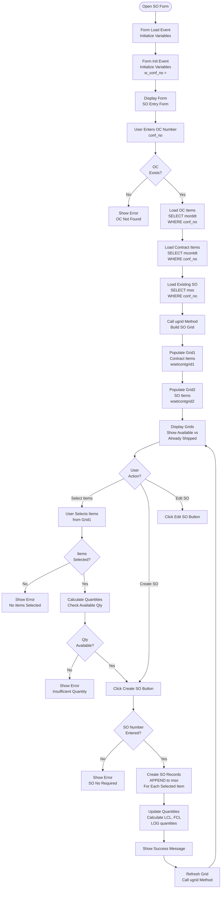

# Shipping Order Forms

## Overview

Shipping Order (SO) forms handle the creation and management of shipping orders from contracts. SOs define what will be shipped and are used for delivery note and invoice generation.

## Form: isetso (Input Shipping Order)

### Form Details

- **Form Name:** `isetso`
- **File:** `source/isetso.scx` / `source/isetso.SCT`
- **Type:** Formset with multiple forms
- **Purpose:** Create and manage shipping orders

### Process Flow

### ugrid Method

**Purpose:** Populate SO grids with contract and SO items

**Process:**
1. Load existing SO items from `mso`
2. Load contract items from `mcontdt`
3. Calculate available quantities
4. Populate Grid1 (contract items)
5. Populate Grid2 (SO items)

## Form: isetsodt (SO Detail)

### Form Details

- **Form Name:** `isetsodt`
- **Purpose:** SO detail item entry
- **Called From:** SO header form

## Form: pso (Print Shipping Order)

### Form Details

- **Form Name:** `pso`
- **Purpose:** Print shipping order document
- **Process:** Generate report from `mso` table

## Form: isoformat (Input SO Format)

### Form Details

- **Form Name:** `isoformat`
- **Purpose:** Configure SO format settings
- **Process:** Maintain SO format parameters

## Summary

Shipping Order forms provide:
- **isetso** - SO creation from contracts
- **isetsodt** - SO detail item entry
- **pso** - SO document printing
- **isoformat** - SO format configuration

The forms include quantity validation, LCL/FCL calculations, and integration with delivery note workflow.
